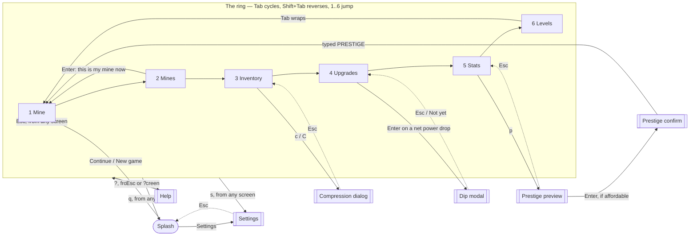
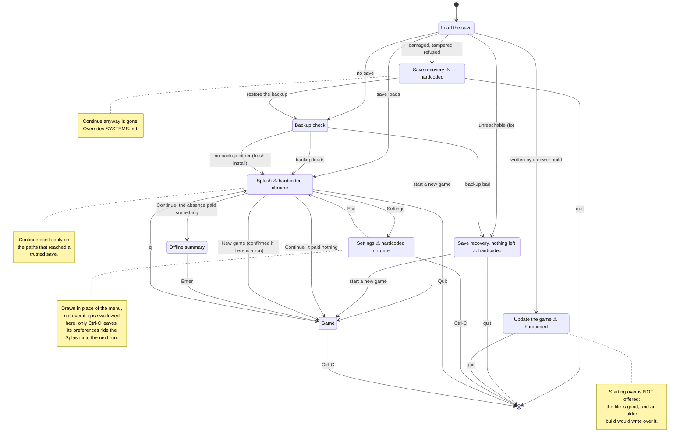
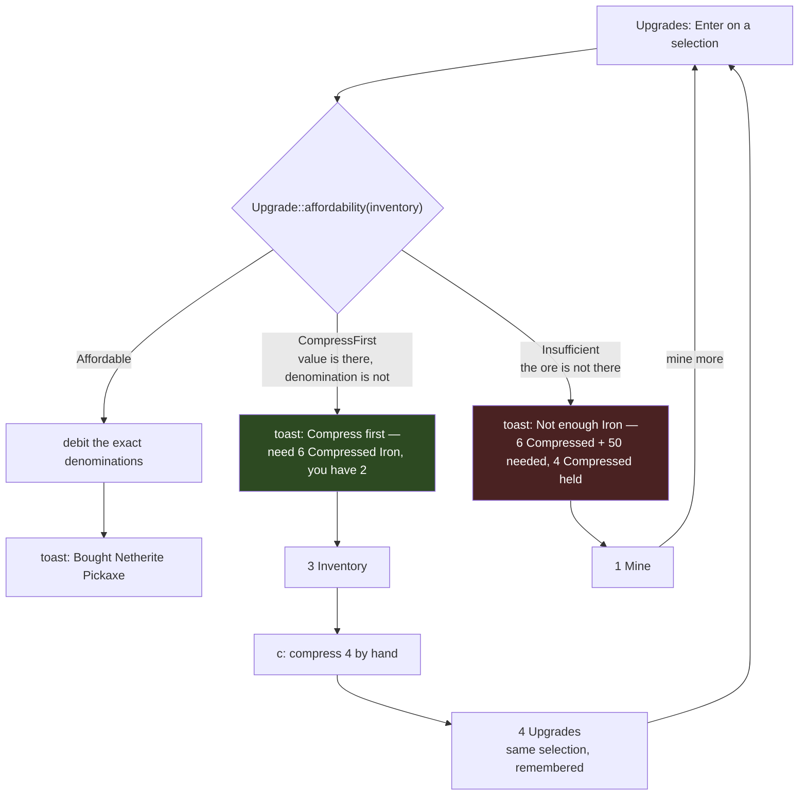

# Skylode - UI specification

What is on screen, and the constraint that gives it that shape. This is the
front-end's specification: [`skylode-tui`](../crates/skylode-tui) renders core
state and forwards input, and every frame below is drawn at the reference terminal
size and counted.

Three documents divide the work, and each fact lives in exactly one of them:

| Document | Job |
| --- | --- |
| [DECISIONS.md](DECISIONS.md) | the **verdict** and its short reason — an append-only ledger |
| **this file** | **what is on screen**, and the constraint that made it that shape |
| [DESIGN.md](DESIGN.md) | the concept and the loop; its screen list links here |

For the rules the screens render, see [MECHANICS.md](MECHANICS.md); for the save,
input and tech stack, [SYSTEMS.md](SYSTEMS.md).

## 1. The reference terminal, and the rule that follows

**80x24 minimum, adapting upward.** Every frame in this document is exactly 80
columns by 24 rows, counted rather than estimated — a wireframe that has not been
counted cannot answer the one question it exists to answer.

**The grid is fixed, the chrome flexes.** Mine size is a game constant per mine,
decoupled from terminal size, so the window cannot change balance
([MECHANICS.md](MECHANICS.md#mine-size)). The mine grid is therefore a
`Constraint::Length(42)` — 20 cells x 2 columns plus borders — and **never** a
`Percentage`. All adaptivity belongs to the panels around it.

```txt
  20x10 mine  =  20 cells x 2 chars  =  40 cols
  + Block borders                    =  42 cols
  80 - 42                            =  38 cols for the side panel
```

A mine smaller than 20x10 does not grow its panel; it leaves the reserved area
partly empty. That empty margin is the proof the largest mine fits without
re-laying anything out.

## 2. The states

**Seventeen states plus a cross-cutting toast component.** Six are the tab ring;
eleven are overlays, split by who opens them.

### 2.1 The ring

| # | Screen | Responsibility |
| --- | --- | --- |
| 1 | **Mine** | active mining: the grid, the target, break progress |
| 2 | **Mines** | pick world and mine; move the richness dial |
| 3 | **Inventory** | ores held, in both denominations; compress / decompress |
| 4 | **Upgrades** | pickaxe roadmap, enchant tracks, both mine tracks |
| 5 | **Stats** | progression, prestige, run progress, event history |
| 6 | **Levels** | the level roadmap, and what each level grants |

### 2.2 The overlays

**Pulled** — the player opens them, so they can be dismissed and reopened:
Splash, Settings, Help, the compression dialog, the dip modal, the prestige
preview, the prestige confirm.

**Pushed** — the game raises them; there is no key that leads here: the offline
summary, terminal-too-small, and save recovery.

**Toasts** are neither: an ephemeral overlay (2-3 s) drawn with `Clear` over the
current screen, costing **zero permanent layout rows**, with the full history in
Stats. One buffer, two renderings.

#### 2.2.1 Salience: which announcement gets the one slot

There is **one** slot, and the rule that filled it used to be *newest wins*. That
handed it to whatever spoke most often, and what speaks most often is the tick: in a
late run the refill and the procs fire several times a second, so a level-up — the
rarest line in the game and the only one carrying an errand (`claim on 6`) — was
reliably erased within a frame or two of being raised. Frequency was beating
importance, which is the wrong way round.

So a third property rides beside the text and the tone, decided in `announce::of` and
nowhere else:

| Level | Drawn? | Who | Why |
| --- | --- | --- | --- |
| **Silent** | never | spatial procs, the Excavator, the mine refill | the screen is already saying it |
| **Normal** | yes, until superseded | purchases, refusals, conversions, a lapsed boost | an answer to a key, which the next key may supersede |
| **Major** | yes, and nothing covers it | a level-up | it ends in an instruction, not a receipt |

**Silent is undrawn, not dropped.** The entry still enters the buffer, so §5.5's
History reads exactly what it always did — which is what keeps *one buffer, two
renderings* true. Filtering at the push would have emptied the history of the events a
run is mostly made of, and the alternative, a second buffer, is the thing that
arrangement exists to avoid.

**The test for Silent is "is the screen already showing this".** A blast has its flash
and its cleared cells (§7); a refill has a grid visibly filling back up; an Excavator's
payout is a count in the inventory. Those three are also, by a wide margin, the most
frequent — an Excavator at its ceiling rolls 5 % of a swing and a held `Space` swings
twenty times a second, so it alone lands about once a second. They were spending the
interface's only interruption on the three things needing none.

**Salience is not derivable from tone, and the two must not be merged.** `Neutral`
covers both a Nuke the player is watching and `Entered the Iron Mine`, an answer they
are waiting for; `Success` covers both `Excavator!` and `Level 23`. A ranking read off
the hue would be wrong in both directions at once.

**A `Major` cannot swallow an answer the player is waiting for**, and that falls out of
the game rather than being arranged. The only `Major` is a level-up; XP comes from
swings and the auto-miner grants none, so a level is crossed only while `Space` is held
— with the player's hands on the one key that announces nothing. The keys that *do*
announce live on screens where no swing is happening. The dev menu is the single path
that can collide, and there the level-up deliberately wins over the row's own `+1 000
xp` receipt.

**It fixed §6.4.1's banner without touching it.** `Toasts::showing` asks "is the slot
taken"; silent news does not take it, so the standing save-failure row stops being
suppressed by chatter that was not being drawn either. Before, the gravest line in the
interface was hidden for practically every frame of a late run.

### 2.3 The bootstrap rule

Config lives inside the save, and the save may be missing or untrusted. Therefore:

> **Splash, terminal-too-small and save recovery render with hardcoded defaults,
> never with config.**

Reading settings out of a save that has not passed its HMAC is reading data the
game has just decided not to trust. The Splash's *chrome* is hardcoded; the save
summary line under its menu is data, because by then the save has either passed or
been routed to recovery.

## 3. Reading the frames

ASCII cannot show colour or reverse video, so the frames encode them. This legend
is load-bearing: the frames are unreadable without it.

| In the wireframe   | In the terminal                                                                                                                                                                                                                                |
| ------------------ | ---------------------------------------------------------------------------------------------------------------------------------------------------------------------------------------------------------------------------------------------- |
| `[1 Mine]`         | the selected `Tabs` item — reverse video, not brackets                                                                                                                                                                                         |
| `▸`  at line start | the `ListState` / `TableState` selection — reverse video on the whole row                                                                                                                                                                      |
| `##`               | an intact **common** cell. In the terminal it is a **solid two-column swatch** of that block's colour and carries no glyph at all — see §5.8                                                                                                    |
| `▓▓`               | an intact **value** cell — the same swatch, in the value block's colour, **plus a stipple** (`░░`). The stipple is unconditional, in both colour modes: it is what makes common-vs-value survive a palette the terminal cannot render (§5.8)   |
| `::`               | the **targeted** cell, mid-break — the crack glyph over the swatch, `··` → `::` → `##` as it fills (§5.8)                                                                                                                                       |
| (two spaces)       | a broken cell: **no swatch, no glyph**, the terminal's own background                                                                                                                                                                          |
| `█░` in a gauge    | `LineGauge`'s filled / unfilled halves                                                                                                                                                                                                         |
| `✓ ✗ —`            | affordable / cannot afford / not applicable                                                                                                                                                                                                    |
| `~`                | **the third state**: you hold the value, not the denomination — _compress first_                                                                                                                                                               |
| `●`                | where you are now on a roadmap (owned, current)                                                                                                                                                                                                |

The ruler line (`0---------1---------`...) is part of the document, not the UI. It
is there so the next edit can be **checked** rather than eyeballed.

**The invariant every frame satisfies**, and which any edit must preserve: 24 lines;
every bordered line exactly 80 columns wide measured in code points; borders
vertically aligned. The scripts that check it live beside the working document, not
here.

## 4. The mine cell

The single most repeated element in the game, and the one that carries the most
information per character.

### 4.1 A cell is a background swatch, not two coloured characters

**Decided in [DECISIONS.md](DECISIONS.md).** A cell is two columns of *background*
colour. The glyph channel is then free, and carries two things that never collide:

- **the stipple `░░`** marks the mine's **value** cell, in both colour modes;
- **the crack progression `.` → `:` → `#`** marks break percentage on the
  targeted cell.

Because an intact cell carries **no glyph at all**, `#` is free to be the fullest
crack state — so [MECHANICS.md](MECHANICS.md#break-feedback)'s `.:#` ordering
stands as written. A **broken** cell is the *absence* of a swatch, which is the
maximum available contrast and needs no glyph of its own.

### 4.2 The palette — 24 entries, and the constraint is pairwise

The `Block` enum has exactly 24 variants, and `MineKind`'s twelve
`(common, value)` pairs partition them exactly: every variant is used once, with
no duplicate and no orphan. **Two mines are never on screen together**, so the
requirement is not 24 mutually distinguishable colours — it is twelve pairs with
strong internal contrast.

Hue follows Minecraft, so a material is recognised rather than learned; lightness
is the free variable, because it is the only channel that survives both a poor
terminal and colour blindness. The gate, applied **per pair** in CIELAB:
**ΔE ≥ 40 and ΔL\* ≥ 20**, with every swatch at **L\* ≥ 12** so no material
competes with the background.

| Mine | Common cell | 256 | Value cell | 256 | ΔE | 16-colour |
| --- | --- | --- | --- | --- | --- | --- |
| Stone | `Stone` | **240** #585858 | `Cobblestone` | **252** #d0d0d0 | 46 | white |
| Coal | `CoalOre` | **246** #949494 | `CoalBlock` | **235** #262626 | 46 | white |
| Iron | `IronOre` | **94** #875f00 | `IronBlock` | **223** #ffd7af | 52 | yellow |
| Gold | `GoldOre` | **130** #af5f00 | `GoldBlock` | **226** #ffff00 | 78 | yellow |
| Lapis | `LapisOre` | **20** #0000d7 | `LapisBlock` | **81** #5fd7ff | 125 | blue |
| Redstone | `RedstoneOre` | **88** #870000 | `RedstoneBlock` | **210** #ff8787 | 47 | red |
| Emerald | `EmeraldOre` | **29** #00875f | `EmeraldBlock` | **48** #00ff87 | 60 | green |
| Diamond | `DiamondOre` | **30** #008787 | `DiamondBlock` | **51** #00ffff | 45 | cyan |
| Quartz | `Netherrack` | **95** #875f5f | `QuartzOre` | **255** #eeeeee | 53 | red |
| Ancient Debris | `AncientDebris` | **137** #af875f | `NetheriteBlock` | **238** #444444 | 42 | yellow |
| Obsidian | `Obsidian` | **54** #5f0087 | `CryingObsidian` | **165** #d700ff | 52 | magenta |
| Amethyst | `Endstone` | **229** #ffffaf | `Amethyst` | **135** #af5fff | 135 | magenta |

### 4.3 The 16-colour fallback

Sixteen ANSI colours cannot carry 24 materials without collisions, so the fallback
drops to **one colour per mine** and lets the **stipple** carry the common/value
distinction. It is the same glyph as in 256-colour mode: one rendering model with a
channel switched off, not a second code path.

### 4.4 Accessibility

**The stipple is unconditional in both colour modes, and there is no dedicated
accessibility setting.** The common-vs-value distinction is what the Mine screen
exists for; making it depend on a setting would make it optional. Always on, it is
redundant at 256 colours and essential at 16 — which is what redundancy is supposed
to look like.

### 4.5 The chrome palette — a second, smaller table

Everything above is about the mine cell. The **chrome** — panel borders and titles,
the tab bar, gauges, scrollbars, footers, toasts, and the `✓ ✗ ~ ● ▸` marks — has a
separate palette, and the separation is deliberate: §4.2 answers *"what colour is
iron?"*, which has one right answer measurable against a gate, while this answers
*"what does a refusal look like?"*, whose right answer depends on a terminal the
game cannot see.

**Named ANSI colours, not indexed ones** — the reverse of §4.2, for the reason that
makes §4.2 right. There, a theme remapping a colour is a hazard, so the table names
exact indices. Here it is the point: chrome is drawn on the terminal's own
background — the same background a broken cell is — so the player's theme is the
authority on what "grey" should be, and a pinned index is the thing that could come
out illegible on a light terminal. Two things follow. The chrome needs **no
16-colour fallback**, because it never asks for more than sixteen, so §4.3 remains a
question about the grid alone. And **there is no contrast gate**, because a gate
would have to measure against a background that is not knowable from inside the
process.

| Role | What it doubles | Colour |
| --- | --- | --- |
| Accent | the cursor `▸`, panel titles, the filled half of a gauge, the scrollbar thumb, the active sub-tab, the toast border | cyan |
| Muted | borders, footers, table headers, the unfilled half of a gauge, the scrollbar track | dark grey |
| Affordable | `✓` — you can buy it; on Levels and Stats, already yours | green |
| Refused | `✗` — not enough ore, or a world still gated | red |
| Compress first | `~` — the third state of §5.3 | yellow |
| Current | `●` — where you are now on a roadmap | magenta |

`●` is magenta rather than a second green because of one row on Levels: the cursor
and the current level render adjacent as `▸●`, so it has to separate from the accent
beside it *and* from the `✓` on the reached levels above it. Titles take the accent
**plus bold**, so a title still reads as a title where the hue is dropped.

**`—` is drawn in the mark column and is deliberately absent from this table.** §5.4.2
uses it on the rows with no price to quote — a maxed track, the End's level gate — and
it stays in the terminal's default foreground. It cannot be added: the em dash is
ordinary prose across half the interface (the Stats history, the Upgrades detail pane,
the Help legend itself), and the colouring pass reads whole finished rows, so one
entry here would tint every one of those. That is the right answer rather than a gap.
`✓ ~ ✗` say what the ore can buy; `—` says the question was never asked on this row,
and an absence of an answer has no hue.

**Every entry doubles a glyph that is already there.** §4.4's rule is not relaxed
for chrome: the colour of a mark is *derived from* the mark, in one place, so it can
neither contradict its glyph nor appear without one. Colour is never the only thing
carrying an answer — remove it entirely and the screen still says everything it said.

**Three roles are applied to text as well as to a glyph, and they add no colours.**
The table above is closed; what follows re-uses it.

- **A price takes the hue of its own affordability mark** (§5.4.3). The colour is read
  from the same table by the same lookup that colours the `✓ ~ ✗` in the pane, so it is
  still *derived from* a glyph and still cannot appear without one — a `—` row and an
  already-owned one yield nothing and stay in the default foreground. What is relaxed is
  the *distance*: the glyph doubling it is elsewhere in the pane rather than in the same
  run of characters. The mark scan runs after the tint, so a tinted row's own marks keep
  their colours and a tint can never quietly recolour an answer.
- **A block's label is muted**, which is the role's existing job — table headers — read
  one level down: `Cost` introduces the answer and is not it.
- **A toast is drawn in the tone of its news**: accent for neutral, and the three
  verdict colours for a purchase, a shortage and a compress-first. A toast has no glyph
  to double, so here the hue doubles the *sentence*, which still carries the answer
  alone. What it buys is the three seconds: a refusal and a purchase were the same
  picture, and the refusal is the one that has to be read before it expires.

The **blast colour** for §7's proc flash is deliberately *not* in this table, and the
split is §4.2's rather than an omission: it is pinned like a material and not remapped
like chrome. It answers "what does an explosion look like *against the twenty-four
swatches*", which is a question about the grid, so it lives in `palette.rs` beside them
and is measured against them. A theme free to move it could move it onto the mine it is
supposed to separate from.

## 5. The screens

### 5.1 Mine

```text
0---------1---------2---------3---------4---------5---------6---------7---------
 1 Mine │ 2 Mines │ 3 Inventory │ 4 Upgrades │ 5 Stats │ [6 Levels]
┌─ Haul · Iron Mine ───────────────────────────────────────────────────────────┐
│  Iron   480 Raw   2 Compressed        value 680 Iron                         │
└──────────────────────────────────────────────────────────────────────────────┘
┌─ Iron Mine ────────────────────────────┐┌─ Pickaxe ──────────────────────────┐
│                                        ││ Diamond Pickaxe  Efficiency IV     │
│        ######▓▓####  ##########        ││ Power  25.0   ×1.5 boost → 37.5    │
│        ##  ##########▓▓####  ##        ││ Fortune III   drops ×4             │
│        ######::################        ││ Ench   Exp II   Jck I   Exc I      │
│        ####  ##▓▓########  ####        │└────────────────────────────────────┘
│        ############▓▓##########        │┌─ Mine ─────────────────────────────┐
│          ####▓▓##############          ││ Iron Mine             Overworld    │
│        ########▓▓##  ##########        ││ Blocks    76 / 84                  │
│                                        ││ Size      12 x 7   (level 5)       │
│                                        ││ Richness  level 0 / 9   value 10%  │
└────────────────────────────────────────┘└────────────────────────────────────┘
 Break  61%  Iron Block      ████████████████████░░░░░░░░░░░░░░░░░░░░░░░░░░░░░
 XP  Lv 23   1 240 / 2 300      ███████░░░░░░░░░░░░░░░░░░░░░░░░░░░░░░░░░░░░░░░
 Boost  12s  ×1.50   3 held     ██████████████████████████████░░░░░░░░░░░░░░░░

                     ┌──────────────────────────────────────┐
                     │  Excavator!  +1 Compressed Iron      │
                     └──────────────────────────────────────┘
 Space  mine     b  boost     Tab  next screen     ?  help
```

**Constraints.** The grid is `Length(42)` and never a percentage (§1). The status
strip uses `LineGauge`, not `Gauge`: a `Gauge` needs a `Block` and costs 3 rows
each, so four readouts would need 12 rows and the screen would not fit. The **Haul**
strip is a fixed three-row box on every mine — a two-material mine still fits on one
content line, so the box never changes height and the grid below it never moves.

The `Boost` gauge is the **temporary Redstone boost**, which has a countdown; the
permanent **Haste** enchant does not and is not shown here. The Pickaxe panel shows
*derived numbers* — power, the boost product, the Fortune multiplier — with only
non-zero special enchants listed; the full roster belongs to Upgrades.

**The `Boost` gauge carries two independent facts, and the label is a product of
them.** A boost that runs and a charge that is banked have nothing to do with each
other: the player can hold either, both or neither, and the reserve is at its most
interesting in exactly the state where nothing is running. So the countdown and the
reserve are composed rather than written out as four sentences —
`Boost  12s  ×1.50   3 held`, `Boost  —   3 held`, `Boost  12s  ×1.50   no charges`,
`Boost  —   no charges`.

**`b` fires one charge, and it is contextual to this screen.** A thirty-second window
spent looking at the Inventory table is thirty seconds wasted, and this is the only
screen that draws the gauge the boost appears on — so the binding lives here and is
advertised in this footer, which is the only place outside Help that names it. §9.
The charge itself is bought on the Upgrades screen (§5.4.4); a level-up grants one
every fifth level, which is why the footer has to name the key for a player who has
never opened that sub-tab.

**Core reads — all of them exist, and this screen is wired to them.**
`Mine::get_target()`, `Mine::break_ratio()`, `Mine::value_weight_percent()`,
`Mine::get_size_level()` and `Mine::get_richness_level()` supply the grid and both
right-hand panels; `Block::name()` labels the Break gauge, read off the targeted
cell rather than stored beside it; `Pickaxe::mining_power()` and
`fortune_multiplier()` supply the Pickaxe panel; `MineKind::common_material()` /
`value_material()` plus `Inventory::count()` supply the Haul strip. The boost
product reads `GameState::active_boost()`, which the tick will keep counting down.

**Two states the wireframe above does not draw, because a level-23 save does not
have them.** Before the first swing there is no target, and until a charge is fired
there is no boost — so both gauges read `—` on an empty bar rather than `0%` or
`0s`, which would assert a block part-broken and a countdown running. The Pickaxe
panel likewise drops the `×1.0 boost → 25.0` clause when nothing multiplies, and
prints `Fortune —` and `Ench —` rather than a level of zero.

**The `Boost` bar is a fraction of what the running boost was *granted*, not of one
charge's thirty seconds.** Charges stack by addition, so two fired together make a
sixty-second boost — and against a fixed thirty-second denominator that reads as a
clamped full bar for the whole first charge, with the gauge only beginning to move
halfway through. `Boost::granted_ticks` is the core counter that fixes it: the bar
opens full, falls to empty over whatever the boost actually holds, and steps *up*
visibly when another charge lands mid-run. Rounding the constant up to the next
multiple was the version that needed no core change, and it is worse than the bug —
crossing back under thirty seconds takes the denominator down with it, so the bar
leaps from half to full **while draining**.

**The label is deliberately not widened to say so.** `Boost  45s / 60s  ×2.50   3 held`
is the version that states the denominator in words, and it costs five columns the
32-column budget above does not have. The division of labour is the ordinary one: the
bar carries the proportion, the label carries the exact seconds, and a `LineGauge`
that clips in silence is not a place to spend columns for a fact already drawn.

**The empty *reserve* is the one absence in this game that is named and not dashed**,
and the exception is deliberate. `—` is right for the countdown, where nothing running
is nothing to measure; it is wrong for the reserve, because a player who has never seen
the word does not know that the footer's `b  boost` refers to anything they can obtain.
`no charges` is what makes the key mean something before the first one is granted.

**One departure the rendered screen forced: the gauge labels are padded to 32 columns,
not 28**, so the frame above draws its bars four columns wider than the built screen
does. The Boost label is now the longest of the three, and its worst realistic case —
ten charges banked and fired at once, `Boost  300s  ×2.50   10 held` — is 29 columns.
Both right-hand panels are full at four content lines apiece, so the label was the only
place the reserve could go. A `LineGauge` clips its label **in silence**, so an
overflow would not fail: it would quietly stop printing how many charges the player
holds, in precisely the state where the number is largest. A bar is a proportion and
reads the same at 48 columns as at 52; a truncated number does not.

**One departure from the frame above, forced by real numbers.** The composite
`value 680 Iron` is flush right, not eight spaces along. The frame was counted at
`480 Raw`; at the holdings a run reaches, a fixed gap plus a material name printed
twice overflows the fixed-width box — the Ancient Debris mine spends 28 of 78
columns on its own name — and a three-row box cannot wrap. On a **two-material**
mine the composite is dropped entirely and the two segments are separated by `·`:
there is no total of 540 Netherrack and 73 Quartz, and inventing one would invent an
exchange rate the game does not have.

### 5.2 Mines

```text
0---------1---------2---------3---------4---------5---------6---------7---------
 1 Mine │ [2 Mines] │ 3 Inventory │ 4 Upgrades │ 5 Stats       Prestige II  ×1.2
┌─ Mines ────────────────────────────┐┌─ Obsidian Mine ────────────────────────┐
│ Overworld                       ✓  ││ Obsidian         hard 50.0   60 ticks  │
│   Stone            20 x 10   R  9  ││ Crying Obsidian  hard 50.0   60 ticks  │
│   Coal             18 x 9    R  7  ││                                        │
│   Iron             12 x 7    R  0  ││ World      Nether        Lv 15  ✓      │
│   Gold             10 x 6    R  2  ││ Gate       Diamond pickaxe      ✓      │
│   Lapis             8 x 5    R  1  ││ Size       8 x 5 = 40    level 3       │
│   Redstone          6 x 4    R  0  ││ Blocks     31 / 40                     │
│   Emerald           6 x 4    R  0  ││ Richness   level 6 / 9                 │
│   Diamond           8 x 5    R  1  ││                                        │
│ Nether                   Lv 15  ✓  ││ Dial   ◄ ██████████████░░░░░░░░ ►      │
│   Quartz            8 x 5    R  3  ││        Crying 64%   Obsidian 36%       │
│   Ancient Debris    6 x 4    R  0  ││                                        │
│ ▸ Obsidian          8 x 5    R  6  ││        free, reversible, any time      │
│ End                      Lv 30  ✗  ││                                        │
│   End            locked Netherite  ││ The enhancement past Netherite eats    │
│                                    ││ both of them, so this dial has an      │
│                                    ││ optimum, not a maximum.                │
│                                    ││                                        │
│                                    ││ ← →  move the dial                     │
│                                    ││                                        │
└────────────────────────────────────┘└────────────────────────────────────────┘
 ↑↓  select     Enter  mine it     ← →  richness dial     Tab  next screen
```

**Constraints.** Fifteen rows for twelve mines plus three world headers fit in 20:
this is the one list screen that never needs a `Scrollbar` at 80x24.

**The right column is a table, and every field in it is padded to a fixed width.**
Flushing a row's right-hand string against the edge aligns its last character and
nothing else, which is what made `locked` step four columns left between `Stone` and
`Netherite` and left `20 x 10` sharing no column with `3 x 3`. The widths are facts
about core tables — two digits a side (`MINE_SIZES` tops out at `20 x 10`), two for
the rung, nine for `Netherite`, the longest tier.

**A locked row and a sized row do not share columns, and cannot.** `   Ancient
Debris` is seventeen columns and `locked` plus `Netherite` is fifteen more; one grid
covering both variants needs two columns this panel does not have, which is why the
locked rows keep a single space between the word and the tier where the sized rows
can afford three.

**The width of the size is right-aligned and its height is left-aligned**, so the
pair reads `3 x 3` rather than `3 x  3`. That costs no comparison: `MINE_SIZES`'
widths are strictly increasing (3, 4, 6, … 20), so the width column already orders
all ten rungs and a height column would answer the same question twice. The rung is
the exception and stays right-aligned, because it is last on the row — a trailing
pad there would push its number out from under the `✓` the world headers put at the
same edge.

**The dial is one control, drawn identically on all twelve mines** — slider,
arrows, rung, and the split beneath it. The wireframe above reserved the slider for
the three whose two cells drop *different* materials (Quartz, Obsidian, End) and
replaced it with a flat readout elsewhere; see the departures below for why that
did not survive. The dial reads `10 + 9 x setting` percent — the real
`value_weight` formula, so level 9 is 91% and never 100%.

**The Obsidian pane says the dial has an *optimum*, not a maximum**, because the
post-Netherite enhancement consumes both materials in a ratio. It is the one dial in
the game a player can set too high.

**Core reads — all of them exist, and this screen is wired to them.**
`MineKind::lock(level, tier)` answers *why* a mine is shut with a `MineLock`
carrying its two axes apart (`missing_level`, `missing_tier`), which is what lets
the list print `Lv 30` on a world header and `locked Netherite` on the row below
without saying either twice. `MineKind::ALL` lists the twelve — an enum cannot
enumerate itself, and the front-end has to draw all of them.
`GameState::select_mine` and `set_mine_richness_setting` are the two the keys call.

**Two of those reads did not exist before this screen was wired**, and both come
from the same fact: **a run creates its mines lazily**, on first entry, so eleven
of the twelve have no `Mine` behind them at all.

- `set_mine_richness_setting(kind, setting)` takes the mine by name. The old
  `set_richness_setting` moved the dial of the mine the player is *standing in*, and
  the frame above dials Obsidian from the Iron mine — which is the normal case, not
  an edge one. For a mine never entered it answers from a ceiling of 0 **without
  building a grid**: a refusal that spent a grid's worth of draws would shift every
  later draw in the run.
- `Mine::size_for_level(level)` and `Mine::value_weight_percent_for(setting)` are
  pure table lookups, so a never-entered mine is drawn as the one it *will* be
  created at rather than as a blank.

#### 5.2.1 Four departures from this frame

Recorded when the screen was wired, each a decision rather than a bug. The frame
above is left as drawn.

- **The standing mine is marked `●`.** The frame has one mark, `▸`, for the cursor —
  so the moment the cursor moves after entering a mine, the screen stops saying
  where the player is. The Upgrades ladder already carries the same pair and the
  chrome palette already owns both glyphs. **The cursor wins the column** when they
  coincide: `▸` is what just moved; `●` is a standing fact the player can recover by
  walking the list.
- **The slider is drawn on all twelve mines, not three.** The frame removes the
  whole dial block on the nine same-material mines, and its *argument* was sound —
  there is no trade to picture when the value cell is nine of the same ore. But that
  argument is about the **stakes**, not the **control**. The dial there still decides
  what share of the grid is the dense block, and the arrows still move it: raising
  the richness *ceiling* and sliding the *dial* are separate actions (§8), and only
  the dial turns the purchase into dense cells, so a flat readout would have left
  nine mines' richness track unspendable. **Amended on that last clause**: a purchase
  now carries a dial that was already at the ceiling (see
  [MECHANICS.md](MECHANICS.md#mine-richness)), so the default path spends itself and
  the track cannot be stranded by a missing control. The slider stays, for what the
  carry deliberately does *not* do — a player who wants the grid **less** enriched has
  no other way to say so, and the carry is precisely the rule that leaves that
  position alone once taken. A slider that appears on a quarter of the
  screens is also one the player has to learn twice. **What varies per mine is the
  sentence under it, not the widget** — "this one has an optimum, not a maximum" on
  Obsidian, "pure gain here" on the nine, nothing on Quartz and the End where the
  split already says it in numbers.
- **The split under the bar is justified, and names the two *blocks*.** The frame
  writes `Crying 64%   Obsidian 36%` at a fixed gap, abbreviating a block actually
  named *Crying Obsidian*; spelled out at the frame's indent the row runs past the
  pane, so the two shares now sit at the pane's two edges. Same departure §5.1
  records for the Haul strip, same cause. Blocks rather than materials for the same
  reason the line below applies to the header: on nine mines the two materials are
  the same word, and the row would read `Iron 10%   Iron 90%`.
- **The pane's first line names the two *blocks* too.** On the two-material mines
  that is the frame's own line either way (`Obsidian  +  Crying Obsidian`); on the
  nine others the materials are equal, so the frame's rule would print
  `Stone  +  Stone`. The blocks never coincide, and they are the more useful pair:
  `Iron Ore  +  Iron Block`, the second worth nine of the first.
- **That line is now two rows, and each block carries its hardness and its break
  time.** It is the one place in the game either number is shown, and they answer two
  different questions: `hard 50.0` is the block's own constant and never moves, so it
  is what compares one mine against another, while `60 ticks` is what *this* pickaxe
  pays today and drops with every Efficiency level. One without the other leaves the
  player either unable to compare or unable to act. Both are core reads that already
  existed — `Block::hardness` and `Block::ticks_to_break`, the latter `pub` precisely
  so a front-end could quote a cost in something the player feels (§6.7 states the
  tier-jump dip the same way).
  The tick count is quoted at **unboosted** power: a figure that changes by itself for
  thirty seconds and changes back cannot be compared across twelve mines, and the
  boosted product already has a home on the Mine screen's Pickaxe panel.
  A block the pickaxe's **tier** refuses reads `—` rather than the arithmetic the
  formula would still happily do — below `min_pickaxe_tier` the answer is *no*, never
  *slowly*, so a number there would quote a price the rules never let the player pay.
  The hardness still prints beside it: that is a fact about the rock, not about the
  pickaxe. Reachable in a real run, since the End's two blocks want Netherite.
  The row is 38 columns at its widest, against the 38 the pane leaves clear — the
  longest block name is fifteen (`Crying Obsidian`, `Netherite Block`), hardness tops
  out at `50.0`, and no tick count can pass three digits, a Wooden pickaxe's `2.0`
  against a hardness of `50.0` being `750`. The extra row is paid for out of the
  pane's spare ones; the note under the dial is unchanged.
- **The bar is filled by the rung, not by the value-weight curve** — and this reverses
  the entry above it, which read "the bar is filled by the value-weight *curve*, not
  by the setting". That was the honest reading of a different question, and it made the
  control lie about its own ends: the curve runs 10 % to 91 %, so the bottom rung drew
  a sliver and the top stopped two cells short of the arrow. A slider that is neither
  empty when empty nor full when full is a slider the player cannot trust. It now
  fills `rung / 10`, so `5/10` is half a bar and `10/10` is all of it — the bar became
  a *picture of the number printed beside it*. Nothing is hidden by the change: the
  composition is the split line directly below, in absolute percentages the bar cannot
  distort. Rungs *reached* rather than travelled, so the first rung fills one tenth
  rather than nothing — `1/10` beside an empty bar would contradict itself — and at
  twenty cells for ten rungs each rung is exactly two, so the bar is countable.
- **The dial prints its rung against the run's ten, not against the ceiling** (`4/10`),
  which reverses this list's own earlier `3/6` and the reasoning under it. Two
  denominators in one control is the fault, not either number: the bar is graduated on
  the ten rungs of the run and the readout was graduated on the ceiling bought so far,
  so a fresh mine read `1/1` beside a bar filled one tenth. Both were true and the
  control still misled — `1/1` invites "I am at the maximum", and the maximum that
  matters by the end of a run is ten. One scale for the bar and the number means they
  cannot disagree.
- **The bought ceiling is drawn on the track, in three regions**: `█` where the dial
  sits, `░` for rungs bought but above it, `·` for rungs not bought. That is where the
  ceiling went when it stopped being the readout's denominator, and it answers the
  question at the place it is asked — *why does the dial stop here* — instead of leaving
  it to a number on another row. A **texture rather than a marker glyph** at the
  boundary: a vertical rule on a slider track reads as the handle, and the handle here
  is the filled edge already, so at rung 4 of a bought 7 the loudest glyph on the row
  would sit at 70 % while the dial is at 40 %. Three glyphs and not three colours, for
  §4.4's reason about mine cells — colour is the unreliable channel, and the two muted
  regions are told apart by shape, so the bar survives a remapped palette. At a maxed
  ceiling the tail is empty and this is the two-tone bar it has always been.
- **The ceiling's own row is labelled `ceiling`, not `level`** (`Richness   ceiling
  1/10`), on the Mines pane and on the Mine screen's status panel. `level` was doing
  two jobs one row apart — the ceiling on that line, the dial's rung on the next — and
  `Ceiling` is what the Upgrades pane already calls this exact track and what
  [MECHANICS.md](MECHANICS.md#mine-richness) argues in. The fraction is tight (`1/10`)
  where a *count* is spaced (`Blocks  31 / 40`): same shape as the dial's readout for
  the same kind of fact, and the only form that fits — `ceiling` costs two columns more
  than `level`, which pushed `value 10%` off the Mine screen's 36-column panel by
  exactly one character.
- **Every mine rung is displayed counting from 1, not from 0** (`ceiling 7/10`,
  `R 10`, `4/10`, `level 7 → 8`, `At 8`), and the frames above are drawn the old way.
  The core numbers these levels from 0 because they are *indexes into a table of ten
  rungs*; the player is not reading an index. `Size level 0` describes a mine standing
  on the bottom rung of a ladder and reads as a mine that has not started — the two
  senses of zero, and only one of them is true here. **Enchants keep their zero**: an
  enchant at level 0 really is *not owned*, so the shift would claim a purchase that
  never happened. So does the prestige rank, for the same reason and one more — the
  multiplier is computed from the rank, and a displayed rank that differed from the
  computed one would be a discrepancy on the Stats screen. The shift lives in one
  place, `format::shown_rung`, because the print sites are nine across four screens
  and a forgotten one would not fail a build.

### 5.3 Inventory

```text
0---------1---------2---------3---------4---------5---------6---------7---------
 1 Mine │ 2 Mines │ [3 Inventory] │ 4 Upgrades │ 5 Stats       Prestige II  ×1.2
┌─ Inventory ──────────────────────────────────┐┌─ Compress ───────────────────┐
│   Material          Compressed         Raw   ││ Iron                         │
│   Stone                     12       4 508   ││                              │
│   Coal                       3         871   ││ Held     2 Compressed        │
│ ▸ Iron                       2         480   ││          480 Raw             │
│   Gold                       0         312   ││ Value    680 Iron            │
│   Lapis                      1          44   ││                              │
│   Redstone                   0         128   ││ c   compress  100 raw → 1    │
│   Emerald                    0          17   ││ C   decompress  1 → 100 raw  │
│   Diamond                    0           9   ││                              │
│   Netherrack                 2         340   ││ Compressible now:  4         │
│   Quartz                     0          73   ││                              │
│   Ancient Debris             4          60   ││ Efficiency V wants           │
│   Obsidian                   0          21   ││ 6 Compressed + 50.           │
│   Crying Obsidian            0           2   ││ You hold the value, not      │
│   End Stone                  0           0   ││ the denomination.            │
│   Amethyst                   0          38   ││                              │
│                                              ││ Free and lossless both ways. │
│                                              ││                              │
│                                              ││                              │
│                                              ││                              │
└──────────────────────────────────────────────┘└──────────────────────────────┘
 ↑↓  select     c  compress     C  decompress     Tab  next screen
```

**Constraints.** Sixteen rows of table (15 materials plus a header) fit in 20 only
because the material list is closed at 15 and numbers are exact-with-separators
rather than columns of `1.23M`.

**The frame is drawn mid-refusal, on purpose.** Iron reads 680 in value and the
upgrade costs 650, and the player still cannot buy it: costs are paid in the
denomination they are quoted in. The panel therefore names the *missing
denomination* and shows `Compressible now`, because a screen that only said "you
cannot afford this" would be lying — the player can afford it.

**Core reads.** `Inventory::raw_value(material)` exists. Which of the two refusals
applies is the three-state query in §5.4.

#### 5.3.1 Three departures from this frame

Recorded when the screen was wired. The frame above is left as drawn.

- **The refusal block is absent unless something was actually refused.** The frame is
  drawn mid-refusal on purpose, and that state is only reachable from `Enter` on the
  Upgrades screen — so on a run where nothing has been refused, the four lines from
  `Efficiency V wants` down are simply not there. Printing them regardless would have
  the panel invent a refusal that never happened, which is the same class of lie the
  panel exists to avoid. Everything above them is unconditional: the counts, the
  value, `Compressible now`, and the two key legends.
- **The table lists all fifteen materials at zero, and does not shrink.** Not visible
  in the frame, which is drawn at level 23, but it is the rule the projection had to
  choose: an inventory is a *sparse* map, so listing what is held would make rows
  appear and vanish as the player spends. A row reading `0` is information — the
  player has none of a material that exists — so the table walks the material list and
  reads counts off it.
- **`c` on a pile with nothing to convert toasts instead of opening the dialog.**
  §6.6 specifies the dialog and not what happens when its maximum is zero. A modal the
  player can only cancel is a keypress spent on nothing, and the refusal is one they
  cannot otherwise see: the panel does print `Compressible now: 0`, but a player who
  pressed `c` was not reading it. The toast names the shortfall — `Nothing to compress
  — 100 raw Diamond needed, 9 held`.

### 5.4 Upgrades

Four sub-tabs. Three of them are here because 96 rows of content do not fit in 21;
the fourth (§5.4.4) is here for the opposite reason, and the asymmetry is the point.
Master-detail gives the dip warning a place to be read *before* it is bought.

```text
0---------1---------2---------3---------4---------5---------6---------7---------
 1 Mine │ 2 Mines │ 3 Inventory │ [4 Upgrades] │ 5 Stats │ 6 Levels
 [Pickaxe]  Enchants  Mines                    ⇧←→  sub-tab           M  max
┌───────────────────────────────────┬──────────────────────────────────────────┐
│    Diamond Eff III               ░│ Netherite Pickaxe             tier jump  │
│ ●  Diamond Eff IV                ░│                                          │
│    Diamond Eff V              ✓  ░│ Chain    Diamond Eff V + the jump      ✓ │
│ ▸  Netherite Pickaxe          ✓  ░│ Cost     2 Compressed Diamond            │
│    Netherite Eff I            ~  ░│          + 4 Compressed Ancient Debris   │
│    Netherite Eff II           ✗  ░│          + 60 Ancient Debris             │
│    Netherite Eff III          ✗  ░│                                          │
│    Netherite Eff IV           ✗  ░│ ┌──────────────────────────────────┐     │
│    Netherite Eff V            ✗  ░│ │ Power  34.0 → 9.0                │     │
│    Netherite Eff VI           ✗  ░│ │ Ancient Debris  27 → 100 ticks   │     │
│    Netherite Eff VII          ✗  ░│ │ Repaid at Netherite Eff V (35.0) │     │
│    Netherite Eff VIII         ✗  █│ └──────────────────────────────────┘     │
│    Netherite Eff IX           ✗  █│                                          │
│    Netherite Eff X            ✗  █│ Unlocks  the End's Amethyst mine,        │
│    Netherite Eff XI           ✗  █│          gated behind Netherite          │
│    Netherite Eff XII          ✗  █│                                          │
│    Netherite Eff XIII         ✗  █│ Ceiling  Efficiency 5 → 15               │
│    Netherite Eff XIV          ✗  █│                                          │
│    Netherite Eff XV           ✗  █│ Enter  buy the chain   (confirms: dip)   │
└───────────────────────────────────┴──────────────────────────────────────────┘
 ↑↓  select     Enter  buy to here     M  buy max     Tab  next screen
```

**The Pickaxe sub-tab is a roadmap, not a menu, and this is a constraint from the
core.** `Pickaxe::upgrade` is a **single linear step** — Efficiency up to the tier's
cap, then reset to 0 and advance a tier — so **no rung can be skipped**. The mark
column is therefore **cumulative reachability**: `✓`/`~`/`✗` mean "reachable now,
buying every rung from here through this one".

**The `✓` region is always a contiguous prefix from `●`, never a hole**, because
adding a cost cannot make an unaffordable chain affordable. The column can read
`✓✓ ~ ✗✗✗` and nothing else. `Enter` buys the chain up to the cursor; `M` buys to
the last `✓`; preview is free on any rung.

**The dip is stated in ticks per block, not only in power**, because `34.0 → 9.0` is
a number a player cannot feel. The reference block is **the one being mined**, not a
fixed illustration.

| Sub-tab      | Rows                                                  | Fits 19?                       |
| ------------ | ----------------------------------------------------- | ------------------------------ |
| **Pickaxe**  | one ladder, 5 tiers × Eff 0..5 + Netherite to 15 ≈ 46 | scrolls (`Scrollbar`, `░`/`█`) |
| **Enchants** | one row per enchant — 6 tracks, each at its frontier  | **fits**, 13 spare (§5.4.1)    |
| **Mines**    | 12 mines × 2 tracks = 24 frontiers                    | scrolls, 18 + header (§5.4.2)  |
| **Boost**    | one — the game's only repeatable purchase             | **fits**, 18 spare (§5.4.4)    |

**No sub-tab prints a price in its list**, on all four: Pickaxe names rungs, Enchants
names levels and caps, Mines names tracks, Boost names its reserve. The cost is always
the pane's, where a multi-material price has room to be verdicted line by line and the
shortfall under each line has somewhere to sit. The list's own `✓ ~ ✗` is the whole of
what a row says about affordability.

#### 5.4.1 Enchants

```text
0---------1---------2---------3---------4---------5---------6---------7---------
 1 Mine │ 2 Mines │ 3 Inventory │ [4 Upgrades] │ 5 Stats │ 6 Levels
  Pickaxe  [Enchants]  Mines                   ⇧←→  sub-tab           M  max
┌───────────────────────────────────┬──────────────────────────────────────────┐
│   Enchant     Level     Cap       │Explosive                  level II       │
│                                   │                                          │
│   Fortune     III → IV  10  ✓     │Effect   clears a 3x3 square on a         │
│ ▸ Explosive   II → III  6   ✓     │         proc, centred on the cell        │
│   Jackhammer  I → II    6   ~     │                                          │
│   Nuke        0 → I     6   ✗     │Next     III — still 3x3. The square      │
│   Excavator   I → II    6   ✗     │         grows to 5x5 at IV, 7x7 at       │
│   Haste       0 → I     6   ✗     │         VII.                             │
│                                   │                                          │
│                                   │Cost     3 Compressed Quartz              │
│                                   │         + 40 Redstone            ✓       │
│                                   │                                          │
│                                   │Cap      6 — the Nether's, and one        │
│                                   │         number for all five              │
│                                   │         specials. Overworld 3,           │
│                                   │         End 10.                          │
│                                   │                                          │
│                                   │Every level also procs more often.        │
│                                   │Enter  buy one level                      │
└───────────────────────────────────┴──────────────────────────────────────────┘
 ↑↓  select     Enter  buy one level     M  buy to cap     Tab  next screen
```

**Six tracks, and the marks here are *independent*** — not the contiguous prefix the
Pickaxe ladder proves. Each track is paid in its own materials, so a cheaper track
really can be unaffordable while a dearer one is not. Same three glyphs, two
meanings; the sub-tab is what keeps them apart.

**The `Cap` column is a property of the world, not of the enchant.** All six
tracks share one number — 3 / 6 / 10 by world (`World::enchant_cap`) — and
Efficiency is absent entirely, because it is capped by the pickaxe tier and lives on
the ladder.

Fortune is one of the six. This section used to read *"while Fortune's 10 is its
own"*, which predates the amendment in
[DECISIONS.md](DECISIONS.md) rows 31 and 50: the ceiling of 10 stands, but it is now
reached in three steps rather than one, so that no lever in the game is maxable at
level 1. `EnchantType::max_level` implements the amendment.

**The detail pane must name band boundaries.** `explosive_radius` is
`1 + min((level - 1) / 3, 2)`, so the square is 3x3 at I-III, 5x5 at IV-VI and 7x7
from VII: at II → III it does **not** grow, and a pane printing `5x5` there would
promise a reward the core does not pay. The front-end asks
`EnchantType::explosive_side` rather than transcribing that formula — it held two
copies of it, and this paragraph is the argument against holding any.

#### 5.4.2 Mines

```text
0---------1---------2---------3---------4---------5---------6---------7---------
 1 Mine │ 2 Mines │ 3 Inventory │ [4 Upgrades] │ 5 Stats │ 6 Levels
  Pickaxe   Enchants  [Mines]                  ⇧←→  sub-tab           M  max
┌───────────────────────────────────┬──────────────────────────────────────────┐
│   Mine           Track    Next    │Obsidian Mine — richness                  │
│   Gold           Size     12x7  ~░│                                          │
│   Gold           Richness 3     ~░│Ceiling   level 6 → 7                     │
│   Lapis          Size     10x6  ✗░│Dial      free, on the Mines screen       │
│   Lapis          Richness 2     ✗░│                                          │
│   Redstone       Size     8x5   ✓█│At 7      Crying Obsidian 73%             │
│   Redstone       Richness 1     ✓█│          Obsidian 27%                    │
│   Emerald        Size     8x5   ✗█│                                          │
│   Emerald        Richness 1     ✗█│Cost      2 Compressed Obsidian           │
│   Diamond        Size     10x6  ✗█│          + 40 Crying Obsidian            │
│   Diamond        Richness 2     ✗█│                                          │
│   Quartz         Size     10x6  ✗█│You hold  0 Compressed Obsidian, 21       │
│   Quartz         Richness 4     ✗█│          raw · 2 Crying Obsidian  ✗      │
│   Ancient Debris Size     8x5   ✓█│                                          │
│   Ancient Debris Richness 1     ✓█│This buys the ceiling only. The           │
│   Obsidian       Size     10x6  ✗█│dial slides anywhere at or below          │
│ ▸ Obsidian       Richness 7     ✗█│it, free and reversible, on the           │
│   End            Size     Lv 30 —█│Mines screen.                             │
│   End            Richness Lv 30 —█│Enter  buy the next level                 │
└───────────────────────────────────┴──────────────────────────────────────────┘
 ↑↓  select     Enter  buy one level     M  buy to cap     Tab  next screen
```

**The mine name repeats on both of its rows**, because a scroll window can open on a
richness row whose mine name has gone off the top. Every row must be readable alone,
which is the only state a scrolled row is ever in.

**This sub-tab buys the richness *ceiling*; the *dial* is on the Mines screen.**
Richness is the only word in the game that appears next to a price *and* next to a
free cursor, and this is the one place both senses are on screen at once — hence four
lines of detail pane spent refusing the conflation. The two senses stay distinct even
though a purchase here can move the dial there: it moves it **only when the dial was
already at the ceiling**, which is the one case where the two readings agree about
where it belongs (see [MECHANICS.md](MECHANICS.md#mine-richness)).

**The End's rows are drawn locked with the reason** (`Lv 30`), not hidden: its gate
is a level, not a price, so the affordability mark has nothing to say.

#### 5.4.3 Recorded departures from these three frames

Recorded when the screen was wired. The frames above are left as drawn.

- **A mine this run has never entered refuses its upgrades**, and its detail pane says
  so instead of quoting a price. Creating a mine draws its whole grid from the run's
  RNG, and the draw order is a save-compatibility contract — so pricing an unvisited
  mine's *next* level (which is knowable: the curve is keyed by the level, and it is 0)
  is free, while *buying* one would have to build a grid the player never asked for and
  shift every later draw in the run. The list row still prints what the level would
  buy; only the pane and the purchase refuse, and both name `2 Mines` as the fix.
- **The `Chain` line counts rungs rather than naming them.** The frame writes
  `Chain  Diamond Eff V + the jump`, which is a sentence for a chain of exactly two;
  `M` can aim at nine. The pane prints `2 rungs` and the cost lines below it already
  name every material. The §6.7 modal keeps the frame's sentence at length two, since
  there it is the whole content of the decision, and falls back to a count past that.
- **A mine track's levels are displayed counting from 1**, so §5.4.2's
  `Ceiling   level 6 → 7` and its `At 7` block read `level 7 → 8` and `At 8`, and the
  `Next` column of a richness row prints the rung the buy *arrives* at in the same
  numbering. The reason is §5.2.1's, recorded there once: these levels are indexes into
  a table of ten rungs, and an index is not what a player is reading. Both halves of the
  step shift, because this pane and the Mines pane name the same rung `level` and may
  not disagree about which one it is. The pickaxe and enchant sub-tabs are untouched —
  their level 0 means *not owned*.
- **Three sentences the frames print unconditionally are conditional.** §5.4.1's
  *"Every level also procs more often"* is false for Fortune and Haste —
  `EnchantType::proc_permille` is `0` for both, they are permanent multipliers — so
  each names the number it actually moves. §5.4.2's `At 7` block is absent on a maxed
  track, where there is no next level to describe. And the `Enter  buy …` line inside
  each pane is dropped: it repeats the footer one row below it.
- **`You hold` is two lines per material, not one.** The frame's
  `0 Compressed Obsidian, 21 raw · 2 Crying Obsidian` is 35 columns against the 31 a
  labelled block leaves in a 42-column pane, so it would be cut off exactly where the
  number the player came to read sits. The name goes on its own line, the two
  denominations under it.
- **The columns are measured, and the gap between them is one space.** The frames are
  drawn with fixed two-space gaps; the widest real Mines row (`Ancient Debris` ·
  `Richness` · a size) then fills the pane exactly and pushes the mark column off the
  right edge. Widths are measured over the header and every row, which also means the
  Enchants table's `Level` column is narrow on a fresh run and wide at the cap.
- **One blank column sits between the mark and the scrollbar, on all three sub-tabs.**
  The three frames above disagree with each other: §5.4 leaves two columns there, §5.4.2
  leaves none, and neither is reachable. Two does not fit — the widest Mines row is 32
  columns against the 34 the pane has once the bar column is reserved, so a two-column
  gutter plus the mark leaves 31 and pushes the mark off the pane, which is the same
  budget the bullet above already spent. None is what was built first, and it draws `✗█`,
  where the mark reads as part of the thumb. One is the only value all three sub-tabs
  survive.
- **The scrollbar's column is reserved on every sub-tab and drawn only where the list
  overflows.** Reserving it only when needed made the whole mark column shift one column
  left as the player moved from Pickaxe (46 rows, scrolls) to Enchants (6 rows, fits) —
  a column of glyphs that jumps on a sub-tab change reads as a redraw fault rather than
  as a layout. Enchants therefore ends in two blank columns rather than one, and no
  thumb is drawn in the second.
- **A price is drawn in the colour of its own affordability mark**, green, yellow or
  red, and the `Cost` / `Chain` / `Effect` labels beside it are muted. §4.5 explains why
  this is not a new entry in the chrome table.
- **The mark and the colour sit on each *line* of a price, not on the block.** The block
  was verdicted once, from `economy::affordability` over the whole `Cost` — and that
  query answers `Insufficient` on a mixed shortage by design, so a two-material price
  short of a single ore was painted red end to end and said which *price* was refused
  without ever saying which *material* refused it. Every line now carries its own
  `✓ ~ ✗`, and a line that is not affordable is followed by an untinted
  `hold 2 — short 38`. The wealth question is asked per **material** and the shape
  question per **item**, so a `Compressed` row and a raw row of the same ore can never
  disagree over one pile.
- **`You hold` is gone from the Mines pane**, and no pane gained it. §5.4.2 drew it and
  §5.4 / §5.4.1 did not, which was three frames drawn on different days rather than a
  rule; the shortfall line above says the same thing on the row it is about, in one
  line instead of two, and now says it on all three sub-tabs.
- **The pickaxe chain's price is summed per material *and denomination*, and clamped.**
  One `CostLine` per rung is what `upgrade::chain_affordability` walks, and at forty-five
  rungs that block alone was longer than the pane — it pushed the dip box, `Unlocks` and
  `Ceiling` off the bottom. The rule those two carry is about the **re-split**: adding
  `30 raw` to `80 raw` and quoting `1 Compressed + 10` names a payment the player is
  never asked to make. Summing *inside* a denomination invents nothing — `economy::pay`
  is strict per denomination and converts nothing, and no ore enters the purse between
  two rungs, so the multiset of demands the walk makes is exactly this sum. The verdict
  is still the core's: the `Chain` line reads `chain_affordability`, the same answer the
  list column shows. Where the two can differ is *which* refusal they name — the walk
  stops at the first rung that fails, the lines report every material independently —
  and the lines are the richer answer. A price still too long for the pane ends in
  `…+ N more lines`, counting lines rather than rungs, since rungs are no longer what
  was cut.
- **The `Power` block is drawn on every rung; the box art stays the dip's.** The pane
  quoted power only under `is_dip()`, so the one number a speed upgrade is bought for
  was printed only when it went the wrong way. An ordinary rung now gets a labelled
  `Power  36.0 → 41.0` and a `Ticks` line naming the reference block; the `┌─…─┐` frame
  is kept for a regression alone, because a warning drawn on all forty-six rungs stops
  being read as one — and its five rows are what the price block above needs back on a
  long chain. The block is named *inside* the `Ticks` value rather than used as a label:
  `Crying Obsidian` is fifteen columns against the nine a label gets.
- **`Next` became `At <level>`, and states numbers instead of a sentence.** §5.4.1's
  prose left the player to work out whether *this* level was the third; `square 3x3 →
  3x3` says it. Each track names the stat it actually moves — `drops`, `square`, `row`,
  `blast`, `yield`, `speed`/`power` — and the four that roll a die add `procs`, quoted as
  a percentage. Permille is the core's unit because the roll is an integer comparison a
  save resumes; it is not a unit anyone reads. One prose line survives, on Explosive
  alone and only where the square stands still.
- **`At <level>` on the Mines pane states both sides too**, and the `Cap` column reads
  `3/10`. A share or a grid quoted only *after* leaves the player to remember what they
  are moving from, and both numbers are free — the two tracks are pure functions of a
  level. The `Cap` cell showed the world's ceiling as if it were the game's, and the two
  call for opposite decisions: stop buying, or go open the Nether. The pane's `Cap` block
  spells the rest out — the world in force, the two the player is not in, and that
  Efficiency is capped by the tier instead. It is the one prose block on this screen
  whose line breaks move with the run, so it is wrapped rather than hand-broken.

#### 5.4.4 Boost

Numbered after the departures rather than in frame order, so that the §5.4.3 this and
§4.5 both point at keeps its number.

```text
0---------1---------2---------3---------4---------5---------6---------7---------
 1 Mine │ 2 Mines │ 3 Inventory │ [4 Upgrades] │ 5 Stats │ 6 Levels
  Pickaxe   Enchants   Mines  [Boost]          ⇧←→  sub-tab           M  max
┌───────────────────────────────────┬──────────────────────────────────────────┐
│   Item           Reserve          │ Redstone boost                    3 held │
│ ▸ Redstone boost 3 held        ✓  │                                          │
│                                   │ Effect    ×2.50 mining power             │
│                                   │           for 30 s                       │
│                                   │                                          │
│                                   │ Cost      3 Compressed Redstone        ✓ │
│                                   │                                          │
│                                   │ Reserve   3 charges, unfired             │
│                                   │                                          │
│                                   │ Fired with b on the Mine screen.         │
│                                   │ A second charge adds its window to       │
│                                   │ the one running, never replacing it.     │
│                                   │                                          │
│                                   │                                          │
│                                   │                                          │
│                                   │                                          │
│                                   │                                          │
└───────────────────────────────────┴──────────────────────────────────────────┘
 ↑↓  select     Enter  buy one charge     M  buy max     Tab  next screen
```

**A sub-tab holding one row, which the other three would call a waste of a tab.** The
screen's own reason for having sub-tabs is that ninety-six rows do not fit in
twenty-one; this one is here for the opposite reason. A boost is bought with ore, so it
belongs on the screen where ore is spent — and it is not a *track*, so it cannot be a
row on any of the other three without lying about their columns. `Level` and `Cap` mean
nothing to a charge: there is no rung held and no ceiling to reach, which is exactly
what makes it the only repeatable purchase in the game. The sparse list buys the pane
beside it, which is where the multiplier, the duration, the stacking rule and the
reserve are stated — none of which fits in a table cell.

**Two columns and not three, and the width is measured rather than assumed.** The
master side is 35 columns; `Redstone boost` alone is 14 of them, so a third column
carrying the effect was clipped to `R` and `3` by the reachability mark before anyone
saw it. The row's job is what it is, how many are banked, and whether one is
affordable.

**The price is quoted in Compressed units, and that puts §8.4's `compress first` loop
squarely on this purchase's path.** `BOOST_COST` is 300 raw, but `Cost::single` sends
it through `CostLine::from_raw_total`, which normalises any total past
`RAW_PER_COMPRESSED` into the larger denomination — so the till asks for
`3 Compressed Redstone`, and a player who has mined four hundred Redstone and never
compressed any of it is wealthy and refused. The refusal remembers what it named, so
`c` walks them to the right pile.

**`M` has no cap to stop at, and the wording says so: `buy max`, not `buy to cap`.**
Every other track ends at a ceiling — a maxed enchant, the last rung, richness 9 — so
"as far as possible" terminates at something the game defines. The boost is the only
uncapped sink in the economy (`organization/PRICES-FR.md` §Q10), so `M` here means
*until the purse refuses*, and it can empty a Redstone reserve the enchant tracks are
also paid from. Enoal's call, and taken with that consequence stated: `M` means the
same thing on all four sub-tabs, and a key that behaved differently on one of them
would be the harder thing to remember.

**The pane is the only one on this screen that says what to press next**, and that is
forced by the split the core makes. Every other purchase here takes effect the moment
it is paid for — a rung climbed, a level bought, a ceiling raised. A charge does
nothing until it is *fired*, from another screen, with a key that appears in no footer
but Mine's. A pane that quoted a price and stopped would be selling something with no
visible effect.

**An empty reserve reads `none — nothing to fire`**, and one charge reads `1 charge`
rather than `1 charges` — the singular is the arm a fixture set to three never reaches,
and the kind of thing that survives a whole project because it only appears in one
state.

### 5.5 Stats

```text
0---------1---------2---------3---------4---------5---------6---------7---------
 1 Mine │ 2 Mines │ 3 Inventory │ 4 Upgrades │ [5 Stats]       Prestige II  ×1.2
┌─ Progression ──────────────┐┌─ This run ─────────────────────────────────────┐
│ Mining level    23 / 50    ││ ✓  Break your first block                      │
│ XP        1 240 / 2 300    ││ ✓  Reach the Nether             Lv 15          │
│                            ││ ✓  Diamond pickaxe                             │
│ Nether     Lv 15      ✓    ││ ▸  Reach the End          Lv 30    23/30       │
│ End        Lv 30      ✗    ││    Netherite pickaxe                           │
│                            ││    Instamine Obsidian                          │
│ Prestige   rank II         ││    Max out a mine       Stone 20x10 R9  ✓      │
│ Multiplier ×1.20           ││    Reach mining level 50           23/50       │
│ Next rank  ×1.30           │└────────────────────────────────────────────────┘
│ Cost     6 540 Amethyst    │┌─ History ──────────────────────────────────────┐
│ Held         0 Amethyst    ││ 20:14  Excavator!  +1 Compressed Iron          │
│                            ││ 20:13  Explosive — 9 blocks cleared            │
│ Blocks broken   418 297    ││ 20:13  Mine refilled                           │
│ Playtime        14h 22m    ││ 20:11  Level 23 — +115 Quartz, +80 A. Debris   │
│ This run         3h 07m    ││ 20:09  Compress first: need 6 Compressed Iron  │
│                            ││ 20:04  Jackhammer — 8 blocks                   │
│                            ││ 20:02  Welcome back — 6h away, +12 480 Iron    │
│                            ││ 19:58  Bought Diamond Pickaxe Efficiency IV    │
│                            ││ 19:51  Richness dial: Obsidian 46% → 64%       │
│                            ││ 19:44  Mine refilled                           │
└────────────────────────────┘└────────────────────────────────────────────────┘
 ↑↓  scroll history     Home  newest     p  prestige     ?  help
```

**`This run` is run progress, not achievements.** Every entry is a pure predicate
over `GameState`, costing the save nothing — and it **resets with a prestige**,
which is honest because that is what the panel now claims to be. A panel called
"Milestones" that un-ticks is broken; one called "This run" that un-ticks is working.
**The save schema therefore carries no "ever achieved" bitset.**

The eight, in the order drawn, with the predicate each is: **break your first block**
(any experience, or a level above 1 — the auto-miner grants no XP, so this asks "has
this run swung at anything" and a prestige clears it); **reach the Nether** and **reach
the End** (the mining level against each world's threshold); **Diamond pickaxe** and
**Netherite pickaxe** (the tier); **instamine Obsidian** (base mining power against
Obsidian's hardness, with no boost and no prestige multiplier on it — a threshold that
lapsed with a ten-minute charge would be reporting the boost); **max out a mine** (any
mine at both ceilings, an unvisited one counting as level 0); and **reach the level
cap**. The `▸` goes on the **first row still open in list order** — the rows are not
monotone, so "the next one you will clear" would need an ordering the game does not
define.

**The history is the toast log, verbatim** — one buffer, two renderings, the toast
being its tail with a 3 s window. Nothing is dropped for being old: expiry is a question
the *drawing* asks, so a toast leaving the screen and the log keeping it are the same
buffer answering twice. It is capped at **500 entries**, oldest first, and **lives only
for the session** — the wording belongs to the front-end, and a log frozen into the save
would go stale the day an announcement is reworded.

**Core reads, and this one changes a signature.** Nothing in core emits events, and a
front-end that diffs state between frames is guessing: it would miss two procs in one
tick and could never tell an Excavator's `+1 Compressed` from a compression the
player did. So:

```rust
fn tick(&mut self, input: Input) -> Vec<Event>   // phase 7
```

`Blocks broken` and `Playtime` are lifetime totals that **survive prestige**;
`This run` must not. Three counters, two lifetimes.

#### 5.5.1 Three departures on the prestige rows

Recorded when the prestige flow was wired, while the three counters and the two
right-hand panels were still fixture. §5.5.2 below carries the five found when those
were wired in turn. The frame above is left as drawn.

- **`Cost` and `Held` are quoted in two denominations, not as a flat total.** A
  prestige is paid through the same till as every other purchase, so its price is a
  `Cost` split into `65 Compressed + 40` — and a player holding 6 540 *raw* Amethyst is
  genuinely refused. The flat total would let §6.8's preview print a `✗` beside a `Held`
  that matches the `Cost` and say nothing about why, which is the one confusion §8.4's
  whole loop exists to prevent.
- **The material is named once, on a `Price in` row of its own.** Forced by the
  panel's width: 28 columns cannot hold `Cost  65 Compressed + 40 Amethyst`, and of the
  two things that could go, the denominations are the ones that decide whether the till
  accepts. The row costs one line the panel has spare and reads as the unit both
  figures below it are counted in.
- **`Held` is the purse as it stands, not the value re-split.** `Inventory::raw_value`
  answers *how much is this worth in raw*, which is a sum and does not remember its
  terms — so re-splitting it the way a price is split reports 20 000 raw Amethyst as
  `200 Compressed`, which the player owns none of, on the one line whose job is to
  explain a refusal. The two counts are read off the inventory instead and both are
  kept, `0 Compressed + 20 000`, because the line exists to be compared against a price
  quoted in both. Those two rows also keep a **one-column** right margin where the
  counters keep three: at twenty-one columns of figure they do not fit at the wider one.

#### 5.5.2 Six departures the rendered screen found

Recorded when the three panels were wired to the run — except the last, which came later,
when the history's `↑↓` were finally bound and the panel could be scrolled by hand for the
first time. §5.5.1 above was written while the counters and the two right-hand panels were
still fixture; **these six are what showed up when the boxes were drawn with what the game
actually says**, and five of them are about the History. The frame above is left as drawn.

- **The real announcements do not fit, and the frame hides it by abbreviating.** §5.5
  writes `+80 A. Debris`; nothing in the code produces that. The sentence
  `announce::of` words is `Level 23 — +115 Quartz, +80 Ancient Debris — claim on 6` —
  **fifty-five columns against the forty-six the box has at 80**. Ratatui clips flush at
  the border, where a cut word and a word that merely ends there are the same picture,
  so the lines are **truncated with an `…`** and keep one column of margin. The `…` is
  the whole point: it is what separates "there is more" from "that is all it said".
- **The stamp is an age, not a clock.** The frame draws `20:14`. The buffer holds
  `Instant`s — monotonic, and by construction ignorant of what time of day it is — and
  Rust's standard library cannot render a **local** time without being told the zone. The
  three ways out were a date/time dependency, UTC (wrong for the player, and it would
  read as a bug), or a relative age. The column shows `2m`, `14m`, `3h`, `1d`: no
  dependency, no timezone, and _"a quarter of an hour ago"_ is the better answer in a
  log anyway.
- **The selected row is drawn, which the frame does not show.** Forced by making the
  scroll a list cursor (§9): without a mark, `↑↓` moves the cursor _inside_ the visible
  box for a screenful of presses before the box has to move, and the screen reports
  nothing. It takes the **accent colour and no glyph** — the `▸` every other list uses
  would spend a column the box cannot spare, and would put an act-on-me mark in front of
  sentences nothing is bought from.
- **Three of the frame's history lines can never appear.** `Entered the Obsidian Mine`
  and `Richness dial: Obsidian 46% → 64%` raise no announcement at all: entering a mine
  toasts only its refusal, and the dial is deliberately silent (§9 — reaching the end of
  a slider is not a player error). They were invented for the wireframe. **Nothing was
  added to make them true**: announcing the most repeated gesture in the game would bury
  the announcements that carry news.
- **`Max out a mine` loses the `✓` inside its detail.** The frame draws
  `Stone 20x10 R9  ✓` on a row it leaves _un_-ticked — but `20x10 R9` **is** a maxed
  mine, so the sub-mark and the row's own mark contradict each other. The detail now
  names the frontrunner (`Iron 12x7 R3`) and the row's mark is the only verdict.
- **The History carries a scrollbar, which the frame has no column for.** The panel is
  the one place on this screen where _"how much of this is off screen"_ is a real
  question: the log is capped at 500 entries and **every** announcement enters it,
  including the ones too quiet to draw a toast, so it outgrows its eleven rows within a
  minute of mining. Without the bar the only report of depth is the selected row moving,
  which says where the cursor is and nothing about how far the log runs. It costs one
  column of prose on a panel §5.5.2's first bullet already calls too narrow — accepted,
  because a truncated word is recoverable by scrolling and an unknown depth is not. It
  reuses the roadmap's `░`/`█` bar and, like it, **draws nothing at all when the log
  fits**, which is the state every run opens in.

**One thing the frame gets right and is worth stating**, since counting it would suggest
otherwise: the `This run` panel is ten rows of box, so **exactly eight** goals fit. The
list is a fixed eight and there is no room for a ninth without taking a row from the
History below it.

### 5.6 Levels

```text
0---------1---------2---------3---------4---------5---------6---------7---------
 1 Mine │ 2 Mines │ 3 Inventory │ 4 Upgrades │ 5 Stats │ [6 Levels]
┌─ Levels ─── Lv 23 · 1 240 / 2 300 XP to Lv 24 ───────────────────────────────┐
│    Lv    Grants                                                         XP   │
│  ✓ 13  ~ +65 Lapis, +45 Gold, +19 Diamond                            1 300  ░│
│  ✓ 14    +70 Lapis, +49 Gold, +21 Diamond                            1 400  ░│
│  ✓ 15    The Nether opens, +1 charge                                 1 500  ░│
│  ✓ 16    +80 Quartz, +56 Netherrack, +24 A. Debris                   1 600  ░│
│  ✓ 17    +85 Quartz, +59 Netherrack, +25 A. Debris                   1 700  ░│
│  ✓ 18    +90 Quartz, +63 Netherrack, +27 A. Debris, +45 Emerald      1 800  █│
│  ✓ 19    +95 Quartz, +66 Netherrack, +28 A. Debris                   1 900  █│
│  ✓ 20    +100 Quartz, +70 Netherrack, +30 A. Debris, +1 charge       2 000  █│
│  ✓ 21  ~ +105 Quartz, +73 A. Debris, +31 Obsidian, +52 Emerald       2 100  █│
│  ✓ 22    +110 Quartz, +77 A. Debris, +33 Obsidian                    2 200  █│
│ ▸● 23  ~ +115 Quartz, +80 A. Debris, +34 Obsidian                    2 300  █│
│    24    +120 Quartz, +84 A. Debris, +36 Obsidian, +60 Emerald       2 400  █│
│    25    +125 Quartz, +87 A. Debris, +37 Obsidian, +1 charge         2 500  █│
│    26    +130 Quartz, +91 Obsidian, +39 Crying Obs.                  2 600  ░│
│    27    +135 Quartz, +94 Obsidian, +40 Crying Obs., +67 Emerald     2 700  ░│
│    28    +140 Quartz, +98 Obsidian, +42 Crying Obs.                  2 800  ░│
│    29    +145 Quartz, +101 Obsidian, +43 Crying Obs.                 2 900  ░│
│    30    The End opens, +1 charge                                    3 000  ░│
│    31    +233 End Stone, +77 Amethyst                                3 100  ░│
└──────────────────────────────────────────────────────────────────────────────┘
 ↑↓  scroll     Enter  claim     A  claim all (3)     Home  Lv 23     ?  help
```

**A roadmap with no detail pane, unlike Upgrades and Mines.** The rule was never
"lists get a detail pane" — it is "content that overflows is cut in two". Here each
level *is* one line and there is nothing to detail.

**The Block title carries the distance**, spending no row. **Two marks, not one**:
`▸` is the selection, `●` is the current level; they diverge on scroll, which is why
`Home` exists.

**The XP column is per-level, counted from zero.** Each level-up resets XP to 0, so
the column is the requirement for *that* level, matching the status bar's
`1 240 / 2 300`.

**Levels 15 and 30 grant a world and no loot.** A level-up's *payout* is exactly one
thing — loot, or a world, never both and never nothing — so those rows are visibly a
different kind of line, and need no "no loot" label. The **garnishes** are not
governed by that rule: a boost charge lands every fifth level, 15 and 30 included,
because a charge announces nothing and so dilutes nothing. Emerald, which lands every
third level, *is* loot and skips them.

**Grants are quoted as raw totals, not split into denominations** — `+115 Quartz`,
not `+1 Compressed 15 Quartz`, the form §6.4's offline summary already uses for a
gain. Three materials per row leave no width for the long form, and the strict
two-denomination rule governs **paying**, never receiving.

> The loot bundles follow the model settled in
> [MECHANICS.md](MECHANICS.md#level-up-rewards) and are **real**. The XP figures
> follow the `level × 100` curve the code currently ships, which
> [ROADMAP.md](ROADMAP.md) still lists as an open tunable — real, but provisional.

**Core reads.** `loot_for_level(n)` and `xp_for_level(n)` for **every** `n`, not
just the level that fired — a roadmap that can only show the past is a history, and
Stats already has one.

#### 5.6.1 Departures from the frame above

**This screen collects, where the frame only listed.** Enoal's call, TUI phase 7:
crossing a level no longer credits its bundle. The tick files it, the toast says
`Level 16 — +80 Quartz, … — claim on 6`, and the player collects it here. The
argument is that the roadmap had nothing to *be* — every number on it described
something that had already happened somewhere the player was not looking — and that a
reward you go and take is an event, where one that lands silently is a rounding on the
inventory. `GameState::claim_level` and `claim_all` are the two doors; an uncollected
reward is lost to a prestige, like everything else a run accumulates.

Four departures follow from it, and one does not:

- **`~` is a fourth mark, and it gets a column of its own** — the one between the level
  number and the grants, where the frame above spent nothing but spacing. It was first
  written into the mark field beside `▸ ● ✓`, ranked below them, and that ladder hid it
  on the row that most often carries one: a level is announced the instant it is crossed
  and collected some time afterwards, so the level being played is at once the likeliest
  to owe a reward and the one wearing `▸●`. The footer's count says *how many* are
  waiting and never *which*, so a run owed a single reward — its own current level's —
  showed the player nothing at all. Two questions, two columns: the field before the
  number says *where you are*, the column after it says *something is waiting here*, and
  neither can silence the other. It also gives `✓` back to a reached-and-waiting level,
  which the ladder used to take away, so the left field answers one question on every
  row instead of two depending on the row.
  The column had to be **found inside the row rather than added to it**: at 80 columns a
  row has 75 to spend and the widest bundles already take 74 — level 18's `+90 Quartz,
  +63 Netherrack, +27 Ancient Debris, +45 Emerald` is the first, since the frame above
  abbreviates (`A. Debris`) where the game writes the material's name in full — so a
  wider mark field would leave the justifier nothing to pad with and print the grants
  hard against the XP. §6.11's legend glosses `~` in the same breath as its Upgrades
  sense: a thing of yours that takes one more action to become useful.
- **The footer is conditional.** With something waiting it reads
  `↑↓ scroll · Enter claim · A claim all (3) · Home Lv 23 · ? help`; with nothing
  waiting the two claim keys are dropped and `Tab next screen` comes back. A footer is
  a promise, and `Enter` on an empty ladder answers with a refusal.
- **`A` collects everything, and the sweep gets one toast.** Shifted for the reason
  Upgrades' `M` is: it acts on the whole ladder at once. One announcement rather than
  one per level, because six three-second toasts stacked on each other are six the
  player reads none of — the same argument §8.4 makes for naming only the first
  shortfall of a refused price. A sweep of exactly one level names that level.
- **The XP column reads `—` at level 50**, where the frame drew a number for every
  row it happened to include. There is no level 51, so the last rung has no
  requirement to state, and §5.1's rule against `0%` on an empty gauge applies: a
  `5 000` there names a price nothing is for sale at.

The one that does not follow: the cursor is now real (`↑↓`, and `Home` to come back),
which the frame already drew as `▸` apart from `●` and which phase 7 simply wired.

## 6. The overlays

### 6.1 Splash

```text
0---------1---------2---------3---------4---------5---------6---------7---------


            ███████ ██   ██ ██   ██ ██      ███████ ██████  ███████
            ██      ██  ██   ██ ██  ██      ██   ██ ██   ██ ██
            ███████ █████     ███   ██      ██   ██ ██   ██ ██████
                 ██ ██  ██     ██   ██      ██   ██ ██   ██ ██
            ███████ ██   ██    ██   ███████ ███████ ██████  ███████

                         ┌────────────────────────────┐
                         │  ▸  Continue               │
                         │     New game               │
                         │     Settings               │
                         │     Quit                   │
                         └────────────────────────────┘

                     Lv 23 · Diamond Eff V · Prestige II
                               last played 3h ago


                                                                 skylode 0.1.0
 ↑↓  select     Enter  confirm     q  quit
```

`Continue` and the two summary lines are absent on a fresh install. Hardcoded
chrome, save-derived summary (§2.3).

Nine things the implementation settled:

- **The headline is three figures, and one of them can be absent.** `Lv 23 · Diamond
  Eff V · Prestige II` — the level, the pickaxe *rung* (§5.4's own label, so the title
  and the Upgrades ladder never name the same pickaxe differently), and the prestige
  rank. **The rank segment is dropped at rank 0**, which is every run before its first
  prestige: `Prestige 0` would spend the line's third slot on something the player has
  not done. That is the opposite call from the Stats panel, which prints `rank 0`
  happily — a panel is a readout of every figure and this is a headline. Past the
  numerals the rank reads `Prestige 16`, not `?`, since a prestige rank has no cap
  (`format::prestige_rank`). The confirmation box below prints the *same* line from the
  same function, so a `New game` quotes back the run in the words the player was
  already reading.

- **`Settings` is the third row, above `Quit`**, and it opens §6.10 *in place of* the
  menu rather than over it — see §8.3. It sits there and not at the bottom because a
  fresh install offers it before it offers anything else, precisely so a player who
  cannot read the 256-colour palette can fix that **before** their first run. The
  preferences it turns are the title's own: they are carried into whichever run
  `Continue` or `New game` opens next, and reach the disk on that run's first autosave.
  The cost is accepted knowingly — changing a setting and then quitting from the title
  without playing loses it, since there is no run to write.
- **`3h ago`, not `3 hours ago`.** One elapsed-time vocabulary across the crate — the
  same `format::age` the Stats history prints in its stamp column.
- **The version is read from the manifest** (`env!("CARGO_PKG_VERSION")`), so this
  corner cannot drift from what the build actually is.
- **`New game` asks first, but only where there is a run to lose.** §6.1 drew no
  confirmation; the box below is a deliberate departure, because `New game` sits one
  arrow key from `Continue` and the new run's first write — ten seconds later —
  takes both the save and the backup. On a fresh install, and on a title reached
  through recovery, there is nothing to protect and no box appears.
- **The wordmark is one word in one bounding box**, 55 columns wide. The art it
  replaced hung ` L O D E` off the end of its last row alone, which made that row
  twelve columns wider than the block above it — and since the art is left-aligned
  inside a rect sized from its widest row, the block drew twelve columns left of
  where it looked like it should. A wordmark whose rows share a box cannot repeat
  that. It clears the 80-column budget with twelve columns of margin either side, so
  there is no narrow variant to maintain.
- **The block is placed at the optical centre, and the corners are pinned.** The
  slack is split two parts above to three below, so the title sits a little above the
  arithmetic middle — a block placed dead centre reads as having slipped. The version
  and the key hints are outside that split, on the last two rows whatever the window
  does; the version used to ride the slack and ended up a third of the way down a
  tall terminal. At 80×24 there are eight rows to place, so the small window and the
  large one differ only in how much air surrounds the same block.
- **The title obeys the same 160×48 cap as the screens.** It is drawn from `Session`
  rather than through `App::render`, so it does not inherit that band for free — and
  without it a 240-column terminal put the version corner and the key hints at
  opposite ends of the desk, which is exactly what the cap exists to prevent (§10).
- **It takes the chrome colours the six screens take.** The caret is `ACCENT` (through
  `theme::marked`, like every list row in the crate), the menu border and the footer and
  the version are `MUTED`, the wordmark is `ACCENT`. The sharpest symptom of the drift
  this fixes was internal: the `▸` in the confirmation box below is drawn by `modal`, so
  it was already accented, while the `▸` in the menu one row above it was not — two
  carets, two colours, one screen. The summary keeps the hierarchy `theme::marked_row`
  applies everywhere else: the headline plain, `last played 3h ago` muted.
  The *"nowhere to save"* warning takes **no** colour, because §4.4 says a hue doubles a
  glyph and that sentence has none — colouring it would make it the one place in the
  interface where a colour carries a meaning by itself.

```text
                 ┌ Start a new game? ─────────────────────────┐
                 │                                            │
                 │  There is already a run here:              │
                 │  Lv 23 · Diamond Eff V · Prestige II       │
                 │                                            │
                 │  Starting over writes over it.             │
                 │                                            │
                 │  ▸  No, keep this save                     │
                 │     Yes, start over                        │
                 │                                            │
                 └────────────────────────────────────────────┘
 ↑↓  select     Enter  confirm     Esc  keep the save
```

**The caret opens on `No`**, which is the accident the box exists for: a reflexive
`Enter` must not land on the answer that destroys a run. It **names what is at stake**
rather than asking a bare *"are you sure?"* — the level and the pickaxe are the two
figures the menu was already showing. And the footer changes with it: `Esc` is
advertised only while there is something to decline.

### 6.2 Terminal too small

```text
0---------1---------2---------3---------4---------5---

     ┌──────────────────────────────────────────┐
     │                                          │
     │ Skylode needs 80 x 24                    │
     │                                          │
     │ This terminal is 54 x 18                 │
     │                  ^^^^^^^                 │
     │                                          │
     │ Enlarge the window, or press q to quit.  │
     │                                          │
     └──────────────────────────────────────────┘

```

**The only screen in the game with no minimum**, so it cannot use a fixed box; below
roughly 42x10 only `80 x 24` remains, centred. It redraws on `Event::Resize` and
dismisses itself the moment the terminal is big enough — there is no key to press,
which is why `q` is the only one offered, and it **quits**. The offending dimension
is underlined so a player at 80x18 learns it is the height.

### 6.3 Save recovery

```text
0---------1---------2---------3---------4---------5---------6---------7---------

        ┌─ Save problem ───────────────────────────────────────────────┐
        │                                                              │
        │ Skylode could not verify your save.                          │
        │                                                              │
        │ Either the file was edited, or a write was interrupted.      │
        │ Skylode will not load it: the values inside cannot be        │
        │ trusted, and it will not guess which ones.                   │
        │                                                              │
        │ ▸  Restore the backup      saved 8s ago                      │
        │    Start a new game        the backup goes with it           │
        │    Quit                                                      │
        │                                                              │
        │ The backup is the last save that passed its check, so at     │
        │ most a few seconds of mining are missing.                    │
        │                                                              │
        └──────────────────────────────────────────────────────────────┘

 ↑↓  select     Enter  confirm
```

**Recovery refuses a save that fails its checksum. There is no "continue anyway".**
Loading data that failed its HMAC is exactly what a hand-editor needs, and refusing
it is a real if partial protection. The innocent player loses seconds, not a run: the
`.bak` is the last save that passed, and autosave runs every 10 s.

**The consequence column is muted and the choice is not.** These rows are the one place
in the interface where the secondary column comes *last* — everywhere else it is a label
in front of a value (`Cost   40 Redstone`) — so they go through `theme::marked_tail`
rather than the plain scan every other modal body takes. What the player is choosing
between keeps the foreground; what each choice costs supports it. The caret is still
`ACCENT`: the mark scan runs last, so §4.5's *"the colour of a mark is derived from the
mark"* cannot be switched off by which half of the row the mark lands in.

The prose either side of the rows stays at full weight, and deliberately. `The backup is
the last save that passed its check…` is the answer to *"what do I do now"* — content,
not signposting — and muting it would de-emphasise the sentence at the moment it matters
most. Likewise the box's title stays `TITLE` like every other: one colour for every
title says *"this is a box"* and nothing else, and a red one here would open a second
axis of meaning to maintain for the sake of two frames.

When the backup fails too, there is no floor left, and the frame says so:

```text
0---------1---------2---------3---------4---------5---------6---------7---------

        ┌─ Save problem ───────────────────────────────────────────────┐
        │                                                              │
        │ Skylode could not verify your save,                          │
        │ and it could not verify the backup either.                   │
        │                                                              │
        │ Skylode will not load either of them, and has changed        │
        │ neither.                                                     │
        │                                                              │
        │ ▸  Start a new game        both files are written over       │
        │    Quit                                                      │
        │                                                              │
        │ If you edited a save by hand, this is why. If you did not,   │
        │ the disk did — and the files are still there to look at.     │
        │                                                              │
        └──────────────────────────────────────────────────────────────┘

 ↑↓  select     Enter  confirm
```

**Both files are kept, untouched — until the player starts over.** Nothing is
destroyed by the *refusal*; the game simply declines to be the one that reads it. But
the row that starts a new run does destroy them, at its first write, and both frames
now say which: the first loses the backup it was offering, the second loses both. The
earlier wording — *"the current save is kept"* — was true for about ten seconds of play.

**Two more frames, and neither is a fourth screen.** `Io` — the bytes could not be
reached at all — shares the second frame's shape with a header of its own, because
telling a player with a permission problem that their file *"does not match its
checksum"* would be a diagnosis of the wrong thing; and its footnote says why the
backup is no help (both files live in the same directory). A save written by a **newer
build** gets a frame that offers only `Quit`:

```text
0---------1---------2---------3---------4---------5---------6---------7---------

        ┌─ Save problem ───────────────────────────────────────────────┐
        │                                                              │
        │ This save was written by a newer version of Skylode.         │
        │                                                              │
        │ It is version 2; this build reads up to 1.                   │
        │ Skylode will not open it: a newer save can describe          │
        │ things these rules do not have.                              │
        │                                                              │
        │ ▸  Quit                                                      │
        │                                                              │
        │ Update the game and it will open. Starting again is not      │
        │ offered: this save is not broken, and an older build         │
        │ would write over it.                                         │
        │                                                              │
        └──────────────────────────────────────────────────────────────┘
```

**The age beside `Restore the backup` is the file's modification time**, not a
`last_seen` read out of it: at that point the backup has *not* been verified — §8.3
checks it only after the player asks — and reading a field out of the one file on
screen that is under suspicion would be trusting exactly what is in question. A
`rename` moves a directory entry and leaves the content's timestamp alone, so the
modification time answers *when that run was written*.

### 6.4 Offline summary

```text
        ┌─ Welcome back ─────────────────────────────────────────┐
        │                                                        │
        │  You were away for  6h 12m                             │
        │  The auto-miner kept going.                            │
        │                                                        │
        │  +12 480  Iron            (124 Compressed + 80)        │
        │  +   372  Coal                                         │
        │  +    31  Gold                                         │
        │                                                        │
        │  Rate  0.22 blocks/s  ×  6h 12m  =  4 910 blocks       │
        │                                                        │
        │  Enter  collect                                        │
        └────────────────────────────────────────────────────────┘
```

**It shows the multiplication**, because `rate x elapsed` is the whole mechanic and
printing it makes the number checkable in the player's head. The parenthesised
denomination split is not a compression — it is the same raw total, shown in the
denomination costs are quoted in.

Three things the implementation settled about that line:

- **The rate is `0.22`, from the tunable.** `AUTO_MINER_MILLIBLOCKS_PER_TICK` is 11 at
  20 tps, so 0.56 was a placeholder. It is read from the constant rather than divided
  out of the report, which is what makes the multiplication a real check: dividing the
  report's own blocks by its own span would print a number that agrees with itself
  whatever the rules did.
- **The product is printed too.** `rate × elapsed` with no `=` leaves the reader to do
  the arithmetic and then find nothing to compare it against.
- **`counted` and not `elapsed` is what is multiplied**, so a capped absence multiplies
  out to the total above it rather than to one the cap has already cut.

**Capped time must say so** — `You were away for 9d 4h — counted 7d`; silence there
reads as a bug. **A backward clock shows no screen at all** — `elapsed` clamps to 0,
the player is not penalised or flagged, and a `Welcome back, +0` after a DST change is
a support ticket about a bug that is not one. **Neither does an absence too short to
complete a block**: see §8.3's fourth correction, which is where that rule is derived.

**Nothing is collected by `Enter`.** The ore was credited by `resume` before this frame
was built, and written to disk in the same breath, so a player who closes the terminal
while reading keeps every block of it. What `Enter` dismisses is a receipt — and the
write is what stops the next launch measuring the absence from the old mark and paying
for the same hours twice.

**`Enter  collect` is drawn muted, like every footer in the interface**, and it reaches
that colour through `overlay::modal_with_hint` rather than through the box's body. A
hint passed inside the body went through `theme::marked`, found no mark in it, and came
out exactly as loud as the ore totals above it. Three modals carry such a line — this
one, the compression dialog's `a  all (n)   Enter  do it`, and the dev menu's — and one
function now decides what all three look like, for the reason `modal` already decides
what a *box* looks like.

### 6.4.1 The standing save-failure banner

A save that will not write is a **state**, not an event, and the interface used to
announce it as one: a single `Save failed: …` toast, three seconds, never repeated. The
player then carried on mining a run that was no longer being kept, with nothing on
screen saying so.

The split it settles into:

- **The transition is announced.** One toast when saving breaks, one when it recovers —
  so the Stats history holds a timestamped line for each edge rather than an identical
  refusal every ten seconds.
- **The condition is displayed.** A one-row banner in `theme::REFUSED`, drawn directly
  above the footer on every screen, naming the cause: `Save failing: permission denied`.
  It is cleared when a write succeeds — which is the whole reason it is *not* a sticky
  toast, since nothing ever leaves that buffer (§3.3) and retracting one would take its
  own history entry with it.
- **It yields the slot and takes it back.** A live toast covers the banner for its three
  seconds; when the toast expires the banner is simply true again, so it reappears with
  nothing having scheduled its return. Both ask `Toasts::showing` — one search, so the
  two cannot disagree about whether the slot is taken. Since §2.2.1, a `Silent`
  announcement does not take it: the banner was in practice invisible for every frame of
  a late run, suppressed by procs and refills that were not being drawn either.

**One row and not the toast's three.** The toast box is drawn over the screen with
`Clear`, so a permanent one would keep three rows of the mine grid hidden for as long as
the disk stayed broken — a fix that costs the player the thing they are looking at.

**The cause is named, not a generic word.** `permission denied` and `no space left` want
different actions from the player; `Save failing` alone only says that something is
wrong. And per §4.4 the sentence carries the meaning alone — strip every colour and the
banner still says the whole thing, which is what licenses the hue at all.

### 6.5 Level-up: no modal

There is no level-up modal. The loot is a toast, the world unlock is a toast, and the
place to *look* at levels is a screen the player opens.

The toast names the **payout** and nothing else. A world level stays one line — the
boost charge it also grants is a number going up, with no message worth splitting the
announcement for.

```text
                  ┌──────────────────────────────────────────┐
                  │ Level 23   +115 Quartz, +80 Ancient      │
                  │            Debris, +34 Obsidian          │
                  └──────────────────────────────────────────┘

                  ┌──────────────────────────────────────────┐
                  │ Level 15   The Nether is open.           │
                  └──────────────────────────────────────────┘
```

### 6.6 Compression dialog

```text
                ┌─ Compress Iron ──────────────┐
                │                              │
                │  Raw held        1 350       │
                │                              │
                │  Compress   ◄  12  ►         │
                │  Costs        1 200 raw      │
                │  Leaves         150 raw      │
                │                              │
                │  a  all (13)   Enter  do it  │
                └──────────────────────────────┘
```

`◄ 12 ►` rather than a typed number: it is a bounded integer with a known maximum,
and a spinner cannot be wrong. **The inverse dialog is the same frame with the
arithmetic reversed**, which is free-and-lossless-both-ways showing up as a UI economy
rather than a second screen — same lines, same height, every figure read in the other
denomination:

```text
                ┌─ Decompress Iron ────────────┐
                │                              │
                │  Compressed held    13       │
                │                              │
                │  Decompress ◄  2  ►          │
                │  Costs            2 Compressed
                │  Leaves          11 Compressed
                │                              │
                │  a  all (13)   Enter  do it  │
                └──────────────────────────────┘
```

`Costs` is still what the operation spends and `Leaves` still what remains of the pile
it spends from; what it *yields* is the number in the spinner, exactly as on the
compress side. The spinner opens at **1**, the smallest real conversion, so a first
`Enter` is never a bigger act than the player meant; `a` is one keypress to the other
end. It closes on `Esc` without converting anything.

### 6.7 The dip modal

```text
      ┌─ Netherite Pickaxe ──────────────────────────────────────┐
      │                                                          │
      │  Buying Diamond Efficiency V, then the tier jump.        │
      │  This resets Efficiency V to 0.                          │
      │                                                          │
      │  Mining power      34.0   →   9.0                        │
      │  Ancient Debris    27 ticks  →  100 ticks per block      │
      │                                                          │
      │  You get it back at Netherite Efficiency V (35.0),       │
      │  five purchases later.                                   │
      │                                                          │
      │  ▸  Buy it       n  Not yet                              │
      └──────────────────────────────────────────────────────────┘
```

**It fires only on a net regression** — a chain that crosses a tier jump and ends
below the power it started at — and never on an ordinary Efficiency step, because a
modal on every purchase is a modal nobody reads. It is **not a warning**: the dip is
a deliberate decision point, so the frame states the trade and offers the deal, with
`Not yet` as the default focus.

**Three departures, recorded when it was wired.** The frame above is left as drawn.

- **The caret opens on `Not yet`**, where the wireframe draws it on `Buy it`. The prose
  directly above says `Not yet` is the default focus, and the prose wins: this box only
  appears on the one purchase in the game that costs power, so the reflex `Enter` must
  not be the one that takes it. `←`/`→` move the caret and **clamp** rather than wrap —
  two options and a held key, and a ring would put `Buy it` one repeat away from the
  answer the player was aiming at.
- **The count is a digit** (`5 purchases later`, not `five`), matching every other
  number the interface prints, and singular at one.
- **The box draws from the same projection as the pane behind it**, so its numbers
  cannot disagree with the ones the player has just read. A chain of three rungs or
  more prints a count in place of the frame's `Buying Diamond Efficiency V, then…`
  (§5.4.3), and the last rung of the ladder — where nothing can earn the power back —
  says so rather than leaving the sentence out.

### 6.8 Prestige preview

```text
    ┌─ Prestige ───────────────────────────────────────────────────────────┐
    │                                                                      │
    │ Rank  II  →  III            Multiplier  ×1.20  →  ×1.30              │
    │ Cost  6 540 Amethyst        Held  0 Amethyst          ✗              │
    │                                                                      │
    │ You lose                          You keep                           │
    │ ────────────────────────────      ────────────────────────           │
    │ Diamond Pickaxe → Wooden          Prestige rank                      │
    │ Efficiency IV → 0                 The global multiplier              │
    │ Fortune III → 0                   Your settings                      │
    │ All 5 enchants → 0                                                   │
    │ Mining level 23 → 1                                                  │
    │ Every mine's size and richness                                       │
    │ Your entire inventory                                                │
    │                                                                      │
    │ You are Lv 23 of 50 and a Diamond pickaxe short of Netherite —       │
    │ and Amethyst only drops past the level.                              │
    │                                                                      │
    └──────────────────────────────────────────────────────────────────────┘
```

**Two columns, because the reset is a trade.** The left column is deliberately
brutal: the deep reset exists because re-walking the progression is the point, and a
preview that soft-pedals it sets up the one complaint that cannot be undone.

**Drawn unaffordable, which is the common case** — the condition is a fully realised
run (level cap and Netherite; Efficiency 15 was dropped as a third gate in phase 10),
so the honest last line names the progression still owed, not "you need 6 540 more
Amethyst": that ore only drops past those gates, and quoting a price to a player short
of them answers the wrong question. **Two gates, so two clauses** — the line is built
from `PrestigeLock`'s two `Option`s, and a third sentence would have to come from
somewhere the lock no longer reports.

#### 6.8.1 Five departures from this frame

Recorded when the box was wired to a real run. The frame above is left as drawn.

- **The price is quoted in two denominations and the purse is read rather than
  re-split**, here and in §5.5's panel, for the reasons §5.5.1 gives: the total is not
  what the till accepts, and a purse is not a price.
- **`c` is claimed by this modal, and the closing line advertises it.** A prestige is
  refused for the denomination exactly as the four purchase tracks are, so it is §8.4's
  fourth door: the refusal is remembered, `c` closes the box and walks to the pile it
  named, and the Inventory panel greets the player with it. The key is named *in the
  box* because a modal captures the keyboard — a player reading this has no footer left
  to read, which is the same argument that puts `· c to go` inside the purchase toasts.
- **Both right-hand columns are placed by a pad, not by counted spaces, and they now
  share one column.** The frame spells the gaps out, which only holds while every
  figure keeps the width it was drawn at — a rank is `0` before the first prestige and
  five digits long after, and the price is now a split rather than a total. `Multiplier`
  and `Held` therefore start together, seven columns right of where the frame put
  `Multiplier` alone.
- **A rank prints as `0` before the first prestige**, where the shared Roman helper
  answers `?`. That helper is right about an *enchant* at level 0 — it is one the player
  does not own — and wrong about a rank of 0, which is where everyone starts. Past `XV`
  the rank is printed in digits, because it is unbounded by design and refusing to name
  it would be reporting a cap that does not exist.
- **A row is dropped when its level is 0, and the closing line changes source once the
  gates are open.** `Efficiency 0 → 0` bills the player for a loss they cannot take, so
  the row is absent; and the lock has nothing left to say once both gates are met, which
  frees the frame's last line for what the till would refuse instead — the ore still
  owed, or the value held in the wrong denomination. Two gates and two refusals, never
  both at once.

### 6.9 Prestige confirm

```text
           ┌─ Prestige III ─────────────────────────────┐
           │                                            │
           │  This cannot be undone.                    │
           │                                            │
           │  6 540 Amethyst  →  rank III  (×1.30)      │
           │  Everything else resets.                   │
           │                                            │
           │  Type  PRESTIGE  to confirm:               │
           │  > ____________                            │
           │                                            │
           └────────────────────────────────────────────┘
```

**The one place in the game that asks for typing.** Everything else is a spinner or a
menu because a keystroke cannot be wrong; here a keystroke *being* possible is the
point. The whole design — free compression, a reversible dial, `Not yet` — trains the
player that nothing is final. This confirm must **break** that training, and a
`No / Yes` is the widget the training was built on.

**The field takes eight characters and no more**, and it echoes them exactly as typed
— no upper-casing, no swallowing of a wrong letter. Both follow from the same argument:
if a keystroke could not be wrong here, this would be a `No / Yes` with extra steps.
`Backspace` is the way back, which is what lets the cap be that tight. **`Enter` on a
wrong word is silent**: the field is on screen beside the word it was asked for, and
that is a refusal the player can already see — the rule the richness dial's ceiling
follows.

### 6.10 Settings

```text
0---------1---------2---------3---------4---------5---------6---------7---------
┌ Settings ──────────────────────────┐┌ Colour ────────────────────────────────┐
│ ▸ Colour             256           ││ 256   every block gets its own swatch  │
│   Mining input       Hold          ││ 16    one colour per mine; the value   │
│   Number format      1 234 567     ││       cell's stipple is what still     │
│   Toast duration     3s            ││       tells it from the common one     │
│   Sub-tab keys       ⇧← ⇧→         ││                                        │
│                                    ││ Your terminal reports: 256 supported   │
│                                    ││                                        │
│                                    ││ Stored in the save. There is no config │
│                                    ││ file; Settings is the only way to      │
│                                    ││ change these — which is what keeps the │
│                                    ││ HMAC quiet when you change a colour.   │
│                                    ││                                        │
│                                    ││                                        │
│                                    ││                                        │
│                                    ││                                        │
│                                    ││                                        │
│                                    ││                                        │
│                                    ││                                        │
│                                    ││                                        │
│                                    ││                                        │
│                                    ││                                        │
└────────────────────────────────────┘└────────────────────────────────────────┘
 ↑↓  select     ← →  change     r  default     Esc  back
```

**Every config field, and no game-state field.** That rule is only auditable if the
list is short enough to read at a glance, and this frame is what makes the audit
possible: every line is a preference and nothing here is state. A setting is what you
add when a preference is genuinely contested — not a way of declining to decide.

**The row's name is the pane's title**, which is where its accent comes from. §4.4's
rule is that colour doubles a glyph and never replaces one, so the only admissible way
to lift that line was to make it a thing that is *already* accented — a block title —
rather than to paint a body line. The footnote below is muted for the complementary
reason: `MUTED` carries no meaning anywhere in the interface, so stepping a paragraph
back into it makes no information depend on a hue.

**`r` restores the row under the cursor**, and there is deliberately **no reset-all**.
It is the only destructive gesture on the one screen with no confirmation, and every
ladder here is short enough to walk back by hand in at most three presses — so a global
reset would buy two keystrokes at the price of the only key that can undo work the
player meant to keep.

**One renderer, two doors.** The same frame is a modal stacked over the six tabs when
`s` opens it from a game, and a screen drawn *in place of* the title's menu when it is
reached from §6.1's fourth row — see §8.3. It therefore takes plain data (a `Config`, a
row, what the terminal declared) and neither a run nor a session: a renderer that
reached for the run could only ever have served the first door, and the title has no
run to give it.

**`q` is swallowed here, on both doors.** Opened from a game the letter never arrives —
§9's rule 2 gives a modal first refusal on every key — and opened from the title it used
to end the process, so one frame answered one key two ways depending on where the player
came from. Getting out is `Esc` and then `q`. `Ctrl-C` is the single exception, and it
is the same rank §9 gives it over a game's modals: the terminal's key belongs to no
frame.

The second row is the one whose pane carries a rule rather than a description:

```text
0---------1---------2---------3---------4---------5---------6---------7---------
┌ Settings ──────────────────────────┐┌ Mining input ──────────────────────────┐
│   Colour             256           ││ Hold            mine while the key is  │
│ ▸ Mining input       Hold          ││                 held down              │
│   Number format      1 234 567     ││ Press to start  one press starts, the  │
│   Toast duration     3s            ││                 next stops             │
│   Sub-tab keys       ⇧← ⇧→         ││                                        │
│                                    ││ Mining only happens on Mine: leaving   │
│                                    ││ pauses it, coming back resumes it.     │
│                                    ││                                        │
│                                    ││ Press to start also stops on its own   │
│                                    ││ after 15m with no key pressed at all,  │
│                                    ││ and says so — a session left running   │
│                                    ││ overnight must not pay full rate.      │
│                                    ││                                        │
│                                    ││ On a terminal that cannot report a key │
│                                    ││ release, allow about a second between  │
│                                    ││ two presses.                           │
│                                    ││                                        │
│                                    ││ Stored in the save. There is no config │
│                                    ││ file; Settings is the only way to      │
│                                    ││ change these — which is what keeps the │
│                                    ││ HMAC quiet when you change a colour.   │
└────────────────────────────────────┘└────────────────────────────────────────┘
 ↑↓  select     ← →  change     r  default     Esc  back
```

**The dead-man's switch is stated where the mode is chosen, not only where it fires.**
A bound a player meets for the first time as a toast is a bound nobody told them about,
and this is the one line of the pane describing something the game does *to* them rather
than something they asked for. The delay is read from the constant, so the sentence and
the behaviour cannot drift apart. §9.1 has the mechanism.

The pane fills its twenty-one lines exactly on this row, which is what the wireframe is
for: the next sentence added to any row pushes the footnote off the bottom, and a
`Paragraph` truncates without complaining.

### 6.11 Help

```text
0---------1---------2---------3---------4---------5---------6---------7---------
┌─ Keys ───────────────────────────────┐┌─ Reading the screen ─────────────────┐
│                                      ││ The mine grid                        │
│ Anywhere                             ││  a solid colour  an intact cell; the │
│  Tab  ⇧Tab     next / previous screen││                  colour is the       │
│  1 … 6         jump to a screen      ││                  material            │
│  ← →           adjust what's selected││  a stippled cell the cell of value — │
│  Esc           back to the mine      ││                  stippled in every   │
│  s             Settings              ││                  colour mode         │
│  ?             this help             ││  · : #           the cell you are    │
│  q             back to title screen  ││                  breaking, filling up│
│                                      ││  nothing at all  already broken      │
│ On this screen — Upgrades            ││                                      │
│  ⇧←  ⇧→        switch sub-tab        ││ Marks                                │
│  ↑ ↓           select a row          ││  ✓   you can buy it                  │
│  Enter         buy up to the cursor  ││  ~   you hold the ore but not the    │
│  M             buy as many as you can││      denomination — compress first   │
│  c             compress what is short││  ✗   not enough ore                  │
│                                      ││  ●   where you are now               │
│ Mining                               ││                                      │
│  Space         hold to mine. Settings││  On Levels and on Stats, ✓ reads     │
│                can make it press to  ││  "already yours": nothing is bought  │
│                start, press to stop. ││  on those two screens.               │
└──────────────────────────────────────┘└──────────────────────────────────────┘
 Esc  or  ?   close
```

**Full screen, not modal**, because ~20 bindings plus the legend do not fit a centred
modal without scrolling, and an aid that scrolls is one whose bottom gets missed.

**It prints the globals plus only the screen it was opened from**, because the
question a player opens Help to ask is almost always about the screen in front of
them.

**The sub-tab binding is rendered from config, dynamically.** An aid that shows the
default while the player has chosen an alternative teaches a key that does nothing —
worse than no aid. Help is also where the `✓` legend lives, since the glyph means
*affordable* on Upgrades and *granted* on Levels and `This run`.

## 7. Spatial procs

§3.5's second open item, untouched by §5 because a wireframe cannot draw an
animation. Note what is **not** open: `c45ca03` settled the mechanics entirely —
Explosive is a Chebyshev square (3x3 / 5x5 / 7x7 by band), Jackhammer a single
full-width row, Nuke the whole grid, all three on a seeded proc, all three clipping
themselves at holes and edges. The shapes exist and are deterministic. The only
question is what the player sees.

**Instant removal is rejected, and the reason is that the shape is the reward.**
Nuke's payout is not the ore — the ore lands in a toast and in the inventory. It is
_two hundred cells going at once_, and a redraw that simply shows an empty grid one
frame later has the player read "the mine is empty" without ever seeing it happen.
The same holds smaller for Jackhammer: a row vanishing between two frames is
indistinguishable from a scroll.

**Decided: a two-stage flash, front-end only, ~200 ms, non-blocking.**

| Stage | ms | What is drawn |
| --- | --- | --- |
| 1 | 0–100 | the affected cells, **still drawn**, swatch replaced by the blast colour and a solid `█` |
| 2 | 100–200 | the same cells at half the ink: `▒` in the blast colour, on the terminal's own background |
| after | — | the cells are empty — *unless the swing refilled the mine*, see §7.1 |

**Both numbers are now assigned, and the timings turned out to be derived rather than
chosen.** The redraw rate is the simulation's 20 fps — every step raises the dirty flag,
because the auto-miner credits on every one, so §10.1's 33 ms ceiling never binds — which
means a stage lasts exactly `stage / 50 ms` **frames**. 100 ms is two of them, and two is
the floor: at one frame a stage, a late pass drops the fade entirely and the animation
becomes a single flicker. So ~100 ms stopped being a playtest guess and became a budget,
pinned by `the_first_beat_outlasts_two_redraws` against the core's own `TICKS_PER_SECOND`
and measured end to end through the real loop by
`each_beat_of_the_flash_is_drawn_on_two_frames`.

**The blast colour is `202` (`#ff5f00`) at 256 colours and `LightRed` at 16.** Orange is
the one hue the material table never spends — it follows Minecraft, which takes grey,
brown, blue, red, green, cyan, magenta, white and yellow — and it reads as *fire* rather
than as ore, which is what "not a material" was asking for. At 16 colours the twelve mines
already spend seven of the eight usable named colours (Black being what a *hole* looks
like), so the blast takes the bright half of the palette, where nothing is claimed.

> **It cannot clear §4.2's own `ΔE ≥ 40` gate, and no colour could.** The twelve pairs
> span the hue circle and every lightness from `L* 15` to `L* 98`, so a twenty-fifth
> colour has neighbours wherever it lands. The gate here is `ΔE ≥ 25`, and the difference
> is a difference in the question: §4.2 asks whether two cells drawn *side by side at the
> same time* can be told apart, while this asks whether a region that just **changed
> colour for 200 ms** reads as a change. The glyph is what makes the weaker gate safe —
> see the next paragraph. Both values stay open to a deliberate retune; what is settled is
> that changing either now fails a test.

**Each stage spends the glyph channel as well as the colour, and §4.4 is why.** A flash
carried by hue alone would be *invisible* — not merely subtle — on a terminal that dropped
the colour, which is the one thing that rule forbids. So the first beat is painted as
background **and** foreground with a solid `█`, and the second hands the background back
and keeps only the ink. That second beat is also how a text terminal spells "dimmed": by
**coverage**, not by luminance. `Modifier::DIM` was the obvious alternative and is wrong
twice over — §4.5 already refuses it because terminals disagree about implementing it at
all, and it applies to the *foreground*, so a cell whose information is a background would
not dim in the least.

**Stage 1 is the whole trick: the cells are painted _before_ they are erased.**
Painting the shape in one uniform colour for ~3 frames is what makes a 7x7 legible
as a square and a Jackhammer legible as a row — the geometry is shown as a shape,
once, rather than inferred from an absence.

**It does not block input.** Mining continues through it; the animation is a
decoration the renderer layers on top, and a `Space` held down does not pause for
it. Blocking would put a 200 ms hitch on the most rewarding event in the game,
which is the wrong direction, and it would interact badly with the `HOLD_WINDOW`
timing SYSTEMS pins. If a second proc fires inside the window, the newer overlay
wins per cell — no queue, no compositing rules; the last blast to claim a cell owns
its colour.

**The toast is uncoupled, and — as of the salience pass — silent.** The two readers
are still produced by the same `Event` and still consume it independently, neither
waiting for the other: the toast's 3 s window and the flash's 200 ms have nothing to
say to each other. What changed is that the *where* turned out to carry the *what*. A
painted Nuke square is not mistakable for a Jackhammer line, so the sentence was the
redundant half — and it was arriving several times a second, which made it the half
that owned the one slot. The blast's announcement is now `Salience::Silent`: worded
as before, kept in the buffer as before, read by §5.5's History as before, and never
drawn. See §2.2.1.

**It stays out of the core entirely, and the split is clean.** The core's `Event`
carries **which cells** — deterministic data the seeded PRNG already produced, and
testable exactly as it is today:

```rust
GameEvent::SpatialProc {
    kind: EnchantType,
    origin: (u8, u8),
    cells: Vec<(u8, u8)>,   // the shape, holes included — what the flash paints
    broken: usize,          // what actually stood there — what the toast counts
}
```

**`broken` is a departure from the paragraph below, added when the toast was
written.** One field was not enough: the shape deliberately covers ground the swing
had already cleared, so a toast reading `Nuke — 200 blocks` off `cells.len()` would
quote a haul the inventory never received. The two readers want two different
answers, so there are two fields — and the core already made the distinction
internally (`SpatialProc::cells` against `SpatialProc::broken`), which is why the
addition cost one line rather than a new query.

The **decay over wall-clock frames** is TUI state, keyed on an `Instant` the
front-end owns. So the core gains no timer, no animation state, and no test
changes; `tick()` remains a pure function of `(state, input)` and the golden-vector
test keeps meaning what it means. This is the determinism contract doing exactly
what it was written for: the rule is that no ambient clock enters the core, and an
animation is nothing _but_ an ambient clock — so it lives on the other side of the
boundary, where wall-clock time is already legal (the toast's 3 s window, the
~30 fps redraw).

**One core read this adds:** the spatial `Event` variants must carry their cell
list, not just a count. A front-end given `Nuke { blocks: 200 }` cannot draw the
shape, and re-deriving it from the enchant level and the grid would be a second
copy of `explosive_radius` living in the wrong crate — the same argument §5.5 makes
for `Pickaxe::ladder`.

### 7.1 Five departures the rendered flash found

Recorded when the flash was wired, the last item of TUI phase 7. §7 above was written
against a wireframe that could not draw an animation; **these five are what showed up the
first time a real proc was painted onto a real grid at chosen instants**. The stage table
above is amended in one row; the rest is left as written.

- **The flash has to be painted _before_ the hole check, and that is the whole feature
  rather than a detail of it.** §7 says the affected cells are "still drawn" — but by the
  time the front-end sees the event, the tick has already broken them, so the grid holds
  `None` at every one of those coordinates. `MineGrid` skips a hole with a `continue`, so
  a flash consulted *after* that line would paint **nothing at all**, on every blast, and
  the failure would look like the feature simply not working. "The cells are painted
  before they are erased" is, in code, three lines sitting above three others.
- **A blast that empties the mine gets its cells back before the first frame.** The refill
  is step 5 of the *same* swing (`Mine::refill_if_empty`), so the table's `after — the
  cells are empty` is false exactly when the blast was big enough to matter. On the
  **opening 3×3 Stone mine this is the ordinary case, not an edge one** — it is what the
  first real proc did. The flash **wins the cell** and paints over the standing block: the
  player is owed the picture of what just happened, and the refill has its own
  announcement. Same rule for the crack, which the refill can redraw *inside* the shape —
  the target is a hundred milliseconds late rather than contradicted, and the Break gauge
  beside the grid goes on saying it either way.
- **The geometry argument is about large mines, and the opening one is 3×3.** Explosive's
  smallest band is a 3×3 Chebyshev square, so on a fresh Stone mine a blast covers the
  whole grid and clips at the edges every time. "A 7×7 reads as a square" is true and is
  what the flash is for; it is simply not true *yet* on the first mine, where the honest
  reading is "everything went at once". Nothing is done about it — the shape becomes
  legible from the first size upgrade, and shrinking the blast to suit the opening mine
  would spend the enchant's whole point on its least interesting moment.
- **`█` is also the filled symbol of all three status gauges.** Not a collision the player
  can see — they are rows apart — but a real one for any test that searches a frame for
  it, which is a test that passes with the feature ripped out. So the flash is asserted by
  **colour** wherever chrome is on screen, and by glyph only over a bare grid. The same
  trap §5.1's own tests already document for `░`, which is the unfilled gauge and the
  value stipple at once.
- **The beat is decided at projection time, not at draw time — unlike the toast.** A toast
  expires inside `render`, so an instant alone can move it; a flash is resolved into the
  read model by `sync_view`, and the two agree only because the loop hands them one `now`.
  Two consequences. A test wanting a beat has to project *and* paint, or it is asserting
  against whichever instant the projection last saw. And a `View` that stops being
  re-projected shows a **frozen** beat — harmless today, since a step raises the dirty flag
  twenty times a second whatever the player does, but it is a note phase 8 is owed: the
  first session state that pauses the tick must clear the flash on the way in.
  **Answered twice since, and both answers were "the case does not arise".** Phase 8's
  offline summary is the one state that pauses a running tick, and the `App` under it has
  just been built from the file, so it holds no flash to freeze. Phase 9's Settings screen
  raised the question again and settled it the other way round: **Settings does not pause
  the game**, exactly as Help does not. The run keeps ticking behind both, so a flash
  behind an open Settings screen goes on resolving normally, and there was nothing to
  clear. A settings screen that stopped the world would also be a place to park a run in —
  and the mine would go on being emptied by the auto-miner regardless, so the pause would
  buy nothing and cost the one invariant this note is about.

---

## 8. Navigation

### 8.1 The graph



**Two screen-to-screen edges, and they differ in kind.** `Mines -> Enter -> Mine`
_decides_ something, and that is what earns it the exception: picking a mine and then
pressing `1` to go look at it is a chore with no decision in it. `Esc` decides
nothing — it only moves the eye — which is precisely why it can be pressed without
thinking. **No screen owns any state**: every cursor, sub-tab and scroll position
belongs to the session rather than to the tab showing it, so leaving a screen costs
nothing and coming back restores exactly what was left.

**`Esc` therefore reads one sentence everywhere: _back out of what is in front of
me_.** Inside a modal that is the modal; on a tab it is the tab, and backing out of a
tab lands on Mine, because Mine is where the game is. The two are not two bindings but
one gesture resolved in layers — a modal is offered every key first, so the first `Esc`
closes the box and only the second leaves the tab. On the Mine screen there is nothing
in front of you and the key does nothing, which is the same treatment `Esc` gets on the
Splash: ignored where there is nothing to back out of, rather than given a second
meaning.

**It is not `q`.** `q` puts the run down and writes it; `Esc` moves the eye and touches
nothing. Nothing destructive is on either key, but only one of them ends a session.

**`q` goes to the Splash, not out of the process.** Nothing destructive is one
keystroke away, which is why there is no quit confirmation.

### 8.2 What the graph does not show


**Pushed overlays have no incoming key**, so there is no edge to draw: the player did
not navigate anywhere, they were away, or the terminal shrank, or the save failed its
check. A graph that mixed them would suggest you can press something to reach the
offline summary.

### 8.3 The session state machine



**Recovery runs before the Splash**, so the Splash is never the first screen for the
player who needs help most, and `Continue` only appears on paths that reached a
trusted save. **`Rec -> new game -> Game` skips the Splash**: the player has already
answered the question it asks.

**A missing save is a fresh install only when the backup is missing too**, and this
edge was corrected when the loader was written rather than guessed at. The atomic
write is two renames — the old save becomes the `.bak`, then the temporary becomes
the save — so there is an instant in which the `.bak` exists and the save does not. A
crash exactly there is rare and entirely possible, and the earlier `no save (fresh
install)` edge would have walked such a player to the Splash with `Continue` greyed
out while a perfectly good run sat beside it under the other name. It is the one
window the atomic write deliberately keeps; see
[SYSTEMS.md](SYSTEMS.md#robustness-and-recovery).

Note what does **not** change: `persist` never falls back to the backup on its own —
it loads one slot and reports, and the routing is the machine's. What the new edge
settles is that the machine must *look* at the backup before concluding "fresh
install".

**That path says so with a toast, and the question is closed.** *"Restored from the
backup save"* fires on entering the game, not on a frame of its own: a frame exists to
ask something, and here the player would answer *"yes, go on"* every time. What they
lose is the few seconds the recovery frame itself calls acceptable, so a modal would
be a full stop in front of a footnote. The same toast covers both ways in — the silent
one above, and the one where the player asked for the backup at §6.3 — which is what
keeps *"you are playing the backup"* one sentence rather than two.

**Five things the implementation moved, and each is a decision rather than a
correction of drafting:**

1. **The two HMAC checks are not states.** `persist::load` answers *"does this file
   load"* in one call, and a state the loop can linger in is a state that has to draw
   something. `Load` and `Backup check` are therefore edges out of one function.
2. **`Io` does not lead to the backup**, and neither does a save from the future. Both
   files share a directory, so whatever stopped one stops the other; and a backup
   written by a newer build is from the future too. §6.3's frames say so.
3. **A save from the future offers only `Quit`**, where the earlier drawing routed
   every failure to *"start a new game"*. That file is not broken — it failed for being
   *newer* — so starting a run over it would let an older build overwrite a save the
   player made with a newer one. It is the one refusal in the table where starting
   again destroys something that was never damaged.
4. **`Continue, elapsed = 0` was the wrong condition.** `GameState::resume` answers
   `None` on a span of *zero*, not on a short one — so `q` followed by `Continue` three
   seconds later would open a summary for three seconds of absence. The rule is
   **"the report paid something"**, read off `gained` being non-empty: the auto-miner
   credits whole blocks, and three seconds completes none. Derived from the report
   rather than from a threshold someone would have to keep in step with the tunables.
5. **`Ctrl-C` has an edge now.** It is a terminal convention rather than a game
   affordance, which is why the drawing did not have one — but it is the only way out
   of a run once `q` means the title, and it saves on the way out like every other exit.

### 8.4 The "compress first" refusal



**The two branches are different news.** `Insufficient` is "come back later" and
leaves the screen; `CompressFirst` is "you own this, do the paperwork". Collapsing
them into one `✗ can't afford` is what MECHANICS forbids, and it is not a wording
problem — it is a different query result driving a different loop.

**The walk to Inventory is kept, deliberately.** The friction *is* the lesson: it
pushes the player to prepare denominations ahead of time rather than compress at the
last moment. What removes the sting is that **the Upgrades selection is remembered**,
so the return lands on the row they left.

**Core reads.** `affordability` must carry **the shortfall per denomination** — "6
Compressed Iron, you have 2" — not a bare variant. The query already computed it to
reach its verdict.

**Both branches are worded in the denominations the price is quoted in**, and the
`Insufficient` one is not what the core hands over. That pass answers in **raw**, and
correctly: *"is the ore there at all"* is a question with no denomination, and a player
holding the value in either form has to pass it. But the pane the player is reading
prices the same purchase as `1 Compressed Stone`, so a toast under it reading
`100 Stone` is two numbers for one price with nothing on screen saying they are the
same. The front-end re-splits both figures by the rule `CostLine` already uses — a
denomination that rounds to nothing is dropped — so `100` reads `1 Compressed`, `650`
reads `6 Compressed + 50`, and anything under a unit stays bare.

**All four purchase doors say it the same way.** The pickaxe chain, the enchant ladder
and a mine's two tracks were split across two announcement paths, one of which printed
`CoreError`'s own sentence and so never passed through the thousands separator. They
share one now. What stays on the core's wording is every refusal that is *not* about the
purse — a capped enchant, a spent pickaxe, a mine this run never opened: there is no
shortfall to word, and re-phrasing them would invent a shortage and send the player to a
mine face instead of to `2 Mines`.

## 9. The keymap

Every binding in one place, so a collision shows up here rather than at
implementation time. Three groups: **global** (any of the six ring screens),
**contextual** (one screen owns it), and **overlay** (a modal captures the keyboard
while it is up). The sub-tab decision (§8) is folded in: the ring is
`Tab`/`Shift+Tab`, `←`/`→` means "adjust the value under the cursor" everywhere and
never switches a sub-tab, and the sub-tab key is the configurable binding
(default `⇧←→`).

**Global — the six ring screens**

| Key | Action | Note |
| --- | --- | --- |
| `Tab` / `Shift+Tab` | ring forward / back | ratatui `Tabs` |
| `1`..`6` | jump to screen N | six tabs since the Levels view (§5.7.5) |
| `Esc` | back to the Mine screen | **global, not shown** in footers, like `s` and `q`; lives in Help. Inside a modal it closes the modal instead — the box is offered every key first (§8.1) |
| `?` | open Help | **shown in every footer** — the only place the hidden bindings below are discoverable |
| `s` | open Settings | **global, not shown** in footers; lives in Help. It closes §6.10 as well as opening it, like `?` for Help — a key that leads nowhere else should be a toggle |
| `q` | quit to Splash | **global, not shown** in footers, exactly like `s`; lives in Help. The process itself exits only from Splash → Quit |

**Contextual — one screen each**

| Screen | Key | Action |
| --- | --- | --- |
| **Mine** | `Space` | mine (hold; or start/stop under the `Mining input` preference, §6.10 and §9.1) |
| | `b` | fire one boost charge from the reserve (§5.4.4) |
| **Mines** | `↑↓` | select mine |
| | `Enter` | mine it — jump to the Mine screen (the one screen-to-screen edge, §6.1) |
| | `←/→` | richness **dial** (adjust the value under the cursor) |
| **Inventory** | `↑↓` | select material |
| | `c` / `C` | compress / decompress |
| **Upgrades** | `⇧←→` (configurable) | switch sub-tab (Pickaxe / Enchants / Mines / Boost) |
| | `↑↓` | select row (preview is free on any row, §5.5) |
| | `Enter` | buy the chain up to the cursor; refused past the `✓` prefix. A net power regression routes through the dip modal (§5.7.7) |
| | `M` | buy max — to the end of the `✓` prefix |
| **Stats** | `↑↓` | scroll history |
| | `Home` | jump to the newest announcement |
| | `p` | open the prestige preview (§5.7.8) |
| **Levels** | `↑↓` | scroll |
| | `Home` | jump to the current level |

`←/→` is deliberately **absent** from Upgrades: the richness _dial_ is never set
there (§8 — Upgrades buys the _ceiling_ on `Enter`, the Mines screen slides the
_dial_), so the lateral axis is free for the sub-tab binding to own.

**Every `↑↓` in both tables wraps.** Past the last row is the first, past the first is
the last — the mines, the materials, the three Upgrades sub-tabs' rows, the Levels
roadmap, the Stats history and the Settings fields alike, on the same rule the tab ring
follows. A cursor only _highlights_: every purchase, claim and entry still costs its own
`Enter`, so a lap of a list spends nothing. Reaching an end and stopping dead, by
contrast, is a keypress that reports nothing.

**The Stats history is a list, and joining that rule decided its shape.** §5.5 calls its
`↑↓` a _scroll_, which suggests a viewport offset — and an offset cannot wrap, because
its bound is `entries - box height` and the reducer that answers a keypress has no
geometry. It would also go dead for a screenful of presses at the bottom, where the
offset is clamped and the frame stops moving. So the history carries a **row cursor**
instead, exactly as the Levels roadmap does: the cursor wraps, `window` slides the box
behind it, and there is no second scroll position to disagree with the first. The cost
is one departure from the frame, recorded in §5.5.2 — the selected row has to be drawn,
or the first presses move a cursor inside the box and nothing on screen changes.

**`Home` is shared with the Levels roadmap, and it is the wrap that makes it necessary.**
The table above gave the key to Levels alone, on the argument that fifty rungs are easy
to scroll away from and expensive to walk back to. The history is the same argument at
five times the scale: the buffer is capped at 500 entries and **every** announcement
enters it, including the ones too quiet to draw a toast, so a session fills it within a
minute of mining. Wrapping does not rescue that, and the reason is worth stating because
it is easy to assume the opposite — a wrap joins the two **ends** of a list, and the
newest entry already _is_ an end, so from two hundred rows down the walk back is two
hundred presses in either direction. The key decodes to the same generic action the
roadmap uses (_put the cursor back where the player actually is_), so the second screen
cost an arm in the reducer and no new gesture to learn.

**The Stats footer gives up `Tab  next screen` to make room**, which is the only place in
§5 a global is dropped from a footer. With `Home` named the line runs to eighty-five
columns against the eighty §6.2 refuses to draw below, so something had to go: `Tab` is
printed in five other footers and listed in Help, while `↑↓  scroll history` cannot lose
the word `history` on a screen with three panels of which only one scrolls. §5.6's own
footer already drops the same key whenever a claim is waiting.

**Three controls stop at their ends, and none of them is a list.** The richness dial is
a cursor on a bought ceiling, and rolling from the ceiling to 0 would jump the bar the
player is reading; the compression spinner is a quantity in `1..=pile`, where rolling
from one to _all of it_ is a trap sitting under a held key; and the dip modal's caret is
two options, for the reason §6.7 already gives. The distinction is _list or quantity_,
not _screen or overlay_.

**Overlay — while a modal is up, it owns the keyboard**

| Overlay | Keys |
| --- | --- |
| Splash | `↑↓` select · `Enter` confirm · `q` quit (process) |
| Splash → Settings | `↑↓` select · `←/→` change · `r` default · `Esc` back. `q` **swallowed**; `Ctrl-C` still quits |
| Terminal too small | `q` quit; dismisses itself on `Resize` |
| Save recovery | `↑↓` select · `Enter` confirm |
| Offline summary | `Enter` collect |
| Compression dialog | `←/→` quantity · `a` all · `Enter` do it · `Esc` cancel |
| Dip modal | `Enter` buy · `n` not yet · `Esc` |
| Prestige preview | `Enter` (→ confirm, if affordable) · `Esc` back |
| Prestige confirm | type `PRESTIGE` · `Enter` · `Esc` |
| Settings | `↑↓` select · `←/→` change · `r` restore this row's default · `s` / `Esc` back |
| Help (`?`) | `Esc` / `?` close |

**What the table settles.** Coherent by the §8 decision: `←/→` is value-adjust
everywhere (dial, spinner, Settings, compression `how many?`) and nowhere a
sub-tab; `Enter` and `↑↓` are always contextual and never collide; `n` is now only
the dip modal's _not yet_ — the Upgrades `n ×10` is **dropped** (Enoal: the game
never has ten upgrades to buy at once, and `M` covers buy-max); `c`/`C` are
Inventory-only, since the `compress first` refusal sends the player _there_ rather
than binding `c` in place (§6.4). No two bindings fight.

**The two bindings the table surfaced, both now settled:**

- **`q` is global, and shown nowhere.** Same treatment as `s`, and the uniformity is
  the point. The alternative that looked friendlier — global but printed on Mine's
  footer, since Mine has the room — is a rule that says _"footers show what fits"_,
  which is not a rule at all: it makes the footer's contents an accident of string
  length, and the next screen that gains a key would silently drop `q` again. The
  footer budget is real and it is tight (Upgrades' footer is already ~70 columns;
  `?  help` costs 9 and `q  quit` another 9, which does not fit), so the choice was
  never between "shown everywhere" and "shown on Mine" — it was between an exception
  and a rule. `?` is in **every** footer precisely so that the unshown globals are
  always one keypress from being found; spending a footer slot on `q` as well would
  buy, at best, the removal of that one keypress on one screen.
  **Consequence, applied:** §5.2's Mine footer drops `q  quit` and now reads
  `Space  mine · Tab  next screen · ?  help`, with 9 columns freed. **Amended when the
  boost landed**: those 9 columns are now spent on `b  boost`, and the footer reads
  `Space  mine · b  boost · Tab  next screen · ?  help` at 58 of 80 columns. The rule
  above is what pays for it — `b` is a *screen-local* binding on the one screen that
  owns it, which is exactly what a footer is for, where `q` is a global and would have
  been an exception.
- **`Esc` is a global on the same terms, and it cost nothing to add.** It was bound
  nowhere on the six screens — only modals answered it — so making it the way back to
  Mine (§8.1) collides with no binding and spends no footer columns: it joins `s` and
  `q` as a global shown **only in Help**, on the rule above. Two consequences worth
  writing down. The layering with a modal needs no special case, because the resolution
  order already gives an open box first refusal on every key — the first `Esc` closes
  it, the second leaves the tab. And the price is paid inside Help rather than in a
  footer: the Keys pane is exactly 21 rows and Upgrades fills all of them, so the row
  was bought by rewording `← →` from _adjust the value under the cursor_, which wrapped
  onto a second line, to _adjust what's selected_, which does not.
- **`p` opens the prestige preview, contextual to Stats, and it is shown in Stats'
  footer.** The focus-model alternative is rejected on cost: Stats would need a
  notion of _which panel is focused_ — a navigation concept the game uses **exactly
  once**, on one screen, to save one letter — and it would have to fight `↑↓`, which
  §5.6 already spends on scrolling the history. Inventing a second navigation axis
  for a single action is how a keymap starts having modes.
  A plain lowercase `p` is safe because **it opens a read-only preview**, not the
  reset: §5.7.8 is reachable at any time and is explicitly designed to be read long
  before it is usable, and the irreversible step is two modals away behind typed
  confirmation (§5.7.9). The guard belongs on the act, not on the door to the
  information about the act.
  **Consequence, applied:** §5.6's Stats footer becomes
  `↑↓  scroll history · Home  newest · p  prestige · ?  help` — `Tab` having since been
  dropped from it for width, per the note above the table.

### 9.1 How a hold is detected, and why `Space` is one binding and two events

Recorded when the tick landed, because the table above says `Space | mine (hold)`
and a terminal cannot report a hold.

**A terminal sends nothing when a key comes up.** The legacy encoding is "one key =
its character", inherited from teletypes where a key *was* a character and a
character has no duration; the release is not lost in transit, it is never encoded.
So *hold Space* is not expressible by default, and the front-end answers it in two
layers that meet on **one** piece of state — the instant the mine key was last heard
from:

- **The window**, everywhere: the key counts as down for `HOLD_WINDOW` (1100 ms)
  after the last press. Auto-repeat keeps refreshing it while the key is held, and
  the 1100 must outlast the longest *initial* repeat delay an OS setting can produce
  (Windows caps at 1000 ms) or mining would hitch in the gap before the second press.
- **The release**, where the kitty keyboard protocol is available: `main` pushes
  `REPORT_EVENT_TYPES | REPORT_ALL_KEYS_AS_ESCAPE_CODES` at startup and a real
  release arrives, which simply **clears that instant early**. Both flags are needed:
  the first alone still delivers `Space` as raw UTF-8, with no event type on it.

The consequence for this table: `Space` decodes to **two** actions rather than one
(`MinePressed`, `MineReleased`), and every *other* binding must ignore releases
outright — otherwise `Tab` would advance two tabs per keystroke on a terminal that
reports them and one everywhere else. That filter is the first branch of
`keymap::resolve`, above even the modal capture: a modal cannot use a release, and
swallowing it would leave the pickaxe swinging behind the box.

The accepted cost is up to 1.1 s of over-mining after a release on a terminal
without the protocol. It is invisible against a seven-day offline cap, and the
alternative — a shorter window — is a stutter the player feels on every hold.

**`Mining input` is a third layer over the same state, not a fourth path.** §6.10's
second preference switches `Press to start` on, and it is implemented as a latch
flipped on the **rising edge of the predicate above** — never on a key event. That is
what makes it work on a terminal with no release protocol: auto-repeat sends a stream
of presses at a rate the operating system lets the player set, so a latch toggled per
event would strobe, while `HOLD_WINDOW` is already sized to outlast the longest initial
repeat delay and therefore stays true for the whole hold. One rising edge, one toggle,
whatever the repeat rate. No capability detection, no branch per terminal — which
matters because this is an **accessibility** option, and a mode offered only where the
kitty protocol exists would be absent from exactly the machines most likely to need it.

Two consequences the mode makes explicit rather than inherits:

- **Mining happens on the Mine screen and nowhere else, in both modes.** `Hold` already
  behaved that way, but by accident of three unrelated mechanics — `Space` is decoded on
  one screen only, so leaving stops refreshing the window and it lapses up to 1.1 s
  later. Written as one condition it is instant, and the latch *survives* the tab change,
  so coming back resumes rather than restarts: the player never pressed anything to stop.
- **A latched swing puts itself down after 15 minutes with no key at all**, and says so
  in a toast. This is a **dead-man's switch, not a cutoff**, and the distinction is the
  whole design: a toggle says *this holds until I change it*, so a timer expiring under
  it would make the mode one the game silently revokes. The two are reconciled by scale
  and by voice — long enough that a present player never meets it, audible when it does
  fire. It is not an anti-cheat measure (a strip of tape over `Space` defeats any bound);
  what it protects is the balance distinction between active play and idle accrual.
  `docs/DECISIONS.md` has both halves.

On a terminal without the release protocol the *stop* tap needs about a second after the
start tap, since the window has to lapse before it can rise again. §6.10's pane says so,
and the kitty release makes the second tap immediate — the same early cut, in a third
place.

## 10. Ratatui mapping

### 10.1 The four clocks

The wireframes were drawn against "a fixed 20 tps tick, rendering decoupled at
~30 fps, redraw on change". Implemented, that is four periods and not two, and the
last two are the ones worth writing down.

| Clock | Period | Where it lives | What it is |
| --- | --- | --- | --- |
| heartbeat | 10 ms | the event thread | **a sampling rate, not a cadence**: it only wakes the loop so it can look at the wall clock |
| simulation | 50 ms | `App::next_tick` | one `GameState::tick`, with catch-up |
| redraw | 33 ms | `Session::next_frame` | a **ceiling**, not a metronome |
| autosave | 10 s | `Session::next_autosave` | the floor on what a crash can cost |

**Three of the four are monotonic (`Instant`) and none of them is the wall clock.** The
autosave *deadline* is an `Instant` like the others; the `SystemTime` it hands to
`persist::save` is read at the transition, not per frame. A save cadence measured on the
wall clock would skip or double on a daylight-saving change.

**The redraw clock moved out of `App`.** *When* to ask the terminal for a frame is a
question about the session — which state is up, whether it is even a game — while
*what changed* is the run's answer, so `App::advance` returns whether a step ran and the
loop decides what to do about it. It is the one thing phase 8's move made *narrower*
rather than wider.

**The simulation is a deadline with catch-up, not a counter.** A pass that arrives
three periods late runs three steps, so 20 tps survives a busy machine — a
decremented countdown would instead drift by whatever each pass overshot, and the
tick rate would become a description of the hardware. Arrears past one second are
**dropped and the clock re-anchored**: a laptop closed mid-session would otherwise
replay seventy-two thousand ticks in one frame, and what the player is owed for that
hour is the offline accrual's answer — a multiplication, not a replay.

**"Redraw on change" is answered by a flag, and today it saves nothing.** Any step
that ran raises it, because the auto-miner credits on every step and a haul that went
stale would be a lie. So the real redraw rate is the simulation's, ~20 fps, and the
33 ms ceiling never binds. It is separate anyway because the proc flash (§7) changes
the screen *between* two steps, and that is the one thing the second clock is for.

**Input is exempt from the ceiling.** A key that meant something draws on the spot:
the only burst input can produce is bounded by the terminal's own repeat rate, and
33 ms of latency in the one place the player is looking costs more than a frame
nobody asked for.

| Need                 | Widget                                                                  |
| -------------------- | ----------------------------------------------------------------------- |
| 5-screen nav         | `Tabs` — native, nothing to write                                       |
| break progress, XP   | `LineGauge` (see §4.2)                                                  |
| mine list, inventory | `List` + `ListState`                                                    |
| upgrade roadmap      | `Table` + `TableState` + `Scrollbar`                                    |
| **all 9 overlays**   | `Clear` over a `Rect`, then the popup on top                            |
| **the mine grid**    | **custom widget, direct `Buffer` writes**                               |
| Stats graphs         | `Chart` / `Sparkline` — needs history the core does not keep. Post-MVP. |

**The grid is not `Canvas`.** `Canvas` plots braille/dot shapes; the grid is
coloured two-column swatches. It is a small custom widget painting the buffer
directly — which is right: the core owns the geometry, the TUI paints it.

`Constraint` priority order: `Min` > `Max` > `Length` > `Percentage` > `Ratio` >
`Fill`. **Every new crate needs `[lints] workspace = true`** — Cargo only applies
workspace lints to crates that opt in.

## 11. What the UI requires of the core

These are **requirements**, stated next to the screen that spends them. Whether each
is built, and in which phase, is tracked in `organization/TODO-CORE-EN.md`, which is
authoritative for scheduling. **On disagreement, the TODO wins for the task list and
this document wins for the signature** — and a disagreement is a bug to reconcile.

| Query | For | Phase | Status |
| --- | --- | --- | --- |
| `Mine::value_weight_percent()` | the richness readout (§5.2) | 5 | **done** |
| `PickaxeTier::name()`, `Block::name()`, `pub MAX_RICHNESS_LEVEL` | the Pickaxe panel, the Break gauge, `level 0 / 9` (§5.2) | 5 | **done** — the three display names the front-end was otherwise mirroring |
| a nameable lock reason — `MineKind::lock(level, tier) -> MineLock` | `Lv 30` in the mines list (§5.2) | 6 | **done** — both axes readable apart, so the header prints the level and the row the tier |
| `MineKind::ALL`, `Mine::size_for_level(n)`, `Mine::value_weight_percent_for(n)` | listing and sizing the eleven mines a run has never entered (§5.2) | 4 | **done** — an enum cannot enumerate itself, and mines are created lazily |
| `GameState::set_mine_richness_setting(kind, n)` | the dial, which belongs to the mine under the *cursor* (§5.2) | 4 | **done** — the old setter reached only the mine underfoot |
| `economy::affordability(&inv, &cost) -> Affordability`, each refusal **carrying its shortfalls** | the `✓ ~ ✗` column and the refusal toast (§5.5, §6.4) | 5 | **done** — a free function over a `Cost`, not a method on an upgrade, since one price shape serves all four tracks. `can_afford` is now `== Affordable`, so screen and till read one rule |
| `Material::ALL`, `GameState::compress` / `decompress` | listing the fifteen rows, and converting by hand (§5.3, §6.6) | 5 | **done** — two gaps this table had not predicted: an enum cannot enumerate itself, and the front-end held no `&mut Inventory` |
| `upgrade::preview(&pickaxe, n) -> UpgradePreview` | the dip box and modal (§5.4, §6.7) | 6 | **done** — `is_dip()` is the single definition of a net regression, read by the pane and the modal alike, so neither can disagree about the boundary case |
| `upgrade::max_affordable(&inv, &pickaxe) -> usize` | `M`, and the `✓` prefix length (§5.4) | 6 | **done** — one walk answers where the ticks stop; asking each rung on its own would be 46 chances for the column to come out with a hole in it |
| `upgrade::ladder() -> Vec<PickaxeRung>` | the roadmap (§5.4) | 6 | **done** — a `Vec` and not an iterator, because the screen indexes it (the cursor is a rung number) and prices a slice of it |
| `upgrade::chain_affordability(&inv, &pickaxe, n)` | the cumulative `✓ ~ ✗` column (§5.4) | 6 | **done** — a chain is **simulated** rung by rung against a cloned inventory, never summed: adding two prices and re-splitting them into denominations describes a payment the player is never asked to make |
| `Block::ticks_to_break(power)`, `Pickaxe::power_with(tier, eff)` | the dip in ticks per block, and a rung the player does not own (§5.4, §6.7) | 6 | **done** — `TICKS_PER_HARDNESS` was private to `mine`, and `Enchants::upgrade` is `pub(crate)`, so the front-end could compute neither |
| `EnchantType::ALL`, `GameState::buy_pickaxe_chain` / `buy_enchant` / `buy_mine_size(kind)` / `buy_mine_richness(kind)` | the first three sub-tabs and their purchases (§5.4) | 6 | **done** — the two mine doors take a `MineKind`, since the cursor may sit on a mine the player is not standing in |
| `GameState::buy_boost_charge` / `fire_boost` / `boost_charges`, `economy::boost_cost` | the fourth sub-tab, and `b` on the Mine screen (§5.4.4, §5.1) | — | **already public, and unused for two phases** — the core shipped both doors with the reserve and the timer, and nothing called them; this row exists so the next such gap is visible before it is a chantier |
| `loot_for_level(n)` / `xp_for_level(n)` | the Levels roadmap (§5.7.5) | 6 | new |
| `tick(&mut self, input) -> Vec<GameEvent>` | toasts, history, the proc flash — **all of them** (§5.5) | 7 | **done** — the front-end drives it from a 20 tps deadline (§10.1) and words each event in `announce` |
| spatial `Event`s carrying **their cell list** | the proc flash (§7) | 7 | **done** — plus `broken`, a count the list could not stand in for: the shape includes ground already dug, so the toast and the flash need different numbers (§7) |
| `tunables::TICKS_PER_SECOND` | the simulation deadline (§10.1) | 7 | **already public** — read rather than mirrored: a front-end spelling `50 ms` would give the tick rate a second definition that no balance pass can see |

The two that change shape rather than add a function:

- **`tick` must return what happened, not merely mutate.** Six mechanics need an
  announcement, one buffer serves both the toast and the history, and the buffer can
  only be filled from inside the tick.
- **Spatial events must carry their cell list.** A front-end handed
  `Nuke { blocks: 200 }` cannot draw the shape, and the shape is the reward.

