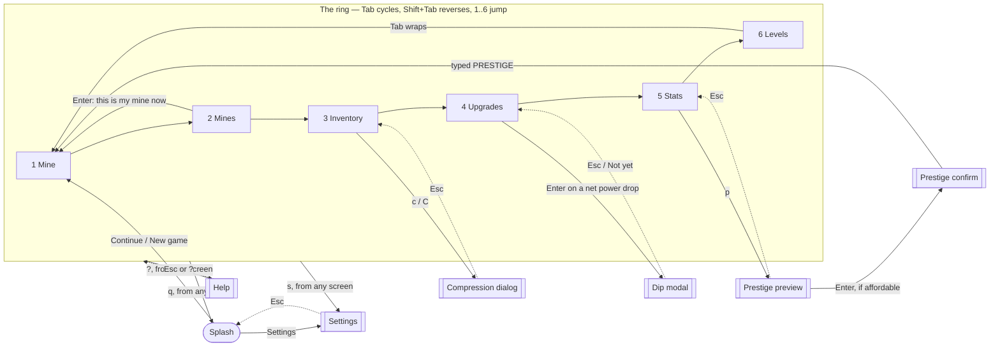
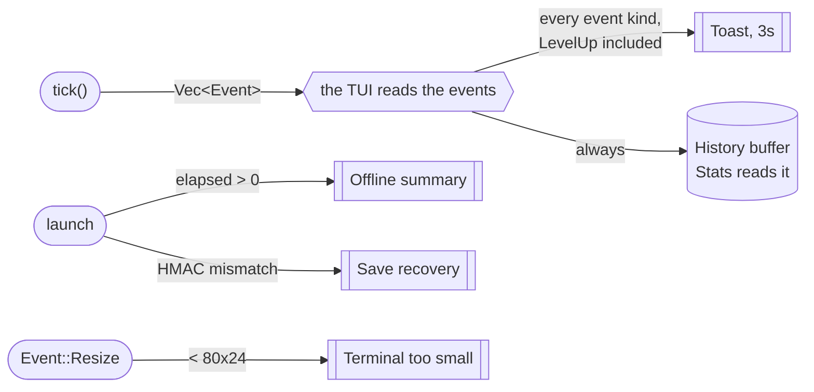
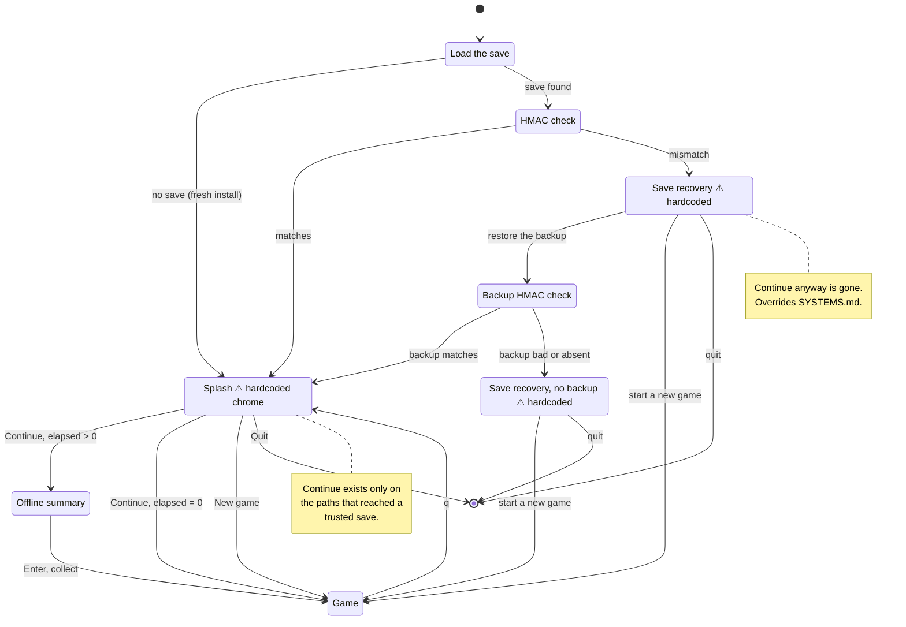
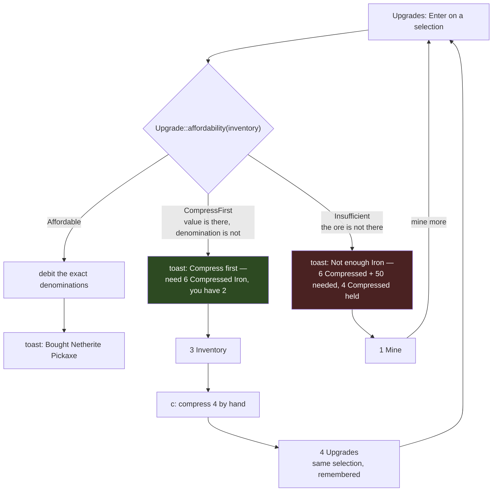

# Skylode - UI specification

What is on screen, and the constraint that gives it that shape. This is the
front-end's specification: [`skylode-tui`](../crates/skylode-tui) renders core
state and forwards input, and every frame below is drawn at the reference terminal
size and counted.

Three documents divide the work, and each fact lives in exactly one of them:

| Document | Job |
| --- | --- |
| [DECISIONS.md](DECISIONS.md) | the **verdict** and its short reason — an append-only ledger |
| **this file** | **what is on screen**, and the constraint that made it that shape |
| [DESIGN.md](DESIGN.md) | the concept and the loop; its screen list links here |

For the rules the screens render, see [MECHANICS.md](MECHANICS.md); for the save,
input and tech stack, [SYSTEMS.md](SYSTEMS.md).

## 1. The reference terminal, and the rule that follows

**80x24 minimum, adapting upward.** Every frame in this document is exactly 80
columns by 24 rows, counted rather than estimated — a wireframe that has not been
counted cannot answer the one question it exists to answer.

**The grid is fixed, the chrome flexes.** Mine size is a game constant per mine,
decoupled from terminal size, so the window cannot change balance
([MECHANICS.md](MECHANICS.md#mine-size)). The mine grid is therefore a
`Constraint::Length(42)` — 20 cells x 2 columns plus borders — and **never** a
`Percentage`. All adaptivity belongs to the panels around it.

```txt
  20x10 mine  =  20 cells x 2 chars  =  40 cols
  + Block borders                    =  42 cols
  80 - 42                            =  38 cols for the side panel
```

A mine smaller than 20x10 does not grow its panel; it leaves the reserved area
partly empty. That empty margin is the proof the largest mine fits without
re-laying anything out.

## 2. The states

**Seventeen states plus a cross-cutting toast component.** Six are the tab ring;
eleven are overlays, split by who opens them.

### 2.1 The ring

| # | Screen | Responsibility |
| --- | --- | --- |
| 1 | **Mine** | active mining: the grid, the target, break progress |
| 2 | **Mines** | pick world and mine; move the richness dial |
| 3 | **Inventory** | ores held, in both denominations; compress / decompress |
| 4 | **Upgrades** | pickaxe roadmap, enchant tracks, both mine tracks |
| 5 | **Stats** | progression, prestige, run progress, event history |
| 6 | **Levels** | the level roadmap, and what each level grants |

### 2.2 The overlays

**Pulled** — the player opens them, so they can be dismissed and reopened:
Splash, Settings, Help, the compression dialog, the dip modal, the prestige
preview, the prestige confirm.

**Pushed** — the game raises them; there is no key that leads here: the offline
summary, terminal-too-small, and save recovery.

**Toasts** are neither: an ephemeral overlay (2-3 s) drawn with `Clear` over the
current screen, costing **zero permanent layout rows**, with the full history in
Stats. One buffer, two renderings.

### 2.3 The bootstrap rule

Config lives inside the save, and the save may be missing or untrusted. Therefore:

> **Splash, terminal-too-small and save recovery render with hardcoded defaults,
> never with config.**

Reading settings out of a save that has not passed its HMAC is reading data the
game has just decided not to trust. The Splash's *chrome* is hardcoded; the save
summary line under its menu is data, because by then the save has either passed or
been routed to recovery.

## 3. Reading the frames

ASCII cannot show colour or reverse video, so the frames encode them. This legend
is load-bearing: the frames are unreadable without it.

| In the wireframe   | In the terminal                                                                                                                                                                                                                                |
| ------------------ | ---------------------------------------------------------------------------------------------------------------------------------------------------------------------------------------------------------------------------------------------- |
| `[1 Mine]`         | the selected `Tabs` item — reverse video, not brackets                                                                                                                                                                                         |
| `▸`  at line start | the `ListState` / `TableState` selection — reverse video on the whole row                                                                                                                                                                      |
| `##`               | an intact **common** cell. In the terminal it is a **solid two-column swatch** of that block's colour and carries no glyph at all — see §5.8                                                                                                    |
| `▓▓`               | an intact **value** cell — the same swatch, in the value block's colour, **plus a stipple** (`░░`). The stipple is unconditional, in both colour modes: it is what makes common-vs-value survive a palette the terminal cannot render (§5.8)   |
| `::`               | the **targeted** cell, mid-break — the crack glyph over the swatch, `··` → `::` → `##` as it fills (§5.8)                                                                                                                                       |
| (two spaces)       | a broken cell: **no swatch, no glyph**, the terminal's own background                                                                                                                                                                          |
| `█░` in a gauge    | `LineGauge`'s filled / unfilled halves                                                                                                                                                                                                         |
| `✓ ✗ —`            | affordable / cannot afford / not applicable                                                                                                                                                                                                    |
| `~`                | **the third state**: you hold the value, not the denomination — _compress first_                                                                                                                                                               |
| `●`                | where you are now on a roadmap (owned, current)                                                                                                                                                                                                |

The ruler line (`0---------1---------`...) is part of the document, not the UI. It
is there so the next edit can be **checked** rather than eyeballed.

**The invariant every frame satisfies**, and which any edit must preserve: 24 lines;
every bordered line exactly 80 columns wide measured in code points; borders
vertically aligned. The scripts that check it live beside the working document, not
here.

## 4. The mine cell

The single most repeated element in the game, and the one that carries the most
information per character.

### 4.1 A cell is a background swatch, not two coloured characters

**Decided in [DECISIONS.md](DECISIONS.md).** A cell is two columns of *background*
colour. The glyph channel is then free, and carries two things that never collide:

- **the stipple `░░`** marks the mine's **value** cell, in both colour modes;
- **the crack progression `.` → `:` → `#`** marks break percentage on the
  targeted cell.

Because an intact cell carries **no glyph at all**, `#` is free to be the fullest
crack state — so [MECHANICS.md](MECHANICS.md#break-feedback)'s `.:#` ordering
stands as written. A **broken** cell is the *absence* of a swatch, which is the
maximum available contrast and needs no glyph of its own.

### 4.2 The palette — 24 entries, and the constraint is pairwise

The `Block` enum has exactly 24 variants, and `MineKind`'s twelve
`(common, value)` pairs partition them exactly: every variant is used once, with
no duplicate and no orphan. **Two mines are never on screen together**, so the
requirement is not 24 mutually distinguishable colours — it is twelve pairs with
strong internal contrast.

Hue follows Minecraft, so a material is recognised rather than learned; lightness
is the free variable, because it is the only channel that survives both a poor
terminal and colour blindness. The gate, applied **per pair** in CIELAB:
**ΔE ≥ 40 and ΔL\* ≥ 20**, with every swatch at **L\* ≥ 12** so no material
competes with the background.

| Mine | Common cell | 256 | Value cell | 256 | ΔE | 16-colour |
| --- | --- | --- | --- | --- | --- | --- |
| Stone | `Stone` | **240** #585858 | `Cobblestone` | **252** #d0d0d0 | 46 | white |
| Coal | `CoalOre` | **246** #949494 | `CoalBlock` | **235** #262626 | 46 | white |
| Iron | `IronOre` | **94** #875f00 | `IronBlock` | **223** #ffd7af | 52 | yellow |
| Gold | `GoldOre` | **130** #af5f00 | `GoldBlock` | **226** #ffff00 | 78 | yellow |
| Lapis | `LapisOre` | **20** #0000d7 | `LapisBlock` | **81** #5fd7ff | 125 | blue |
| Redstone | `RedstoneOre` | **88** #870000 | `RedstoneBlock` | **210** #ff8787 | 47 | red |
| Emerald | `EmeraldOre` | **29** #00875f | `EmeraldBlock` | **48** #00ff87 | 60 | green |
| Diamond | `DiamondOre` | **30** #008787 | `DiamondBlock` | **51** #00ffff | 45 | cyan |
| Quartz | `Netherrack` | **95** #875f5f | `QuartzOre` | **255** #eeeeee | 53 | red |
| Ancient Debris | `AncientDebris` | **137** #af875f | `NetheriteBlock` | **238** #444444 | 42 | yellow |
| Obsidian | `Obsidian` | **54** #5f0087 | `CryingObsidian` | **165** #d700ff | 52 | magenta |
| Amethyst | `Endstone` | **229** #ffffaf | `Amethyst` | **135** #af5fff | 135 | magenta |

### 4.3 The 16-colour fallback

Sixteen ANSI colours cannot carry 24 materials without collisions, so the fallback
drops to **one colour per mine** and lets the **stipple** carry the common/value
distinction. It is the same glyph as in 256-colour mode: one rendering model with a
channel switched off, not a second code path.

### 4.4 Accessibility

**The stipple is unconditional in both colour modes, and there is no dedicated
accessibility setting.** The common-vs-value distinction is what the Mine screen
exists for; making it depend on a setting would make it optional. Always on, it is
redundant at 256 colours and essential at 16 — which is what redundancy is supposed
to look like.

### 4.5 The chrome palette — a second, smaller table

Everything above is about the mine cell. The **chrome** — panel borders and titles,
the tab bar, gauges, scrollbars, footers, toasts, and the `✓ ✗ ~ ● ▸` marks — has a
separate palette, and the separation is deliberate: §4.2 answers *"what colour is
iron?"*, which has one right answer measurable against a gate, while this answers
*"what does a refusal look like?"*, whose right answer depends on a terminal the
game cannot see.

**Named ANSI colours, not indexed ones** — the reverse of §4.2, for the reason that
makes §4.2 right. There, a theme remapping a colour is a hazard, so the table names
exact indices. Here it is the point: chrome is drawn on the terminal's own
background — the same background a broken cell is — so the player's theme is the
authority on what "grey" should be, and a pinned index is the thing that could come
out illegible on a light terminal. Two things follow. The chrome needs **no
16-colour fallback**, because it never asks for more than sixteen, so §4.3 remains a
question about the grid alone. And **there is no contrast gate**, because a gate
would have to measure against a background that is not knowable from inside the
process.

| Role | What it doubles | Colour |
| --- | --- | --- |
| Accent | the cursor `▸`, panel titles, the filled half of a gauge, the scrollbar thumb, the active sub-tab, the toast border | cyan |
| Muted | borders, footers, table headers, the unfilled half of a gauge, the scrollbar track | dark grey |
| Affordable | `✓` — you can buy it; on Levels and Stats, already yours | green |
| Refused | `✗` — not enough ore, or a world still gated | red |
| Compress first | `~` — the third state of §5.3 | yellow |
| Current | `●` — where you are now on a roadmap | magenta |

`●` is magenta rather than a second green because of one row on Levels: the cursor
and the current level render adjacent as `▸●`, so it has to separate from the accent
beside it *and* from the `✓` on the reached levels above it. Titles take the accent
**plus bold**, so a title still reads as a title where the hue is dropped.

**`—` is drawn in the mark column and is deliberately absent from this table.** §5.4.2
uses it on the rows with no price to quote — a maxed track, the End's level gate — and
it stays in the terminal's default foreground. It cannot be added: the em dash is
ordinary prose across half the interface (the Stats history, the Upgrades detail pane,
the Help legend itself), and the colouring pass reads whole finished rows, so one
entry here would tint every one of those. That is the right answer rather than a gap.
`✓ ~ ✗` say what the ore can buy; `—` says the question was never asked on this row,
and an absence of an answer has no hue.

**Every entry doubles a glyph that is already there.** §4.4's rule is not relaxed
for chrome: the colour of a mark is *derived from* the mark, in one place, so it can
neither contradict its glyph nor appear without one. Colour is never the only thing
carrying an answer — remove it entirely and the screen still says everything it said.

**Three roles are applied to text as well as to a glyph, and they add no colours.**
The table above is closed; what follows re-uses it.

- **A price takes the hue of its own affordability mark** (§5.4.3). The colour is read
  from the same table by the same lookup that colours the `✓ ~ ✗` in the pane, so it is
  still *derived from* a glyph and still cannot appear without one — a `—` row and an
  already-owned one yield nothing and stay in the default foreground. What is relaxed is
  the *distance*: the glyph doubling it is elsewhere in the pane rather than in the same
  run of characters. The mark scan runs after the tint, so a tinted row's own marks keep
  their colours and a tint can never quietly recolour an answer.
- **A block's label is muted**, which is the role's existing job — table headers — read
  one level down: `Cost` introduces the answer and is not it.
- **A toast is drawn in the tone of its news**: accent for neutral, and the three
  verdict colours for a purchase, a shortage and a compress-first. A toast has no glyph
  to double, so here the hue doubles the *sentence*, which still carries the answer
  alone. What it buys is the three seconds: a refusal and a purchase were the same
  picture, and the refusal is the one that has to be read before it expires.

The **blast colour** for §5.9's proc flash is not in this table and remains open: it
has to read as "not a material" against all 24 swatches, which is a judgement best
made against a running grid.

## 5. The screens

### 5.1 Mine

```text
0---------1---------2---------3---------4---------5---------6---------7---------
 1 Mine │ 2 Mines │ 3 Inventory │ 4 Upgrades │ 5 Stats │ [6 Levels]
┌─ Haul · Iron Mine ───────────────────────────────────────────────────────────┐
│  Iron   480 Raw   2 Compressed        value 680 Iron                         │
└──────────────────────────────────────────────────────────────────────────────┘
┌─ Iron Mine ────────────────────────────┐┌─ Pickaxe ──────────────────────────┐
│                                        ││ Diamond Pickaxe  Efficiency IV     │
│        ######▓▓####  ##########        ││ Power  25.0   ×1.5 boost → 37.5    │
│        ##  ##########▓▓####  ##        ││ Fortune III   drops ×4             │
│        ######::################        ││ Ench   Exp II   Jck I   Exc I      │
│        ####  ##▓▓########  ####        │└────────────────────────────────────┘
│        ############▓▓##########        │┌─ Mine ─────────────────────────────┐
│          ####▓▓##############          ││ Iron Mine             Overworld    │
│        ########▓▓##  ##########        ││ Blocks    76 / 84                  │
│                                        ││ Size      12 x 7   (level 5)       │
│                                        ││ Richness  level 0 / 9   value 10%  │
└────────────────────────────────────────┘└────────────────────────────────────┘
 Break  61%  Iron Block  ████████████████████████░░░░░░░░░░░░░░░░░░░░░░░░░░░░░
 XP  Lv 23   1 240 / 2 300  ███████████░░░░░░░░░░░░░░░░░░░░░░░░░░░░░░░░░░░░░░░
 Boost  12s  ×1.50          ██████████████████████████████████░░░░░░░░░░░░░░░░

                     ┌──────────────────────────────────────┐
                     │  Excavator!  +1 Compressed Iron      │
                     └──────────────────────────────────────┘
 Space  mine     Tab  next screen     ?  help
```

**Constraints.** The grid is `Length(42)` and never a percentage (§1). The status
strip uses `LineGauge`, not `Gauge`: a `Gauge` needs a `Block` and costs 3 rows
each, so four readouts would need 12 rows and the screen would not fit. The **Haul**
strip is a fixed three-row box on every mine — a two-material mine still fits on one
content line, so the box never changes height and the grid below it never moves.

The `Boost` gauge is the **temporary Redstone boost**, which has a countdown; the
permanent **Haste** enchant does not and is not shown here. The Pickaxe panel shows
*derived numbers* — power, the boost product, the Fortune multiplier — with only
non-zero special enchants listed; the full roster belongs to Upgrades.

**Core reads — all of them exist, and this screen is wired to them.**
`Mine::get_target()`, `Mine::break_ratio()`, `Mine::value_weight_percent()`,
`Mine::get_size_level()` and `Mine::get_richness_level()` supply the grid and both
right-hand panels; `Block::name()` labels the Break gauge, read off the targeted
cell rather than stored beside it; `Pickaxe::mining_power()` and
`fortune_multiplier()` supply the Pickaxe panel; `MineKind::common_material()` /
`value_material()` plus `Inventory::count()` supply the Haul strip. The boost
product reads `GameState::active_boost()`, which the tick will keep counting down.

**Two states the wireframe above does not draw, because a level-23 save does not
have them.** Before the first swing there is no target, and until a charge is fired
there is no boost — so both gauges read `—` on an empty bar rather than `0%` or
`0s`, which would assert a block part-broken and a countdown running. The Pickaxe
panel likewise drops the `×1.0 boost → 25.0` clause when nothing multiplies, and
prints `Fortune —` and `Ench —` rather than a level of zero.

**One departure from the frame above, forced by real numbers.** The composite
`value 680 Iron` is flush right, not eight spaces along. The frame was counted at
`480 Raw`; at the holdings a run reaches, a fixed gap plus a material name printed
twice overflows the fixed-width box — the Ancient Debris mine spends 28 of 78
columns on its own name — and a three-row box cannot wrap. On a **two-material**
mine the composite is dropped entirely and the two segments are separated by `·`:
there is no total of 540 Netherrack and 73 Quartz, and inventing one would invent an
exchange rate the game does not have.

### 5.2 Mines

```text
0---------1---------2---------3---------4---------5---------6---------7---------
 1 Mine │ [2 Mines] │ 3 Inventory │ 4 Upgrades │ 5 Stats       Prestige II  ×1.2
┌─ Mines ────────────────────────────┐┌─ Obsidian Mine ────────────────────────┐
│ Overworld                ✓         ││ Obsidian  +  Crying Obsidian           │
│   Stone          20 x 10   R 9     ││                                        │
│   Coal            18 x 9   R 7     ││ World      Nether        Lv 15  ✓      │
│   Iron            12 x 7   R 0     ││ Gate       Diamond pickaxe      ✓      │
│   Gold            10 x 6   R 2     ││ Size       8 x 5 = 40    level 3       │
│   Lapis            8 x 5   R 1     ││ Blocks     31 / 40                     │
│   Redstone         6 x 4   R 0     ││ Richness   level 6 / 9                 │
│   Emerald          6 x 4   R 0     ││                                        │
│   Diamond          8 x 5   R 1     ││ Dial   ◄ ██████████████░░░░░░░░ ►      │
│ Nether                   Lv 15  ✓  ││        Crying 64%   Obsidian 36%       │
│   Quartz           8 x 5   R 3     ││                                        │
│   Ancient Debris   6 x 4   R 0     ││        free, reversible, any time      │
│ ▸ Obsidian         8 x 5   R 6     ││                                        │
│ End                      Lv 30  ✗  ││ The enhancement past Netherite eats    │
│   End           locked   Netherite ││ both of them, so this dial has an      │
│                                    ││ optimum, not a maximum.                │
│                                    ││                                        │
│                                    ││ ← →  move the dial                     │
│                                    ││                                        │
│                                    ││                                        │
└────────────────────────────────────┘└────────────────────────────────────────┘
 ↑↓  select     Enter  mine it     ← →  richness dial     Tab  next screen
```

**Constraints.** Fifteen rows for twelve mines plus three world headers fit in 20:
this is the one list screen that never needs a `Scrollbar` at 80x24.

**The dial is one control, drawn identically on all twelve mines** — slider,
arrows, rung, and the split beneath it. The wireframe above reserved the slider for
the three whose two cells drop *different* materials (Quartz, Obsidian, End) and
replaced it with a flat readout elsewhere; see the departures below for why that
did not survive. The dial reads `10 + 9 x setting` percent — the real
`value_weight` formula, so level 9 is 91% and never 100%.

**The Obsidian pane says the dial has an *optimum*, not a maximum**, because the
post-Netherite enhancement consumes both materials in a ratio. It is the one dial in
the game a player can set too high.

**Core reads — all of them exist, and this screen is wired to them.**
`MineKind::lock(level, tier)` answers *why* a mine is shut with a `MineLock`
carrying its two axes apart (`missing_level`, `missing_tier`), which is what lets
the list print `Lv 30` on a world header and `locked   Netherite` on the row below
without saying either twice. `MineKind::ALL` lists the twelve — an enum cannot
enumerate itself, and the front-end has to draw all of them.
`GameState::select_mine` and `set_mine_richness_setting` are the two the keys call.

**Two of those reads did not exist before this screen was wired**, and both come
from the same fact: **a run creates its mines lazily**, on first entry, so eleven
of the twelve have no `Mine` behind them at all.

- `set_mine_richness_setting(kind, setting)` takes the mine by name. The old
  `set_richness_setting` moved the dial of the mine the player is *standing in*, and
  the frame above dials Obsidian from the Iron mine — which is the normal case, not
  an edge one. For a mine never entered it answers from a ceiling of 0 **without
  building a grid**: a refusal that spent a grid's worth of draws would shift every
  later draw in the run.
- `Mine::size_for_level(level)` and `Mine::value_weight_percent_for(setting)` are
  pure table lookups, so a never-entered mine is drawn as the one it *will* be
  created at rather than as a blank.

#### 5.2.1 Four departures from this frame

Recorded when the screen was wired, each a decision rather than a bug. The frame
above is left as drawn.

- **The standing mine is marked `●`.** The frame has one mark, `▸`, for the cursor —
  so the moment the cursor moves after entering a mine, the screen stops saying
  where the player is. The Upgrades ladder already carries the same pair and the
  chrome palette already owns both glyphs. **The cursor wins the column** when they
  coincide: `▸` is what just moved; `●` is a standing fact the player can recover by
  walking the list.
- **The slider is drawn on all twelve mines, not three.** The frame removes the
  whole dial block on the nine same-material mines, and its *argument* was sound —
  there is no trade to picture when the value cell is nine of the same ore. But that
  argument is about the **stakes**, not the **control**. The dial there still decides
  what share of the grid is the dense block, and the arrows still move it: raising
  the richness *ceiling* and sliding the *dial* are separate actions (§8), and only
  the dial turns the purchase into dense cells, so a flat readout would have left
  nine mines' richness track unspendable. A slider that appears on a quarter of the
  screens is also one the player has to learn twice. **What varies per mine is the
  sentence under it, not the widget** — "this one has an optimum, not a maximum" on
  Obsidian, "pure gain here" on the nine, nothing on Quartz and the End where the
  split already says it in numbers.
- **The split under the bar is justified, and names the two *blocks*.** The frame
  writes `Crying 64%   Obsidian 36%` at a fixed gap, abbreviating a block actually
  named *Crying Obsidian*; spelled out at the frame's indent the row runs past the
  pane, so the two shares now sit at the pane's two edges. Same departure §5.1
  records for the Haul strip, same cause. Blocks rather than materials for the same
  reason the line below applies to the header: on nine mines the two materials are
  the same word, and the row would read `Iron 10%   Iron 90%`.
- **The pane's first line names the two *blocks* too.** On the two-material mines
  that is the frame's own line either way (`Obsidian  +  Crying Obsidian`); on the
  nine others the materials are equal, so the frame's rule would print
  `Stone  +  Stone`. The blocks never coincide, and they are the more useful pair:
  `Iron Ore  +  Iron Block`, the second worth nine of the first.
- **The dial prints its rung after the right arrow** (`3/6`). The bar is filled by
  the value-weight *curve*, not by the setting, and the dial steps between ten
  discrete rungs bounded by a ceiling the player buys — so "3 of the 6 I own" is what
  they consult before buying a seventh, and no bar can say it.

### 5.3 Inventory

```text
0---------1---------2---------3---------4---------5---------6---------7---------
 1 Mine │ 2 Mines │ [3 Inventory] │ 4 Upgrades │ 5 Stats       Prestige II  ×1.2
┌─ Inventory ──────────────────────────────────┐┌─ Compress ───────────────────┐
│   Material          Compressed         Raw   ││ Iron                         │
│   Stone                     12       4 508   ││                              │
│   Coal                       3         871   ││ Held     2 Compressed        │
│ ▸ Iron                       2         480   ││          480 Raw             │
│   Gold                       0         312   ││ Value    680 Iron            │
│   Lapis                      1          44   ││                              │
│   Redstone                   0         128   ││ c   compress  100 raw → 1    │
│   Emerald                    0          17   ││ C   decompress  1 → 100 raw  │
│   Diamond                    0           9   ││                              │
│   Netherrack                 2         340   ││ Compressible now:  4         │
│   Quartz                     0          73   ││                              │
│   Ancient Debris             4          60   ││ Efficiency V wants           │
│   Obsidian                   0          21   ││ 6 Compressed + 50.           │
│   Crying Obsidian            0           2   ││ You hold the value, not      │
│   End Stone                  0           0   ││ the denomination.            │
│   Amethyst                   0          38   ││                              │
│                                              ││ Free and lossless both ways. │
│                                              ││                              │
│                                              ││                              │
│                                              ││                              │
└──────────────────────────────────────────────┘└──────────────────────────────┘
 ↑↓  select     c  compress     C  decompress     Tab  next screen
```

**Constraints.** Sixteen rows of table (15 materials plus a header) fit in 20 only
because the material list is closed at 15 and numbers are exact-with-separators
rather than columns of `1.23M`.

**The frame is drawn mid-refusal, on purpose.** Iron reads 680 in value and the
upgrade costs 650, and the player still cannot buy it: costs are paid in the
denomination they are quoted in. The panel therefore names the *missing
denomination* and shows `Compressible now`, because a screen that only said "you
cannot afford this" would be lying — the player can afford it.

**Core reads.** `Inventory::raw_value(material)` exists. Which of the two refusals
applies is the three-state query in §5.4.

#### 5.3.1 Three departures from this frame

Recorded when the screen was wired. The frame above is left as drawn.

- **The refusal block is absent unless something was actually refused.** The frame is
  drawn mid-refusal on purpose, and that state is only reachable from `Enter` on the
  Upgrades screen — so on a run where nothing has been refused, the four lines from
  `Efficiency V wants` down are simply not there. Printing them regardless would have
  the panel invent a refusal that never happened, which is the same class of lie the
  panel exists to avoid. Everything above them is unconditional: the counts, the
  value, `Compressible now`, and the two key legends.
- **The table lists all fifteen materials at zero, and does not shrink.** Not visible
  in the frame, which is drawn at level 23, but it is the rule the projection had to
  choose: an inventory is a *sparse* map, so listing what is held would make rows
  appear and vanish as the player spends. A row reading `0` is information — the
  player has none of a material that exists — so the table walks the material list and
  reads counts off it.
- **`c` on a pile with nothing to convert toasts instead of opening the dialog.**
  §6.6 specifies the dialog and not what happens when its maximum is zero. A modal the
  player can only cancel is a keypress spent on nothing, and the refusal is one they
  cannot otherwise see: the panel does print `Compressible now: 0`, but a player who
  pressed `c` was not reading it. The toast names the shortfall — `Nothing to compress
  — 100 raw Diamond needed, 9 held`.

### 5.4 Upgrades

Three sub-tabs, because 96 rows of content do not fit in 21. Master-detail gives the
dip warning a place to be read *before* it is bought.

```text
0---------1---------2---------3---------4---------5---------6---------7---------
 1 Mine │ 2 Mines │ 3 Inventory │ [4 Upgrades] │ 5 Stats │ 6 Levels
 [Pickaxe]  Enchants  Mines                    ⇧←→  sub-tab           M  max
┌───────────────────────────────────┬──────────────────────────────────────────┐
│    Diamond Eff III               ░│ Netherite Pickaxe             tier jump  │
│ ●  Diamond Eff IV                ░│                                          │
│    Diamond Eff V              ✓  ░│ Chain    Diamond Eff V + the jump      ✓ │
│ ▸  Netherite Pickaxe          ✓  ░│ Cost     2 Compressed Diamond            │
│    Netherite Eff I            ~  ░│          + 4 Compressed Ancient Debris   │
│    Netherite Eff II           ✗  ░│          + 60 Ancient Debris             │
│    Netherite Eff III          ✗  ░│                                          │
│    Netherite Eff IV           ✗  ░│ ┌──────────────────────────────────┐     │
│    Netherite Eff V            ✗  ░│ │ Power  34.0 → 9.0                │     │
│    Netherite Eff VI           ✗  ░│ │ Ancient Debris  27 → 100 ticks   │     │
│    Netherite Eff VII          ✗  ░│ │ Repaid at Netherite Eff V (35.0) │     │
│    Netherite Eff VIII         ✗  █│ └──────────────────────────────────┘     │
│    Netherite Eff IX           ✗  █│                                          │
│    Netherite Eff X            ✗  █│ Unlocks  the End's Amethyst mine,        │
│    Netherite Eff XI           ✗  █│          gated behind Netherite          │
│    Netherite Eff XII          ✗  █│                                          │
│    Netherite Eff XIII         ✗  █│ Ceiling  Efficiency 5 → 15               │
│    Netherite Eff XIV          ✗  █│                                          │
│    Netherite Eff XV           ✗  █│ Enter  buy the chain   (confirms: dip)   │
└───────────────────────────────────┴──────────────────────────────────────────┘
 ↑↓  select     Enter  buy to here     M  buy max     Tab  next screen
```

**The Pickaxe sub-tab is a roadmap, not a menu, and this is a constraint from the
core.** `Pickaxe::upgrade` is a **single linear step** — Efficiency up to the tier's
cap, then reset to 0 and advance a tier — so **no rung can be skipped**. The mark
column is therefore **cumulative reachability**: `✓`/`~`/`✗` mean "reachable now,
buying every rung from here through this one".

**The `✓` region is always a contiguous prefix from `●`, never a hole**, because
adding a cost cannot make an unaffordable chain affordable. The column can read
`✓✓ ~ ✗✗✗` and nothing else. `Enter` buys the chain up to the cursor; `M` buys to
the last `✓`; preview is free on any rung.

**The dip is stated in ticks per block, not only in power**, because `34.0 → 9.0` is
a number a player cannot feel. The reference block is **the one being mined**, not a
fixed illustration.

| Sub-tab      | Rows                                                  | Fits 19?                       |
| ------------ | ----------------------------------------------------- | ------------------------------ |
| **Pickaxe**  | one ladder, 5 tiers × Eff 0..5 + Netherite to 15 ≈ 46 | scrolls (`Scrollbar`, `░`/`█`) |
| **Enchants** | one row per enchant — 6 tracks, each at its frontier  | **fits**, 13 spare (§5.5.1)    |
| **Mines**    | 12 mines × 2 tracks = 24 frontiers                    | scrolls, 18 + header (§5.5.2)  |

#### 5.4.1 Enchants

```text
0---------1---------2---------3---------4---------5---------6---------7---------
 1 Mine │ 2 Mines │ 3 Inventory │ [4 Upgrades] │ 5 Stats │ 6 Levels
  Pickaxe  [Enchants]  Mines                   ⇧←→  sub-tab           M  max
┌───────────────────────────────────┬──────────────────────────────────────────┐
│   Enchant     Level     Cap       │Explosive                  level II       │
│                                   │                                          │
│   Fortune     III → IV  10  ✓     │Effect   clears a 3x3 square on a         │
│ ▸ Explosive   II → III  6   ✓     │         proc, centred on the cell        │
│   Jackhammer  I → II    6   ~     │                                          │
│   Nuke        0 → I     6   ✗     │Next     III — still 3x3. The square      │
│   Excavator   I → II    6   ✗     │         grows to 5x5 at IV, 7x7 at       │
│   Haste       0 → I     6   ✗     │         VII.                             │
│                                   │                                          │
│                                   │Cost     3 Compressed Quartz              │
│                                   │         + 40 Redstone            ✓       │
│                                   │                                          │
│                                   │Cap      6 — the Nether's, and one        │
│                                   │         number for all five              │
│                                   │         specials. Overworld 3,           │
│                                   │         End 10.                          │
│                                   │                                          │
│                                   │Every level also procs more often.        │
│                                   │Enter  buy one level                      │
└───────────────────────────────────┴──────────────────────────────────────────┘
 ↑↓  select     Enter  buy one level     M  buy to cap     Tab  next screen
```

**Six tracks, and the marks here are *independent*** — not the contiguous prefix the
Pickaxe ladder proves. Each track is paid in its own materials, so a cheaper track
really can be unaffordable while a dearer one is not. Same three glyphs, two
meanings; the sub-tab is what keeps them apart.

**The `Cap` column is a property of the world, not of the enchant.** All six
tracks share one number — 3 / 6 / 10 by world (`World::enchant_cap`) — and
Efficiency is absent entirely, because it is capped by the pickaxe tier and lives on
the ladder.

Fortune is one of the six. This section used to read *"while Fortune's 10 is its
own"*, which predates the amendment in
[DECISIONS.md](DECISIONS.md) rows 31 and 50: the ceiling of 10 stands, but it is now
reached in three steps rather than one, so that no lever in the game is maxable at
level 1. `EnchantType::max_level` implements the amendment.

**The detail pane must name band boundaries.** `explosive_radius` is
`1 + min((level - 1) / 3, 2)`, so the square is 3x3 at I-III, 5x5 at IV-VI and 7x7
from VII: at II → III it does **not** grow, and a pane printing `5x5` there would
promise a reward the core does not pay. The front-end asks
`EnchantType::explosive_side` rather than transcribing that formula — it held two
copies of it, and this paragraph is the argument against holding any.

#### 5.4.2 Mines

```text
0---------1---------2---------3---------4---------5---------6---------7---------
 1 Mine │ 2 Mines │ 3 Inventory │ [4 Upgrades] │ 5 Stats │ 6 Levels
  Pickaxe   Enchants  [Mines]                  ⇧←→  sub-tab           M  max
┌───────────────────────────────────┬──────────────────────────────────────────┐
│   Mine           Track    Next    │Obsidian Mine — richness                  │
│   Gold           Size     12x7  ~░│                                          │
│   Gold           Richness 3     ~░│Ceiling   level 6 → 7                     │
│   Lapis          Size     10x6  ✗░│Dial      free, on the Mines screen       │
│   Lapis          Richness 2     ✗░│                                          │
│   Redstone       Size     8x5   ✓█│At 7      Crying Obsidian 73%             │
│   Redstone       Richness 1     ✓█│          Obsidian 27%                    │
│   Emerald        Size     8x5   ✗█│                                          │
│   Emerald        Richness 1     ✗█│Cost      2 Compressed Obsidian           │
│   Diamond        Size     10x6  ✗█│          + 40 Crying Obsidian            │
│   Diamond        Richness 2     ✗█│                                          │
│   Quartz         Size     10x6  ✗█│You hold  0 Compressed Obsidian, 21       │
│   Quartz         Richness 4     ✗█│          raw · 2 Crying Obsidian  ✗      │
│   Ancient Debris Size     8x5   ✓█│                                          │
│   Ancient Debris Richness 1     ✓█│This buys the ceiling only. The           │
│   Obsidian       Size     10x6  ✗█│dial slides anywhere at or below          │
│ ▸ Obsidian       Richness 7     ✗█│it, free and reversible, on the           │
│   End            Size     Lv 30 —█│Mines screen.                             │
│   End            Richness Lv 30 —█│Enter  buy the next level                 │
└───────────────────────────────────┴──────────────────────────────────────────┘
 ↑↓  select     Enter  buy one level     M  buy to cap     Tab  next screen
```

**The mine name repeats on both of its rows**, because a scroll window can open on a
richness row whose mine name has gone off the top. Every row must be readable alone,
which is the only state a scrolled row is ever in.

**This sub-tab buys the richness *ceiling*; the *dial* is on the Mines screen.**
Richness is the only word in the game that appears next to a price *and* next to a
free cursor, and this is the one place both senses are on screen at once — hence four
lines of detail pane spent refusing the conflation.

**The End's rows are drawn locked with the reason** (`Lv 30`), not hidden: its gate
is a level, not a price, so the affordability mark has nothing to say.

#### 5.4.3 Recorded departures from these three frames

Recorded when the screen was wired. The frames above are left as drawn.

- **A mine this run has never entered refuses its upgrades**, and its detail pane says
  so instead of quoting a price. Creating a mine draws its whole grid from the run's
  RNG, and the draw order is a save-compatibility contract — so pricing an unvisited
  mine's *next* level (which is knowable: the curve is keyed by the level, and it is 0)
  is free, while *buying* one would have to build a grid the player never asked for and
  shift every later draw in the run. The list row still prints what the level would
  buy; only the pane and the purchase refuse, and both name `2 Mines` as the fix.
- **The `Chain` line counts rungs rather than naming them.** The frame writes
  `Chain  Diamond Eff V + the jump`, which is a sentence for a chain of exactly two;
  `M` can aim at nine. The pane prints `2 rungs` and the cost lines below it already
  name every material. The §6.7 modal keeps the frame's sentence at length two, since
  there it is the whole content of the decision, and falls back to a count past that.
- **Three sentences the frames print unconditionally are conditional.** §5.4.1's
  *"Every level also procs more often"* is false for Fortune and Haste —
  `EnchantType::proc_permille` is `0` for both, they are permanent multipliers — so
  each names the number it actually moves. §5.4.2's `At 7` block is absent on a maxed
  track, where there is no next level to describe. And the `Enter  buy …` line inside
  each pane is dropped: it repeats the footer one row below it.
- **`You hold` is two lines per material, not one.** The frame's
  `0 Compressed Obsidian, 21 raw · 2 Crying Obsidian` is 35 columns against the 31 a
  labelled block leaves in a 42-column pane, so it would be cut off exactly where the
  number the player came to read sits. The name goes on its own line, the two
  denominations under it.
- **The columns are measured, and the gap between them is one space.** The frames are
  drawn with fixed two-space gaps; the widest real Mines row (`Ancient Debris` ·
  `Richness` · a size) then fills the pane exactly and pushes the mark column off the
  right edge. Widths are measured over the header and every row, which also means the
  Enchants table's `Level` column is narrow on a fresh run and wide at the cap.
- **One blank column sits between the mark and the scrollbar, on all three sub-tabs.**
  The three frames above disagree with each other: §5.4 leaves two columns there, §5.4.2
  leaves none, and neither is reachable. Two does not fit — the widest Mines row is 32
  columns against the 34 the pane has once the bar column is reserved, so a two-column
  gutter plus the mark leaves 31 and pushes the mark off the pane, which is the same
  budget the bullet above already spent. None is what was built first, and it draws `✗█`,
  where the mark reads as part of the thumb. One is the only value all three sub-tabs
  survive.
- **The scrollbar's column is reserved on every sub-tab and drawn only where the list
  overflows.** Reserving it only when needed made the whole mark column shift one column
  left as the player moved from Pickaxe (46 rows, scrolls) to Enchants (6 rows, fits) —
  a column of glyphs that jumps on a sub-tab change reads as a redraw fault rather than
  as a layout. Enchants therefore ends in two blank columns rather than one, and no
  thumb is drawn in the second.
- **A price is drawn in the colour of its own affordability mark**, green, yellow or
  red, and the `Cost` / `Chain` / `Effect` labels beside it are muted. §4.5 explains why
  this is not a new entry in the chrome table.
- **The mark and the colour sit on each *line* of a price, not on the block.** The block
  was verdicted once, from `economy::affordability` over the whole `Cost` — and that
  query answers `Insufficient` on a mixed shortage by design, so a two-material price
  short of a single ore was painted red end to end and said which *price* was refused
  without ever saying which *material* refused it. Every line now carries its own
  `✓ ~ ✗`, and a line that is not affordable is followed by an untinted
  `hold 2 — short 38`. The wealth question is asked per **material** and the shape
  question per **item**, so a `Compressed` row and a raw row of the same ore can never
  disagree over one pile.
- **`You hold` is gone from the Mines pane**, and no pane gained it. §5.4.2 drew it and
  §5.4 / §5.4.1 did not, which was three frames drawn on different days rather than a
  rule; the shortfall line above says the same thing on the row it is about, in one
  line instead of two, and now says it on all three sub-tabs.
- **The pickaxe chain's price is summed per material *and denomination*, and clamped.**
  One `CostLine` per rung is what `upgrade::chain_affordability` walks, and at forty-five
  rungs that block alone was longer than the pane — it pushed the dip box, `Unlocks` and
  `Ceiling` off the bottom. The rule those two carry is about the **re-split**: adding
  `30 raw` to `80 raw` and quoting `1 Compressed + 10` names a payment the player is
  never asked to make. Summing *inside* a denomination invents nothing — `economy::pay`
  is strict per denomination and converts nothing, and no ore enters the purse between
  two rungs, so the multiset of demands the walk makes is exactly this sum. The verdict
  is still the core's: the `Chain` line reads `chain_affordability`, the same answer the
  list column shows. Where the two can differ is *which* refusal they name — the walk
  stops at the first rung that fails, the lines report every material independently —
  and the lines are the richer answer. A price still too long for the pane ends in
  `…+ N more lines`, counting lines rather than rungs, since rungs are no longer what
  was cut.
- **The `Power` block is drawn on every rung; the box art stays the dip's.** The pane
  quoted power only under `is_dip()`, so the one number a speed upgrade is bought for
  was printed only when it went the wrong way. An ordinary rung now gets a labelled
  `Power  36.0 → 41.0` and a `Ticks` line naming the reference block; the `┌─…─┐` frame
  is kept for a regression alone, because a warning drawn on all forty-six rungs stops
  being read as one — and its five rows are what the price block above needs back on a
  long chain. The block is named *inside* the `Ticks` value rather than used as a label:
  `Crying Obsidian` is fifteen columns against the nine a label gets.
- **`Next` became `At <level>`, and states numbers instead of a sentence.** §5.4.1's
  prose left the player to work out whether *this* level was the third; `square 3x3 →
  3x3` says it. Each track names the stat it actually moves — `drops`, `square`, `row`,
  `blast`, `yield`, `speed`/`power` — and the four that roll a die add `procs`, quoted as
  a percentage. Permille is the core's unit because the roll is an integer comparison a
  save resumes; it is not a unit anyone reads. One prose line survives, on Explosive
  alone and only where the square stands still.
- **`At <level>` on the Mines pane states both sides too**, and the `Cap` column reads
  `3/10`. A share or a grid quoted only *after* leaves the player to remember what they
  are moving from, and both numbers are free — the two tracks are pure functions of a
  level. The `Cap` cell showed the world's ceiling as if it were the game's, and the two
  call for opposite decisions: stop buying, or go open the Nether. The pane's `Cap` block
  spells the rest out — the world in force, the two the player is not in, and that
  Efficiency is capped by the tier instead. It is the one prose block on this screen
  whose line breaks move with the run, so it is wrapped rather than hand-broken.

### 5.5 Stats

```text
0---------1---------2---------3---------4---------5---------6---------7---------
 1 Mine │ 2 Mines │ 3 Inventory │ 4 Upgrades │ [5 Stats]       Prestige II  ×1.2
┌─ Progression ──────────────┐┌─ This run ─────────────────────────────────────┐
│ Mining level    23 / 50    ││ ✓  Break your first block                      │
│ XP        1 240 / 2 300    ││ ✓  Reach the Nether             Lv 15          │
│                            ││ ✓  Diamond pickaxe                             │
│ Nether     Lv 15      ✓    ││ ▸  Reach the End          Lv 30    23/30       │
│ End        Lv 30      ✗    ││    Netherite pickaxe                           │
│                            ││    Instamine Obsidian                          │
│ Prestige   rank II         ││    Max out a mine       Stone 20x10 R9  ✓      │
│ Multiplier ×1.20           ││    Reach mining level 50           23/50       │
│ Next rank  ×1.30           │└────────────────────────────────────────────────┘
│ Cost     6 540 Amethyst    │┌─ History ──────────────────────────────────────┐
│ Held         0 Amethyst    ││ 20:14  Excavator!  +1 Compressed Iron          │
│                            ││ 20:13  Explosive — 9 blocks cleared            │
│ Blocks broken   418 297    ││ 20:13  Mine refilled                           │
│ Playtime        14h 22m    ││ 20:11  Level 23 — +115 Quartz, +80 A. Debris   │
│ This run         3h 07m    ││ 20:09  Compress first: need 6 Compressed Iron  │
│                            ││ 20:04  Jackhammer — 8 blocks                   │
│                            ││ 20:02  Welcome back — 6h away, +12 480 Iron    │
│                            ││ 19:58  Bought Diamond Pickaxe Efficiency IV    │
│                            ││ 19:51  Richness dial: Obsidian 46% → 64%       │
│                            ││ 19:44  Mine refilled                           │
└────────────────────────────┘└────────────────────────────────────────────────┘
 ↑↓  scroll history     p  prestige     Tab  next screen     ?  help
```

**`This run` is run progress, not achievements.** Every entry is a pure predicate
over `GameState`, costing the save nothing — and it **resets with a prestige**,
which is honest because that is what the panel now claims to be. A panel called
"Milestones" that un-ticks is broken; one called "This run" that un-ticks is working.
**The save schema therefore carries no "ever achieved" bitset.**

**The history is the toast log, verbatim** — one buffer, two renderings, the toast
being its tail with a 3 s window.

**Core reads, and this one changes a signature.** Nothing in core emits events, and a
front-end that diffs state between frames is guessing: it would miss two procs in one
tick and could never tell an Excavator's `+1 Compressed` from a compression the
player did. So:

```rust
fn tick(&mut self, input: Input) -> Vec<Event>   // phase 7
```

`Blocks broken` and `Playtime` are lifetime totals that **survive prestige**;
`This run` must not. Three counters, two lifetimes.

### 5.6 Levels

```text
0---------1---------2---------3---------4---------5---------6---------7---------
 1 Mine │ 2 Mines │ 3 Inventory │ 4 Upgrades │ 5 Stats │ [6 Levels]
┌─ Levels ─── Lv 23 · 1 240 / 2 300 XP to Lv 24 ───────────────────────────────┐
│     Lv   Grants                                                         XP   │
│  ✓ 13   +65 Lapis, +45 Gold, +19 Diamond                             1 300  ░│
│  ✓ 14   +70 Lapis, +49 Gold, +21 Diamond                             1 400  ░│
│  ✓ 15   The Nether opens, +1 charge                                  1 500  ░│
│  ✓ 16   +80 Quartz, +56 Netherrack, +24 A. Debris                    1 600  ░│
│  ✓ 17   +85 Quartz, +59 Netherrack, +25 A. Debris                    1 700  ░│
│  ✓ 18   +90 Quartz, +63 Netherrack, +27 A. Debris, +45 Emerald       1 800  █│
│  ✓ 19   +95 Quartz, +66 Netherrack, +28 A. Debris                    1 900  █│
│  ✓ 20   +100 Quartz, +70 Netherrack, +30 A. Debris, +1 charge        2 000  █│
│  ✓ 21   +105 Quartz, +73 A. Debris, +31 Obsidian, +52 Emerald        2 100  █│
│  ✓ 22   +110 Quartz, +77 A. Debris, +33 Obsidian                     2 200  █│
│ ▸● 23   +115 Quartz, +80 A. Debris, +34 Obsidian                     2 300  █│
│    24   +120 Quartz, +84 A. Debris, +36 Obsidian, +60 Emerald        2 400  █│
│    25   +125 Quartz, +87 A. Debris, +37 Obsidian, +1 charge          2 500  █│
│    26   +130 Quartz, +91 Obsidian, +39 Crying Obs.                   2 600  ░│
│    27   +135 Quartz, +94 Obsidian, +40 Crying Obs., +67 Emerald      2 700  ░│
│    28   +140 Quartz, +98 Obsidian, +42 Crying Obs.                   2 800  ░│
│    29   +145 Quartz, +101 Obsidian, +43 Crying Obs.                  2 900  ░│
│    30   The End opens, +1 charge                                     3 000  ░│
│    31   +233 End Stone, +77 Amethyst                                 3 100  ░│
└──────────────────────────────────────────────────────────────────────────────┘
 ↑↓  scroll     Home  jump to Lv 23     Tab  next screen     ?  help
```

**A roadmap with no detail pane, unlike Upgrades and Mines.** The rule was never
"lists get a detail pane" — it is "content that overflows is cut in two". Here each
level *is* one line and there is nothing to detail.

**The Block title carries the distance**, spending no row. **Two marks, not one**:
`▸` is the selection, `●` is the current level; they diverge on scroll, which is why
`Home` exists.

**The XP column is per-level, counted from zero.** Each level-up resets XP to 0, so
the column is the requirement for *that* level, matching the status bar's
`1 240 / 2 300`.

**Levels 15 and 30 grant a world and no loot.** A level-up's *payout* is exactly one
thing — loot, or a world, never both and never nothing — so those rows are visibly a
different kind of line, and need no "no loot" label. The **garnishes** are not
governed by that rule: a boost charge lands every fifth level, 15 and 30 included,
because a charge announces nothing and so dilutes nothing. Emerald, which lands every
third level, *is* loot and skips them.

**Grants are quoted as raw totals, not split into denominations** — `+115 Quartz`,
not `+1 Compressed 15 Quartz`, the form §6.4's offline summary already uses for a
gain. Three materials per row leave no width for the long form, and the strict
two-denomination rule governs **paying**, never receiving.

> The loot bundles follow the model settled in
> [MECHANICS.md](MECHANICS.md#level-up-rewards) and are **real**. The XP figures
> follow the `level × 100` curve the code currently ships, which
> [ROADMAP.md](ROADMAP.md) still lists as an open tunable — real, but provisional.

**Core reads.** `loot_for_level(n)` and `xp_for_level(n)` for **every** `n`, not
just the level that fired — a roadmap that can only show the past is a history, and
Stats already has one.

## 6. The overlays

### 6.1 Splash

```text
0---------1---------2---------3---------4---------5---------6---------7---------

                        ███████ ██   ██ ██    ██
                        ██      ██  ██   ██  ██
                        ███████ █████     ████
                             ██ ██  ██     ██
                        ███████ ██   ██    ██     L O D E

                        ┌────────────────────────────┐
                        │  ▸  Continue               │
                        │     New game               │
                        │     Settings               │
                        │     Quit                   │
                        └────────────────────────────┘

                          Lv 23  ·  Diamond Pickaxe
                          last played 3 hours ago

                                                              skylode 0.1.0
 ↑↓  select     Enter  confirm     q  quit
```

`Continue` and the two summary lines are absent on a fresh install. Hardcoded
chrome, save-derived summary (§2.3).

### 6.2 Terminal too small

```text
0---------1---------2---------3---------4---------5---

     ┌──────────────────────────────────────────┐
     │                                          │
     │ Skylode needs 80 x 24                    │
     │                                          │
     │ This terminal is 54 x 18                 │
     │                  ^^^^^^^                 │
     │                                          │
     │ Enlarge the window, or press q to quit.  │
     │                                          │
     └──────────────────────────────────────────┘

```

**The only screen in the game with no minimum**, so it cannot use a fixed box; below
roughly 42x10 only `80 x 24` remains, centred. It redraws on `Event::Resize` and
dismisses itself the moment the terminal is big enough — there is no key to press,
which is why `q` is the only one offered, and it **quits**. The offending dimension
is underlined so a player at 80x18 learns it is the height.

### 6.3 Save recovery

```text
0---------1---------2---------3---------4---------5---------6---------7---------

        ┌─ Save problem ───────────────────────────────────────────────┐
        │                                                              │
        │ Your save does not match its checksum.                       │
        │                                                              │
        │ Either the file was edited, or a write was interrupted.      │
        │ Skylode will not load it: the values inside cannot be        │
        │ trusted, and it will not guess which ones.                   │
        │                                                              │
        │ ▸  Restore the backup      saved 8 seconds ago               │
        │    Start a new game        the current save is kept          │
        │    Quit                                                      │
        │                                                              │
        │ The backup is the last save that passed its check, so at     │
        │ most a few seconds of mining are missing.                    │
        │                                                              │
        └──────────────────────────────────────────────────────────────┘

 ↑↓  select     Enter  confirm
```

**Recovery refuses a save that fails its checksum. There is no "continue anyway".**
Loading data that failed its HMAC is exactly what a hand-editor needs, and refusing
it is a real if partial protection. The innocent player loses seconds, not a run: the
`.bak` is the last save that passed, and autosave runs every 10 s.

When the backup fails too, there is no floor left, and the frame says so:

```text
0---------1---------2---------3---------4---------5---------6---------7---------

        ┌─ Save problem ───────────────────────────────────────────────┐
        │                                                              │
        │ Your save does not match its checksum,                       │
        │ and neither does the backup.                                 │
        │                                                              │
        │ Both files are kept exactly as they are. Skylode will not    │
        │ load either of them.                                         │
        │                                                              │
        │ ▸  Start a new game                                          │
        │    Quit                                                      │
        │                                                              │
        │ If you edited a save by hand, this is why. If you did not,   │
        │ the disk did — and the files are still there to look at.     │
        │                                                              │
        └──────────────────────────────────────────────────────────────┘

 ↑↓  select     Enter  confirm
```

**Both files are kept, untouched.** Nothing is destroyed; the game simply refuses to
be the one that reads it.

### 6.4 Offline summary

```text
        ┌─ Welcome back ─────────────────────────────────────────┐
        │                                                        │
        │  You were away for  6h 12m                             │
        │  The auto-miner kept going.                            │
        │                                                        │
        │  +12 480  Iron            (124 Compressed + 80)        │
        │  +   372  Coal                                         │
        │  +    31  Gold                                         │
        │                                                        │
        │  Rate  0.56 blocks/s  ×  6h 12m                        │
        │                                                        │
        │  Enter  collect                                        │
        └────────────────────────────────────────────────────────┘
```

**It shows the multiplication**, because `rate x elapsed` is the whole mechanic and
printing it makes the number checkable in the player's head. The parenthesised
denomination split is not a compression — it is the same raw total, shown in the
denomination costs are quoted in.

**Capped time must say so** (`counted 7d (the cap)`); silence there reads as a bug.
**A backward clock shows no screen at all** — `elapsed` clamps to 0, the player is
not penalised or flagged, and a `Welcome back, +0` after a DST change is a support
ticket about a bug that is not one.

### 6.5 Level-up: no modal

There is no level-up modal. The loot is a toast, the world unlock is a toast, and the
place to *look* at levels is a screen the player opens.

The toast names the **payout** and nothing else. A world level stays one line — the
boost charge it also grants is a number going up, with no message worth splitting the
announcement for.

```text
                  ┌──────────────────────────────────────────┐
                  │ Level 23   +115 Quartz, +80 Ancient      │
                  │            Debris, +34 Obsidian          │
                  └──────────────────────────────────────────┘

                  ┌──────────────────────────────────────────┐
                  │ Level 15   The Nether is open.           │
                  └──────────────────────────────────────────┘
```

### 6.6 Compression dialog

```text
                ┌─ Compress Iron ──────────────┐
                │                              │
                │  Raw held        1 350       │
                │                              │
                │  Compress   ◄  12  ►         │
                │  Costs        1 200 raw      │
                │  Leaves         150 raw      │
                │                              │
                │  a  all (13)   Enter  do it  │
                └──────────────────────────────┘
```

`◄ 12 ►` rather than a typed number: it is a bounded integer with a known maximum,
and a spinner cannot be wrong. **The inverse dialog is the same frame with the
arithmetic reversed**, which is free-and-lossless-both-ways showing up as a UI economy
rather than a second screen — same lines, same height, every figure read in the other
denomination:

```text
                ┌─ Decompress Iron ────────────┐
                │                              │
                │  Compressed held    13       │
                │                              │
                │  Decompress ◄  2  ►          │
                │  Costs            2 Compressed
                │  Leaves          11 Compressed
                │                              │
                │  a  all (13)   Enter  do it  │
                └──────────────────────────────┘
```

`Costs` is still what the operation spends and `Leaves` still what remains of the pile
it spends from; what it *yields* is the number in the spinner, exactly as on the
compress side. The spinner opens at **1**, the smallest real conversion, so a first
`Enter` is never a bigger act than the player meant; `a` is one keypress to the other
end. It closes on `Esc` without converting anything.

### 6.7 The dip modal

```text
      ┌─ Netherite Pickaxe ──────────────────────────────────────┐
      │                                                          │
      │  Buying Diamond Efficiency V, then the tier jump.        │
      │  This resets Efficiency V to 0.                          │
      │                                                          │
      │  Mining power      34.0   →   9.0                        │
      │  Ancient Debris    27 ticks  →  100 ticks per block      │
      │                                                          │
      │  You get it back at Netherite Efficiency V (35.0),       │
      │  five purchases later.                                   │
      │                                                          │
      │  ▸  Buy it       n  Not yet                              │
      └──────────────────────────────────────────────────────────┘
```

**It fires only on a net regression** — a chain that crosses a tier jump and ends
below the power it started at — and never on an ordinary Efficiency step, because a
modal on every purchase is a modal nobody reads. It is **not a warning**: the dip is
a deliberate decision point, so the frame states the trade and offers the deal, with
`Not yet` as the default focus.

**Three departures, recorded when it was wired.** The frame above is left as drawn.

- **The caret opens on `Not yet`**, where the wireframe draws it on `Buy it`. The prose
  directly above says `Not yet` is the default focus, and the prose wins: this box only
  appears on the one purchase in the game that costs power, so the reflex `Enter` must
  not be the one that takes it. `←`/`→` move the caret and **clamp** rather than wrap —
  two options and a held key, and a ring would put `Buy it` one repeat away from the
  answer the player was aiming at.
- **The count is a digit** (`5 purchases later`, not `five`), matching every other
  number the interface prints, and singular at one.
- **The box draws from the same projection as the pane behind it**, so its numbers
  cannot disagree with the ones the player has just read. A chain of three rungs or
  more prints a count in place of the frame's `Buying Diamond Efficiency V, then…`
  (§5.4.3), and the last rung of the ladder — where nothing can earn the power back —
  says so rather than leaving the sentence out.

### 6.8 Prestige preview

```text
    ┌─ Prestige ───────────────────────────────────────────────────────────┐
    │                                                                      │
    │ Rank  II  →  III            Multiplier  ×1.20  →  ×1.30              │
    │ Cost  6 540 Amethyst        Held  0 Amethyst          ✗              │
    │                                                                      │
    │ You lose                          You keep                           │
    │ ────────────────────────────      ────────────────────────           │
    │ Diamond Pickaxe → Wooden          Prestige rank                      │
    │ Efficiency IV → 0                 The global multiplier              │
    │ Fortune III → 0                   Your settings                      │
    │ All 5 enchants → 0                                                   │
    │ Mining level 23 → 1                                                  │
    │ Every mine's size and richness                                       │
    │ Your entire inventory                                                │
    │                                                                      │
    │ You are Lv 23 of 50 and a Diamond pickaxe short of Netherite —       │
    │ and Amethyst only drops past the level.                              │
    │                                                                      │
    └──────────────────────────────────────────────────────────────────────┘
```

**Two columns, because the reset is a trade.** The left column is deliberately
brutal: the deep reset exists because re-walking the progression is the point, and a
preview that soft-pedals it sets up the one complaint that cannot be undone.

**Drawn unaffordable, which is the common case** — the condition is a fully realised
run (level cap and Netherite; Efficiency 15 was dropped as a third gate in phase 10),
so the honest last line names the progression still owed, not "you need 6 540 more
Amethyst": that ore only drops past those gates, and quoting a price to a player short
of them answers the wrong question. **Two gates, so two clauses** — the line is built
from `PrestigeLock`'s two `Option`s, and a third sentence would have to come from
somewhere the lock no longer reports.

### 6.9 Prestige confirm

```text
           ┌─ Prestige III ─────────────────────────────┐
           │                                            │
           │  This cannot be undone.                    │
           │                                            │
           │  6 540 Amethyst  →  rank III  (×1.30)      │
           │  Everything else resets.                   │
           │                                            │
           │  Type  PRESTIGE  to confirm:               │
           │  > ____________                            │
           │                                            │
           └────────────────────────────────────────────┘
```

**The one place in the game that asks for typing.** Everything else is a spinner or a
menu because a keystroke cannot be wrong; here a keystroke *being* possible is the
point. The whole design — free compression, a reversible dial, `Not yet` — trains the
player that nothing is final. This confirm must **break** that training, and a
`No / Yes` is the widget the training was built on.

### 6.10 Settings

```text
0---------1---------2---------3---------4---------5---------6---------7---------
┌─ Settings ─────────────────────────┐┌────────────────────────────────────────┐
│ ▸ Colour            256            ││ Colour                                 │
│   Mining input      Hold           ││                                        │
│   Number format     1 234 567      ││ 256   every block gets its own swatch  │
│   Toast duration    3s             ││ 16    one colour per mine; the value   │
│   Sub-tab keys      ⇧← ⇧→          ││       cell's stipple is what still     │
│                                    ││       tells it from the common one     │
│                                    ││                                        │
│                                    ││ Your terminal reports: 256 supported   │
│                                    ││                                        │
│                                    ││ Stored in the save. There is no config │
│                                    ││ file; Settings is the only way to      │
│                                    ││ change these — which is what keeps the │
│                                    ││ HMAC quiet when you change a colour.   │
│                                    ││                                        │
│                                    ││                                        │
│                                    ││                                        │
│                                    ││                                        │
│                                    ││                                        │
│                                    ││                                        │
│                                    ││                                        │
│                                    ││                                        │
└────────────────────────────────────┘└────────────────────────────────────────┘
 ↑↓  select     ← →  change     Esc  back
```

**Every config field, and no game-state field.** That rule is only auditable if the
list is short enough to read at a glance, and this frame is what makes the audit
possible: every line is a preference and nothing here is state. A setting is what you
add when a preference is genuinely contested — not a way of declining to decide.

### 6.11 Help

```text
0---------1---------2---------3---------4---------5---------6---------7---------
┌─ Keys ───────────────────────────────┐┌─ Reading the screen ─────────────────┐
│                                      ││ The mine grid                        │
│ Anywhere                             ││  a solid colour  an intact cell; the │
│  Tab  ⇧Tab     next / previous screen││                  colour is the       │
│  1 … 6         jump to a screen      ││                  material            │
│  ← →           adjust the value under││  a stippled cell the cell of value — │
│                the cursor            ││                  stippled in every   │
│  s             Settings              ││                  colour mode         │
│  ?             this help             ││  · : #           the cell you are    │
│  q             back to the title     ││                  breaking, filling up│
│                screen                ││  nothing at all  already broken      │
│                                      ││                                      │
│ On this screen — Upgrades            ││ Marks                                │
│  ⇧←  ⇧→        switch sub-tab        ││  ✓   you can buy it                  │
│  ↑ ↓           select a row          ││  ~   you hold the ore but not the    │
│  Enter         buy up to the cursor  ││      denomination — compress first   │
│  M             buy as many as you can││  ✗   not enough ore                  │
│                                      ││  ●   where you are now               │
│ Mining                               ││                                      │
│  Space         hold to mine. Settings││  On Levels and on Stats, ✓ reads     │
│                can make it press to  ││  "already yours": nothing is bought  │
│                start, press to stop. ││  on those two screens.               │
└──────────────────────────────────────┘└──────────────────────────────────────┘
 Esc  or  ?   close
```

**Full screen, not modal**, because ~20 bindings plus the legend do not fit a centred
modal without scrolling, and an aid that scrolls is one whose bottom gets missed.

**It prints the globals plus only the screen it was opened from**, because the
question a player opens Help to ask is almost always about the screen in front of
them.

**The sub-tab binding is rendered from config, dynamically.** An aid that shows the
default while the player has chosen an alternative teaches a key that does nothing —
worse than no aid. Help is also where the `✓` legend lives, since the glyph means
*affordable* on Upgrades and *granted* on Levels and `This run`.

## 7. Spatial procs

§3.5's second open item, untouched by §5 because a wireframe cannot draw an
animation. Note what is **not** open: `c45ca03` settled the mechanics entirely —
Explosive is a Chebyshev square (3x3 / 5x5 / 7x7 by band), Jackhammer a single
full-width row, Nuke the whole grid, all three on a seeded proc, all three clipping
themselves at holes and edges. The shapes exist and are deterministic. The only
question is what the player sees.

**Instant removal is rejected, and the reason is that the shape is the reward.**
Nuke's payout is not the ore — the ore lands in a toast and in the inventory. It is
_two hundred cells going at once_, and a redraw that simply shows an empty grid one
frame later has the player read "the mine is empty" without ever seeing it happen.
The same holds smaller for Jackhammer: a row vanishing between two frames is
indistinguishable from a scroll.

**Decided: a two-stage flash, front-end only, ~200 ms, non-blocking.**

| Stage | ~ms | What is drawn |
| --- | --- | --- |
| 1 | 0–100 | the affected cells, **still drawn**, swatch replaced by a single bright blast colour |
| 2 | 100–200 | the same cells dimmed |
| after | — | the cells are empty, as the model already says they are |

> The **timings are placeholders**, and deliberately loose: ~200 ms is "long enough
> to register, short enough not to feel like a cutscene", which is a playtest
> number, not a derived one. The **structure** is what is decided — two stages,
> painted-then-dimmed, front-end only. The blast colour is likewise unassigned; it
> wants to read as "not a material" against all 24 swatches of §5.8.3, and picking
> it against a running grid beats picking it against a contrast script.

**Stage 1 is the whole trick: the cells are painted _before_ they are erased.**
Painting the shape in one uniform colour for ~3 frames is what makes a 7x7 legible
as a square and a Jackhammer legible as a row — the geometry is shown as a shape,
once, rather than inferred from an absence.

**It does not block input.** Mining continues through it; the animation is a
decoration the renderer layers on top, and a `Space` held down does not pause for
it. Blocking would put a 200 ms hitch on the most rewarding event in the game,
which is the wrong direction, and it would interact badly with the `HOLD_WINDOW`
timing SYSTEMS pins. If a second proc fires inside the window, the newer overlay
wins per cell — no queue, no compositing rules; the last blast to claim a cell owns
its colour.

**The toast is untouched and uncoupled.** The toast says _what_ (`Nuke — 200
blocks`), the flash says _where_. They are produced by the same `Event` and consume
it independently, and neither waits for the other: the toast's 3 s window and the
flash's 200 ms have nothing to say to each other.

**It stays out of the core entirely, and the split is clean.** The core's `Event`
carries **which cells** — deterministic data the seeded PRNG already produced, and
testable exactly as it is today:

```rust
Event::Explosive { origin: (u8, u8), cells: Vec<(u8, u8)> }   // phase 7
```

The **decay over wall-clock frames** is TUI state, keyed on an `Instant` the
front-end owns. So the core gains no timer, no animation state, and no test
changes; `tick()` remains a pure function of `(state, input)` and the golden-vector
test keeps meaning what it means. This is the determinism contract doing exactly
what it was written for: the rule is that no ambient clock enters the core, and an
animation is nothing _but_ an ambient clock — so it lives on the other side of the
boundary, where wall-clock time is already legal (the toast's 3 s window, the
~30 fps redraw).

**One core read this adds:** the spatial `Event` variants must carry their cell
list, not just a count. A front-end given `Nuke { blocks: 200 }` cannot draw the
shape, and re-deriving it from the enchant level and the grid would be a second
copy of `explosive_radius` living in the wrong crate — the same argument §5.5 makes
for `Pickaxe::ladder`.

---

## 8. Navigation

### 8.1 The graph



**`Mines -> Enter -> Mine` is the only screen-to-screen jump**, and it earns the
exception: picking a mine and then pressing `1` to go look at it is a chore with no
decision in it.

**`q` goes to the Splash, not out of the process.** Nothing destructive is one
keystroke away, which is why there is no quit confirmation.

### 8.2 What the graph does not show



**Pushed overlays have no incoming key**, so there is no edge to draw: the player did
not navigate anywhere, they were away, or the terminal shrank, or the save failed its
check. A graph that mixed them would suggest you can press something to reach the
offline summary.

### 8.3 The session state machine



**Recovery runs before the Splash**, so the Splash is never the first screen for the
player who needs help most, and `Continue` only appears on paths that reached a
trusted save. **`Rec -> new game -> Game` skips the Splash**: the player has already
answered the question it asks.

### 8.4 The "compress first" refusal



**The two branches are different news.** `Insufficient` is "come back later" and
leaves the screen; `CompressFirst` is "you own this, do the paperwork". Collapsing
them into one `✗ can't afford` is what MECHANICS forbids, and it is not a wording
problem — it is a different query result driving a different loop.

**The walk to Inventory is kept, deliberately.** The friction *is* the lesson: it
pushes the player to prepare denominations ahead of time rather than compress at the
last moment. What removes the sting is that **the Upgrades selection is remembered**,
so the return lands on the row they left.

**Core reads.** `affordability` must carry **the shortfall per denomination** — "6
Compressed Iron, you have 2" — not a bare variant. The query already computed it to
reach its verdict.

**Both branches are worded in the denominations the price is quoted in**, and the
`Insufficient` one is not what the core hands over. That pass answers in **raw**, and
correctly: *"is the ore there at all"* is a question with no denomination, and a player
holding the value in either form has to pass it. But the pane the player is reading
prices the same purchase as `1 Compressed Stone`, so a toast under it reading
`100 Stone` is two numbers for one price with nothing on screen saying they are the
same. The front-end re-splits both figures by the rule `CostLine` already uses — a
denomination that rounds to nothing is dropped — so `100` reads `1 Compressed`, `650`
reads `6 Compressed + 50`, and anything under a unit stays bare.

**All four purchase doors say it the same way.** The pickaxe chain, the enchant ladder
and a mine's two tracks were split across two announcement paths, one of which printed
`CoreError`'s own sentence and so never passed through the thousands separator. They
share one now. What stays on the core's wording is every refusal that is *not* about the
purse — a capped enchant, a spent pickaxe, a mine this run never opened: there is no
shortfall to word, and re-phrasing them would invent a shortage and send the player to a
mine face instead of to `2 Mines`.

## 9. The keymap

Every binding in one place, so a collision shows up here rather than at
implementation time. Three groups: **global** (any of the six ring screens),
**contextual** (one screen owns it), and **overlay** (a modal captures the keyboard
while it is up). The sub-tab decision (§8) is folded in: the ring is
`Tab`/`Shift+Tab`, `←`/`→` means "adjust the value under the cursor" everywhere and
never switches a sub-tab, and the sub-tab key is the configurable binding
(default `⇧←→`).

**Global — the six ring screens**

| Key | Action | Note |
| --- | --- | --- |
| `Tab` / `Shift+Tab` | ring forward / back | ratatui `Tabs` |
| `1`..`6` | jump to screen N | six tabs since the Levels view (§5.7.5) |
| `?` | open Help | **shown in every footer** — the only place the hidden bindings below are discoverable |
| `s` | open Settings | **global, not shown** in footers; lives in Help |
| `q` | quit to Splash | **global, not shown** in footers, exactly like `s`; lives in Help. The process itself exits only from Splash → Quit |

**Contextual — one screen each**

| Screen | Key | Action |
| --- | --- | --- |
| **Mine** | `Space` | mine (hold; or start/stop under the accessibility toggle) |
| **Mines** | `↑↓` | select mine |
| | `Enter` | mine it — jump to the Mine screen (the one screen-to-screen edge, §6.1) |
| | `←/→` | richness **dial** (adjust the value under the cursor) |
| **Inventory** | `↑↓` | select material |
| | `c` / `C` | compress / decompress |
| **Upgrades** | `⇧←→` (configurable) | switch sub-tab (Pickaxe / Enchants / Mines) |
| | `↑↓` | select row (preview is free on any row, §5.5) |
| | `Enter` | buy the chain up to the cursor; refused past the `✓` prefix. A net power regression routes through the dip modal (§5.7.7) |
| | `M` | buy max — to the end of the `✓` prefix |
| **Stats** | `↑↓` | scroll history |
| | `p` | open the prestige preview (§5.7.8) |
| **Levels** | `↑↓` | scroll |
| | `Home` | jump to the current level |

`←/→` is deliberately **absent** from Upgrades: the richness _dial_ is never set
there (§8 — Upgrades buys the _ceiling_ on `Enter`, the Mines screen slides the
_dial_), so the lateral axis is free for the sub-tab binding to own.

**Overlay — while a modal is up, it owns the keyboard**

| Overlay | Keys |
| --- | --- |
| Splash | `↑↓` select · `Enter` confirm · `q` quit (process) |
| Terminal too small | `q` quit; dismisses itself on `Resize` |
| Save recovery | `↑↓` select · `Enter` confirm |
| Offline summary | `Enter` collect |
| Compression dialog | `←/→` quantity · `a` all · `Enter` do it · `Esc` cancel |
| Dip modal | `Enter` buy · `n` not yet · `Esc` |
| Prestige preview | `Enter` (→ confirm, if affordable) · `Esc` back |
| Prestige confirm | type `PRESTIGE` · `Enter` · `Esc` |
| Settings | `↑↓` select · `←/→` change · `Esc` back |
| Help (`?`) | `Esc` / `?` close |

**What the table settles.** Coherent by the §8 decision: `←/→` is value-adjust
everywhere (dial, spinner, Settings, compression `how many?`) and nowhere a
sub-tab; `Enter` and `↑↓` are always contextual and never collide; `n` is now only
the dip modal's _not yet_ — the Upgrades `n ×10` is **dropped** (Enoal: the game
never has ten upgrades to buy at once, and `M` covers buy-max); `c`/`C` are
Inventory-only, since the `compress first` refusal sends the player _there_ rather
than binding `c` in place (§6.4). No two bindings fight.

**The two bindings the table surfaced, both now settled:**

- **`q` is global, and shown nowhere.** Same treatment as `s`, and the uniformity is
  the point. The alternative that looked friendlier — global but printed on Mine's
  footer, since Mine has the room — is a rule that says _"footers show what fits"_,
  which is not a rule at all: it makes the footer's contents an accident of string
  length, and the next screen that gains a key would silently drop `q` again. The
  footer budget is real and it is tight (Upgrades' footer is already ~70 columns;
  `?  help` costs 9 and `q  quit` another 9, which does not fit), so the choice was
  never between "shown everywhere" and "shown on Mine" — it was between an exception
  and a rule. `?` is in **every** footer precisely so that the unshown globals are
  always one keypress from being found; spending a footer slot on `q` as well would
  buy, at best, the removal of that one keypress on one screen.
  **Consequence, applied:** §5.2's Mine footer drops `q  quit` and now reads
  `Space  mine · Tab  next screen · ?  help`, with 9 columns freed.
- **`p` opens the prestige preview, contextual to Stats, and it is shown in Stats'
  footer.** The focus-model alternative is rejected on cost: Stats would need a
  notion of _which panel is focused_ — a navigation concept the game uses **exactly
  once**, on one screen, to save one letter — and it would have to fight `↑↓`, which
  §5.6 already spends on scrolling the history. Inventing a second navigation axis
  for a single action is how a keymap starts having modes.
  A plain lowercase `p` is safe because **it opens a read-only preview**, not the
  reset: §5.7.8 is reachable at any time and is explicitly designed to be read long
  before it is usable, and the irreversible step is two modals away behind typed
  confirmation (§5.7.9). The guard belongs on the act, not on the door to the
  information about the act.
  **Consequence, applied:** §5.6's Stats footer becomes
  `↑↓  scroll history · p  prestige · Tab  next screen · ?  help`.

## 10. Ratatui mapping

| Need                 | Widget                                                                  |
| -------------------- | ----------------------------------------------------------------------- |
| 5-screen nav         | `Tabs` — native, nothing to write                                       |
| break progress, XP   | `LineGauge` (see §4.2)                                                  |
| mine list, inventory | `List` + `ListState`                                                    |
| upgrade roadmap      | `Table` + `TableState` + `Scrollbar`                                    |
| **all 9 overlays**   | `Clear` over a `Rect`, then the popup on top                            |
| **the mine grid**    | **custom widget, direct `Buffer` writes**                               |
| Stats graphs         | `Chart` / `Sparkline` — needs history the core does not keep. Post-MVP. |

**The grid is not `Canvas`.** `Canvas` plots braille/dot shapes; the grid is
coloured two-column swatches. It is a small custom widget painting the buffer
directly — which is right: the core owns the geometry, the TUI paints it.

`Constraint` priority order: `Min` > `Max` > `Length` > `Percentage` > `Ratio` >
`Fill`. **Every new crate needs `[lints] workspace = true`** — Cargo only applies
workspace lints to crates that opt in.

## 11. What the UI requires of the core

These are **requirements**, stated next to the screen that spends them. Whether each
is built, and in which phase, is tracked in `organization/TODO-CORE-EN.md`, which is
authoritative for scheduling. **On disagreement, the TODO wins for the task list and
this document wins for the signature** — and a disagreement is a bug to reconcile.

| Query | For | Phase | Status |
| --- | --- | --- | --- |
| `Mine::value_weight_percent()` | the richness readout (§5.2) | 5 | **done** |
| `PickaxeTier::name()`, `Block::name()`, `pub MAX_RICHNESS_LEVEL` | the Pickaxe panel, the Break gauge, `level 0 / 9` (§5.2) | 5 | **done** — the three display names the front-end was otherwise mirroring |
| a nameable lock reason — `MineKind::lock(level, tier) -> MineLock` | `Lv 30` in the mines list (§5.2) | 6 | **done** — both axes readable apart, so the header prints the level and the row the tier |
| `MineKind::ALL`, `Mine::size_for_level(n)`, `Mine::value_weight_percent_for(n)` | listing and sizing the eleven mines a run has never entered (§5.2) | 4 | **done** — an enum cannot enumerate itself, and mines are created lazily |
| `GameState::set_mine_richness_setting(kind, n)` | the dial, which belongs to the mine under the *cursor* (§5.2) | 4 | **done** — the old setter reached only the mine underfoot |
| `economy::affordability(&inv, &cost) -> Affordability`, each refusal **carrying its shortfalls** | the `✓ ~ ✗` column and the refusal toast (§5.5, §6.4) | 5 | **done** — a free function over a `Cost`, not a method on an upgrade, since one price shape serves all four tracks. `can_afford` is now `== Affordable`, so screen and till read one rule |
| `Material::ALL`, `GameState::compress` / `decompress` | listing the fifteen rows, and converting by hand (§5.3, §6.6) | 5 | **done** — two gaps this table had not predicted: an enum cannot enumerate itself, and the front-end held no `&mut Inventory` |
| `upgrade::preview(&pickaxe, n) -> UpgradePreview` | the dip box and modal (§5.4, §6.7) | 6 | **done** — `is_dip()` is the single definition of a net regression, read by the pane and the modal alike, so neither can disagree about the boundary case |
| `upgrade::max_affordable(&inv, &pickaxe) -> usize` | `M`, and the `✓` prefix length (§5.4) | 6 | **done** — one walk answers where the ticks stop; asking each rung on its own would be 46 chances for the column to come out with a hole in it |
| `upgrade::ladder() -> Vec<PickaxeRung>` | the roadmap (§5.4) | 6 | **done** — a `Vec` and not an iterator, because the screen indexes it (the cursor is a rung number) and prices a slice of it |
| `upgrade::chain_affordability(&inv, &pickaxe, n)` | the cumulative `✓ ~ ✗` column (§5.4) | 6 | **done** — a chain is **simulated** rung by rung against a cloned inventory, never summed: adding two prices and re-splitting them into denominations describes a payment the player is never asked to make |
| `Block::ticks_to_break(power)`, `Pickaxe::power_with(tier, eff)` | the dip in ticks per block, and a rung the player does not own (§5.4, §6.7) | 6 | **done** — `TICKS_PER_HARDNESS` was private to `mine`, and `Enchants::upgrade` is `pub(crate)`, so the front-end could compute neither |
| `EnchantType::ALL`, `GameState::buy_pickaxe_chain` / `buy_enchant` / `buy_mine_size(kind)` / `buy_mine_richness(kind)` | the three sub-tabs and their purchases (§5.4) | 6 | **done** — the two mine doors take a `MineKind`, since the cursor may sit on a mine the player is not standing in |
| `loot_for_level(n)` / `xp_for_level(n)` | the Levels roadmap (§5.7.5) | 6 | new |
| `tick(&mut self, input) -> Vec<Event>` | toasts, history, the proc flash — **all of them** (§5.6) | 7 | new, and it changes the signature |
| spatial `Event`s carrying **their cell list** | the proc flash (§5.9) | 7 | new |

The two that change shape rather than add a function:

- **`tick` must return what happened, not merely mutate.** Six mechanics need an
  announcement, one buffer serves both the toast and the history, and the buffer can
  only be filled from inside the tick.
- **Spatial events must carry their cell list.** A front-end handed
  `Nuke { blocks: 200 }` cannot draw the shape, and the shape is the reward.

